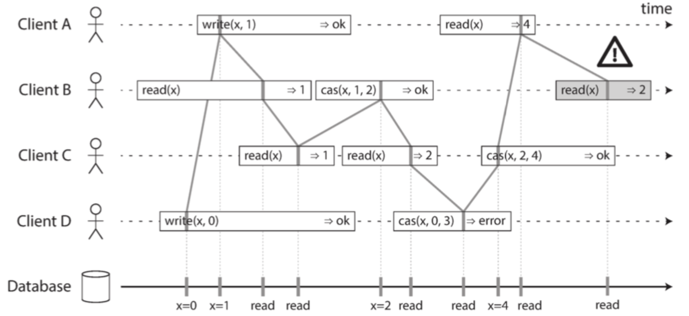
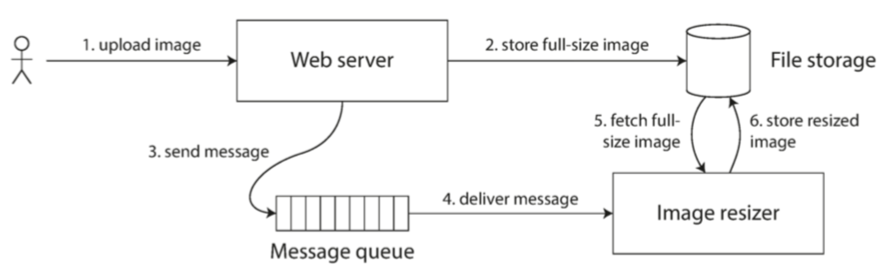
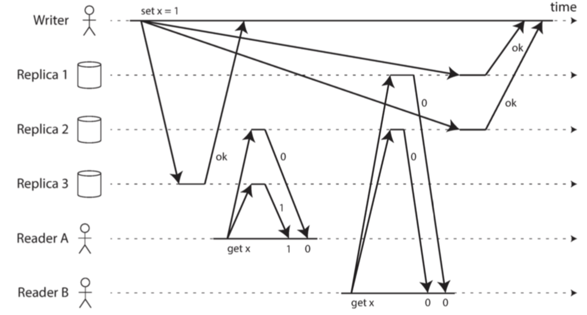
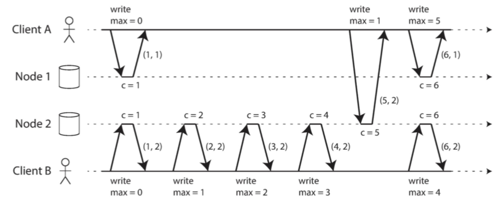

为了构建容错系统，最好先建立一套通用的抽象机制与之对应的技术保证。

## 一致性的保证

不同数据库节点之间的复制中发生的一些时序问题。同一时刻查看两个数据库节点，可能看到不同的数据，因为写请求到达每个节点的时间不一致。但大多数的复制数据库都要最少提供最终一致性。

## 线性一致性

线性一致性，让系统看起来像只有一份数据副本，且所有的操作都是原子的。线性一致性又叫强一致性，立即一致性。

#### 什么使得系统线性一致性？

与写操作在时间上重叠的任何读操作，可能会返回旧值或新值 ，因为我们不知道读取时，写操作是否已经生效。这些操作是 **并发（concurrent）** 的，这不是我们所期望的仿真 “单一数据副本” 的系统。我们期望的是**任何一个读取返回新值后，所有后续读取（在相同或其他客户端上）也必须返回新值。**

```
$cas(x, v_{old}, v_{new})⇒r$ 表示客户端请求进行原子性的 比较与设置 操作。如果寄存器 $x$ 的当前值等于 $v_{old}$ ，则应该原子地设置为 $v_{new}$ 。如果 $x≠v_{old}$ ，则操作应该保持寄存器不变并返回一个错误。 $r$ 是数据库的响应（正确或错误）。
```



线性一致性的要求是，操作标记的连线总是按时间（从左到右）向前移动，而不是向后移动。

```
线性一致性与可串行化容易混淆
可串行化（Serializability） 是事务的隔离属性，每个事务可以读写多个对象（行，文档，记录）—— 它确保事务的行为，与它们按照 某种 顺序依次执行的结果相同（每个事务在下一个事务开始之前运行完成）。这种执行顺序可以与事务实际执行的顺序不同。
线性一致性，线性一致性（Linearizability） 是读取和写入寄存器（单个对象）的 新鲜度保证。它不会将操作组合为事务，因此它也不会阻止写入偏差等问题。
一个数据库可以提供可串行化和线性一致性，这种组合被称为严格的可串行化或 强的单副本可串行化（strong-1SR）基于两阶段锁定的可串行化实现
```

#### 依赖线性一致性

线性一致性在什么情况下有用？

##### 锁定和领导选举

一个使用单主复制的系统，需要确保主节点真的只有一个。一种选择领导者的方法是使用锁：每个节点在启动时尝试获取锁，成功者成为领导者。所有节点必须就哪个节点拥有锁达成一致，否则就没用了。

Apache ZooKeeper 【15】和 etcd 【16】之类的协调服务通常用于实现分布式锁和领导者选举。它们使用一致性算法，以容错的方式实现线性一致的操作。

##### 约束和唯一性保证

用户名或电子邮件地址必须唯一标识一个用户，而在文件存储服务中，不能有两个具有相同路径和文件名的文件。当一个用户注册你的服务时，可以认为他们获得了所选用户名的 “锁定”。

##### 跨信道的时序依赖

 

 首先将照片写入文件存储服务，写入完成后再将给缩放器的指令放入消息队列。文件存储服务是线性一致的，应该可以正常工作。

#### 实现线性一致的系统

这种方法无法容错：如果持有该副本的节点失效，数据将会丢失，或者至少无法访问，直到节点重新启动。

使系统容错最常用的方法是使用复制：

+ 单主复制（可能线性一致）
  主库具备写入数据的猪副本，而追随者在其他节点上保留数据备份。如果从主库或同步更新的从库读取数据，它们 **可能（potential）** 是线性一致性的。
  从主库读取依赖一个假设，你确定地知道领导者是谁。一个节点很可能会认为它是领导者，而事实上并非如此 —— 如果具有错觉的领导者继续为请求提供服务，可能违反线性一致性【20】。使用异步复制，故障切换时甚至可能会丢失已提交的写入，这同时违反了持久性和线性一致性
+ 共识算法
  共识协议包含防止脑裂和陈旧副本的措施。正是由于这些细节，共识算法可以安全地实现线性一致性存储
+ 多主复制（非线性一致）
+ 无主复制（也许不是线性一致的）

##### 线性一致性和法定人数

当我们有可变的网络延迟时，就可能存在竞争条件。



这种方式只能实现线性一致的读写；不能实现线性一致的比较和设置（CAS）操作，因为它需要一个共识算法。

##### 线性一致性的代价

**网络中断迫使在线性一致性和可用性之间做出选择。**

如果两个数据中心之间发生网络中断会发生什么？

使用多主数据库，每个数据中心都可以继续正常运行：由于在一个数据中心写入的数据是异步复制到另一个数据中心的，所以在恢复网络连接时，写入操作只是简单地排队并交换。

如果使用单主复制，则主库必须位于其中一个数据中心。任何写入和线性一致的读取请求都必须发送给该主库，因此对于连接到从库所在数据中心的客户端，这些读取和写入请求必须通过网络同步发送到主库所在的数据中心。在单主配置的条件下，如果数据中心之间的网络被中断，则连接到从库数据中心的客户端无法联系到主库，因此它们无法对数据库执行任何写入，也不能执行任何线性一致的读取。它们仍能从从库读取，但结果可能是陈旧的。

如果客户端可以直接连接到主库所在的数据中心，这就不是问题了，那些应用可以继续正常工作。但只能访问从库数据中心的客户端会中断运行，直到网络链接得到修复

#### cap定理

CAP 有时以这种面目出现：一致性，可用性和分区容错性：三者只能择其二。

CAP 更好的表述成：在分区时要么选择一致，要么选择可用。

##### 线性一致性和网络延迟

虽然线性一致是一个很有用的保证，但实际上，线性一致的系统惊人的少。

分布式数据库也是如此：它们是 **为了提高性能** 而选择了牺牲线性一致性，而不是为了容错。


#### 顺序保证

事实证明，顺序、线性一致性和共识之间有着深刻的联系。

##### 顺序与因果关系

+ 在 “[一致前缀读](https://github.com/Vonng/ddia/blob/master/ch5.md#一致前缀读)”（[图 5-5](https://github.com/Vonng/ddia/blob/master/img/fig5-5.png)）中，问题和答案之间存在 **因果依赖（causal dependency）**
+ 一条记录必须先被创建，然后才能被更新。
+ 如果有两个操作 A 和 B，则存在三种可能性：A 发生在 B 之前，或 B 发生在 A 之前，或者 A 和 B**并发**。这种 **此前发生（happened before）** 关系是因果关系的另一种表述
+ 在事务快照隔离的上下文中，事务是从一致性快照中读取的。 **与因果关系保持一致（consistent with causality）**
  **读偏差（read skew）** 意味着读取的数据处于违反因果关系的状态
+ 事务之间 **写偏差（write skew）** 的例子（请参阅 “[写入偏斜与幻读](https://github.com/Vonng/ddia/blob/master/ch7.md#写入偏斜与幻读)”）也说明了因果依赖。
+ 在爱丽丝和鲍勃看球的例子中（[图 9-1](https://github.com/Vonng/ddia/blob/master/img/fig9-1.png)），在听到爱丽丝惊呼比赛结果后，鲍勃从服务器得到陈旧结果的事实违背了因果关系：爱丽丝的惊呼因果依赖于得分宣告，所以鲍勃应该也能在听到爱丽斯惊呼后查询到比分。相同的模式在 “[跨信道的时序依赖](https://github.com/Vonng/ddia/blob/master/ch9.md#跨信道的时序依赖)” 一节中，以 “图像大小调整服务” 的伪装再次出现。

这些因果依赖的操作链定义了系统中的因果顺序，即，什么在什么之前发生。如果一个系统服从因果关系所规定的顺序，我们说它是 **因果一致（causally consistent）** 的。例如，快照隔离提供了因果一致性：当你从数据库中读取到一些数据时，你一定还能够看到其因果前驱（假设在此期间这些数据还没有被删除）。

##### 因果顺序不是全序的

**全序（total order）** 允许任意两个元素进行比较，所以如果有两个元素，你总是可以说出哪个更大，哪个更小。例如，自然数集是全序的

**无法比较（incomparable）** 的，因此数学集合是 **偏序（partially order）** 的。

全序和偏序之间的差异反映在不同的数据库一致性模型中：

+ 线性一致性
  在线性一致的系统中，操作是全序的：如果系统表现的就好像只有一个数据副本，并且所有操作都是原子性的，这意味着对任何两个操作，我们总是能判定哪个操作先发生
+ 因果性

线性一致的数据存储中是不存在并发操作的：必须有且仅有一条时间线，所有的操作都在这条时间线上，构成一个全序关系。可能有几个请求在等待处理，但是数据存储确保了每个请求都是在唯一时间线上的某个时间点自动处理的，不存在任何并发。

并发意味着时间线会分岔然后合并 —— 在这种情况下，不同分支上的操作是无法比较的（即并发操作）

##### 线性一致性强于因果一致性

线性一致性 **隐含着（implies）** 因果关系：任何线性一致的系统都能正确保持因果性。线性一致性可以自动保证因果性，系统无需任何特殊操作。

线性一致可能会损害其性能和可用性。看上去需要线性一致性的系统，实际上需要的只是因果一致性，因果一致性可以更高效地实现。

##### 捕获因果关系

**happened before**，并发操作可以以任意顺序进行，但如果一个操作发生在另一个操作之前，那它们必须在所有副本上以那个顺序被处理。

为了防止丢失更新，我们需要检测到对同一个键的并发写入。因果一致性则更进一步：它需要跟踪整个数据库中的因果依赖，而不仅仅是一个键

##### 序列号顺序

可以使用 **序列号（sequence nunber）** 或 **时间戳（timestamp）** 来排序事件。它提供了一个全序关系：也就是说每个操作都有一个唯一的序列号，而且总是可以比较两个序列号，确定哪一个更大。

可以使用 **与因果一致（consistent with causality）** 的全序来生成序列号。单主复制的数据库中复制日志定义了与因果一致的写操作。主库为每个操作自增一个计数器，从而为复制日志中的每个操作分配一个单调递增的序列号。

##### 非因果序列号生成器

+ 每个节点都可以生成自己独立的一组序列号。例如有两个节点，一个节点只能生成奇数，而另一个节点只能生成偶数。
+ 可以预先分配序列号区块。节点 A 可能要求从序列号 1 到 1,000 区块的所有权，而节点 B 可能要求序列号 1,001 到 2,000 区块的所有权。然后每个节点可以独立分配所属区块中的序列号，并在序列号告急时请求分配一个新的区块。

这三个选项都比单一主库的自增计数器表现要好，并且更具可伸缩性。它们为每个操作生成一个唯一的，近似自增的序列号。然而它们都有同一个问题：生成的序列号与因果不一致。


##### 兰伯特时间戳

每个节点都有一个唯一标识符，和一个保存自己执行操作数量的计数器。兰伯特时间戳就是两者的简单组合：（计数器，节点 ID）$(counter, node ID)$。两个节点有时可能具有相同的计数器值，但通过在时间戳中包含节点 ID，每个时间戳都是唯一的。

 

兰伯特时间戳提供了一个全序，如果你有两个时间戳，则 **计数器** 值大者是更大的时间戳。如果计数器值相同，则节点 ID 越大的，时间戳越大。

##### 光有时间戳排序还不够

为了实现诸如用户名上的唯一约束这种东西，仅有操作的全序是不够的，你还需要知道这个全序何时会尘埃落定。

##### 全序广播

单主复制通过选择一个节点作为主库来确定操作的全序，并在主库的单个 CPU 核上对所有操作进行排序。接下来的挑战是，如果吞吐量超出单个主库的处理能力，这种情况下如何扩展系统；以及，如果主库失效，如何处理故障切换。在分布式系统文献中，这个问题被称为 **全序广播（total order broadcast）** 或 **原子广播（atomic broadcast）**

全序广播通常被描述为在节点间交换消息的协议：

+ 可靠交付

  没有消息丢失：如果消息被传递到一个节点，它将被传递到所有节点。

+ 全序交付（totally ordered delivery）

  消息以相同的顺序传递给每个节点。

正确的全序广播算法必须始终保证可靠性和有序性，即使节点或网络出现故障。当然在网络中断的时候，消息是传不出去的，但是算法可以不断重试，以便在网络最终修复时，消息能及时通过并送达

##### 使用全序广播

ZooKeeper 和 etcd 这样的共识服务实际上实现了全序广播。

全序广播正是数据库复制所需的：如果每个消息都代表一次数据库的写入，且每个副本都按相同的顺序处理相同的写入，那么副本间将相互保持一致。
