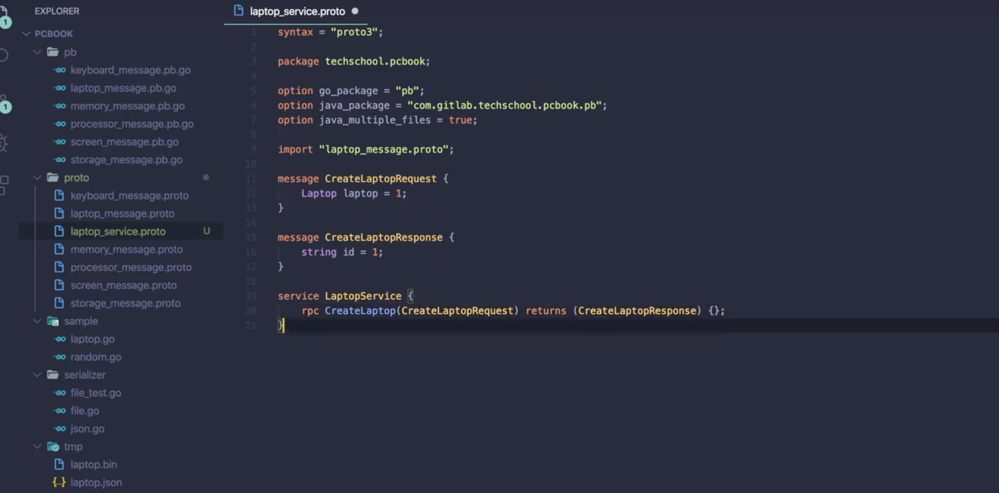
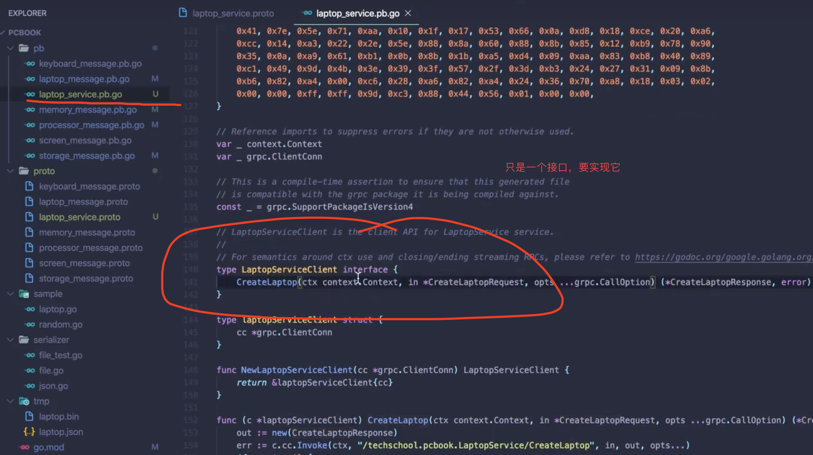
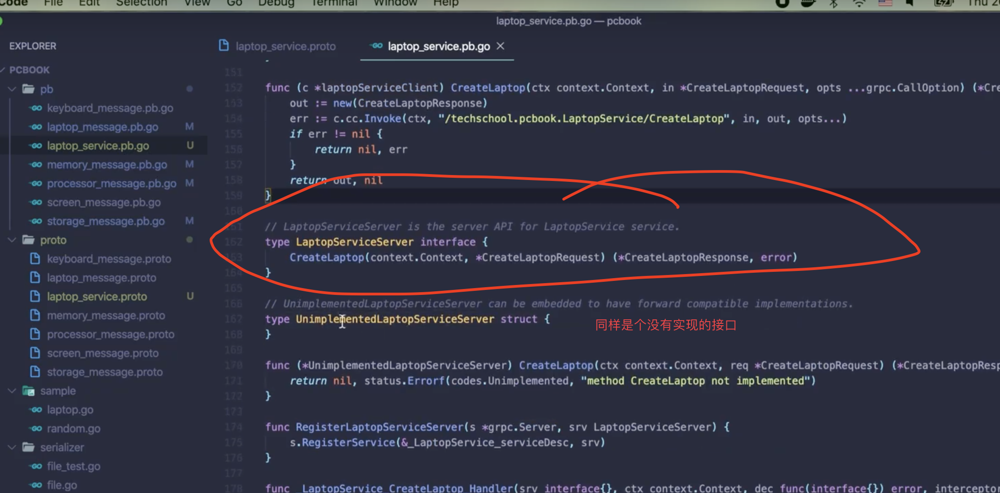
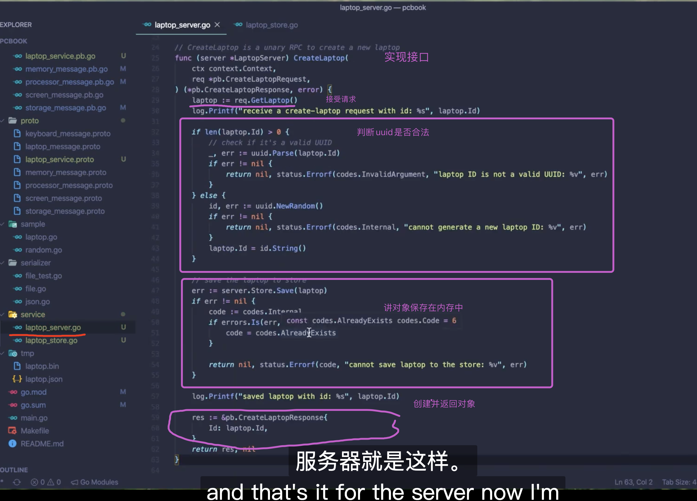
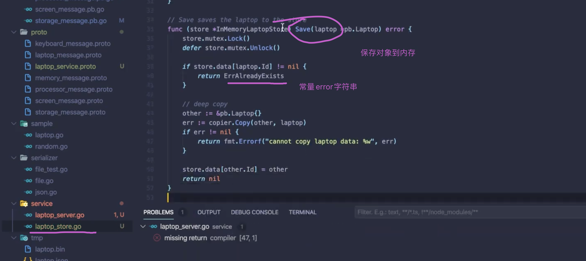
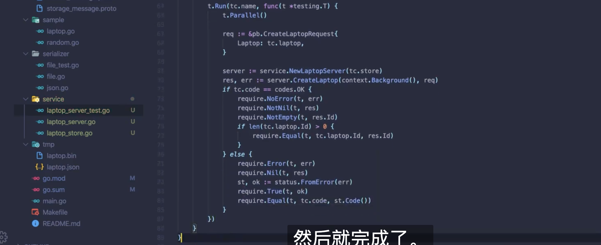
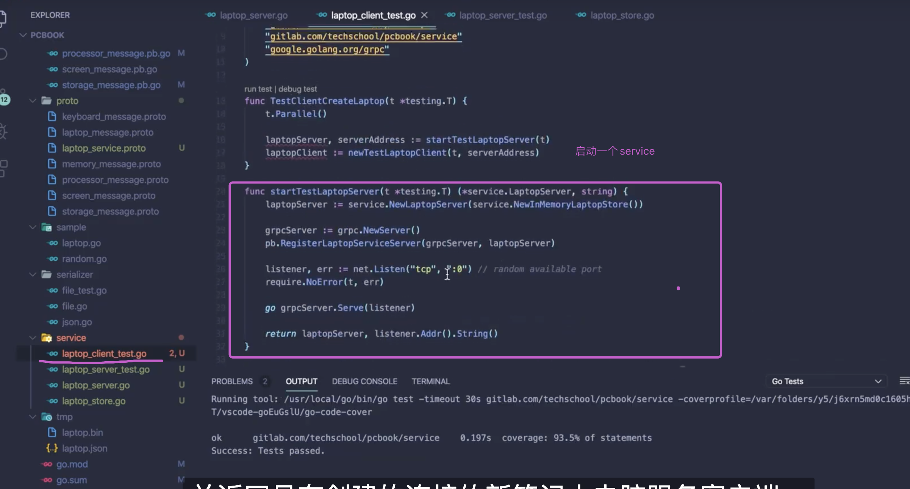
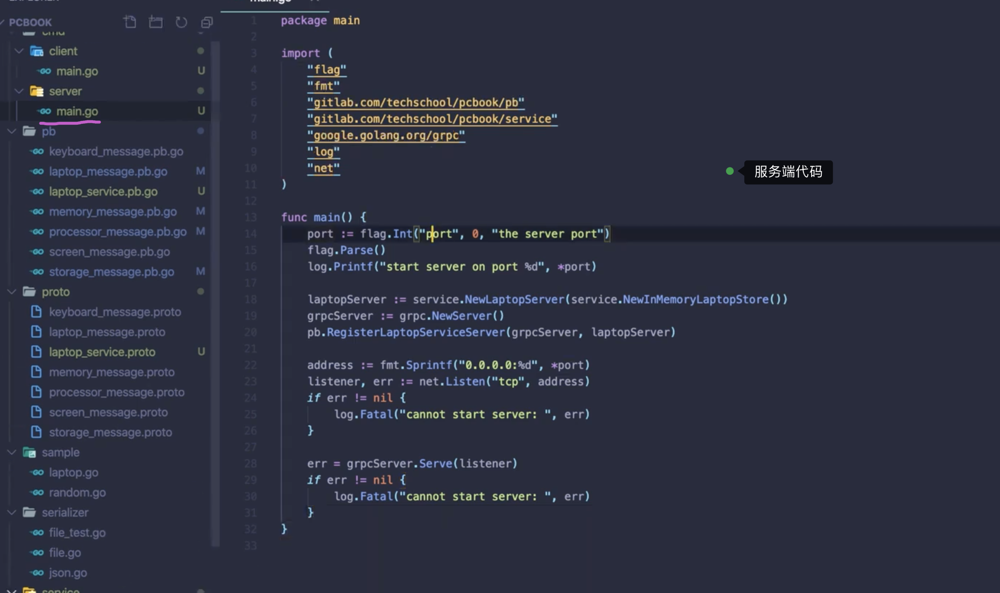
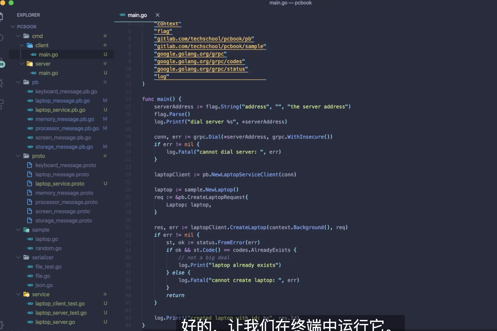

1. 新建一个laptop_service.proto

   

make gen






## 实现service

###### 新建文件夹service, 并且新建laptop_service.go 并且写代码如下,主要是要实现laptop_service.pb.go里面的两个接口



如何保存对象在内存，新建laptop_store


新增拷贝包：

```shell
 go get github.com/jinzhu/copier
```




进行测试 ，新建文件service_test 




 


客户端测试rpc 



 






客户端测试

