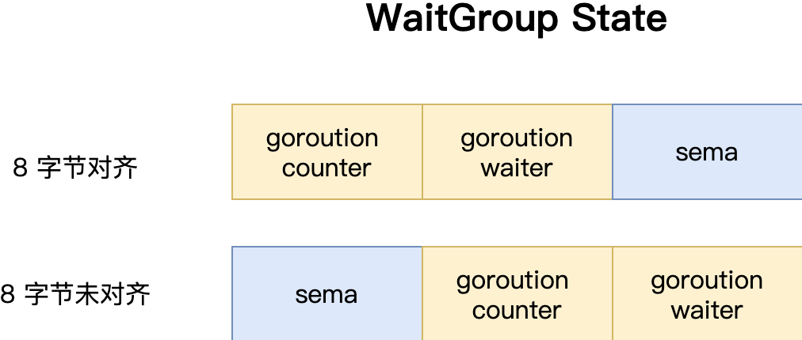

waitGroup

```go
type WaitGroup struct {
	noCopy noCopy

//64 位的原子操作的时候必须要保证 64 位（8 字节）对齐，如果没有对齐的就会有问题，但是 32 位的编译器并不能保证 64 //位对齐所以这里用一个 12 字节的 state1 字段来存储这两个状态，然后根据是否 8 字节对齐选择不同的保存方式
	state1 [3]uint32
}
```



```go
// state returns pointers to the state and sema fields stored within wg.state1.
func (wg *WaitGroup) state() (statep *uint64, semap *uint32) {
	if uintptr(unsafe.Pointer(&wg.state1))%8 == 0 {
		return (*uint64)(unsafe.Pointer(&wg.state1)), &wg.state1[2]
	} else {
		return (*uint64)(unsafe.Pointer(&wg.state1[1])), &wg.state1[0]
	}
}
```

Add()

```go
func (wg *WaitGroup) Add(delta int) {
    // 先从 state 当中把数据和信号量取出来
	statep, semap := wg.state()

    // 在 waiter 上加上 delta 值
	state := atomic.AddUint64(statep, uint64(delta)<<32)
    // 取出当前的 counter
	v := int32(state >> 32)
    // 取出当前的 waiter，正在等待 goroutine 数量
	w := uint32(state)

    // counter 不能为负数
	if v < 0 {
		panic("sync: negative WaitGroup counter")
	}

    // 这里属于防御性编程
    // w != 0 说明现在已经有 goroutine 在等待中，说明已经调用了 Wait() 方法
    // 这时候 delta > 0 && v == int32(delta) 说明在调用了 Wait() 方法之后又想加入新的等待者
    // 这种操作是不允许的
	if w != 0 && delta > 0 && v == int32(delta) {
		panic("sync: WaitGroup misuse: Add called concurrently with Wait")
	}
    // 如果当前没有人在等待就直接返回，并且 counter > 0
	if v > 0 || w == 0 {
		return
	}

    // 这里也是防御 主要避免并发调用 add 和 wait
	if *statep != state {
		panic("sync: WaitGroup misuse: Add called concurrently with Wait")
	}

	// 唤醒所有 waiter，看到这里就回答了上面的问题了
	*statep = 0
	for ; w != 0; w-- {
		runtime_Semrelease(semap, false, 0)
	}
}
```

Wait()

```go
func (wg *WaitGroup) Wait() {
	// 先从 state 当中把数据和信号量的地址取出来
    statep, semap := wg.state()

	for {
     	// 这里去除 counter 和 waiter 的数据
		state := atomic.LoadUint64(statep)
		v := int32(state >> 32)
		w := uint32(state)

        // counter = 0 说明没有在等的，直接返回就行
        if v == 0 {
			// Counter is 0, no need to wait.
			return
		}

		// waiter + 1，调用一次就多一个等待者，然后休眠当前 goroutine 等待被唤醒
		if atomic.CompareAndSwapUint64(statep, state, state+1) {
			runtime_Semacquire(semap)
			if *statep != 0 {
				panic("sync: WaitGroup is reused before previous Wait has returned")
			}
			return
		}
	}
}
```

Done()

```go
func (wg *WaitGroup) Done() {
	wg.Add(-1)
}
```

