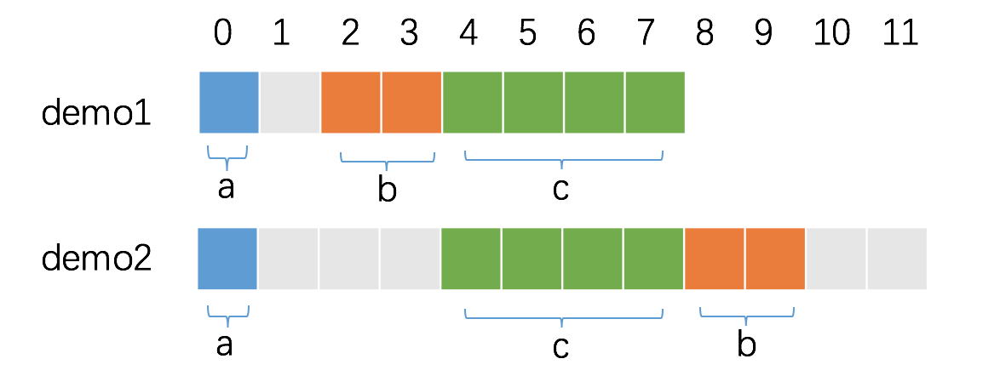

1. 对于结构的各个成员，第一个成员位于偏移为0的位置，以后每个数据成员的起始位置必须是默认对齐长度和该数据成员长度中最小的长度的倍数。

2. 除了结构成员需要对齐，结构本身也需要对齐，结构的长度必须是编译器默认的对齐长度和成员中最长类型中最小的数据大小的倍数对齐。

   ```go
   type demo1 struct {
   	a int8
   	b int16
   	c int32
   }
   
   type demo2 struct {
   	a int8
   	c int32
   	b int16
   }
   
   func main() {
   	fmt.Println(unsafe.Sizeof(demo1{})) // 8
   	fmt.Println(unsafe.Sizeof(demo2{})) // 12
   }
   ```

   

   ​	