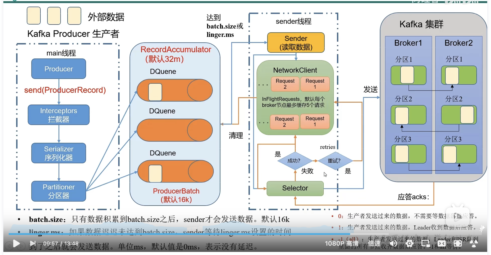

## 使用docker-compose搭建kafka

```dockerfile
version: '3.3'
services:
  zookeeper:
    image: wurstmeister/zookeeper
    container_name: zookeeper
    ports:
      - 2181:2181
    volumes:
      - /Users/wangfusheng/kafka/zookeeper_data:/data
      - /data/zookeeper/datalog:/datalog
      - /data/zookeeper/logs:/logs
    restart: always
  kafka1:
    image: wurstmeister/kafka
    depends_on:
      - zookeeper
    container_name: kafka1
    ports:
      - 9092:9092
    environment:
      KAFKA_BROKER_ID: 1
      KAFKA_ZOOKEEPER_CONNECT: 192.168.1.124:2181
      KAFKA_ADVERTISED_LISTENERS: PLAINTEXT://192.168.1.124:9092
      KAFKA_LISTENERS: PLAINTEXT://0.0.0.0:9092
      KAFKA_LOG_DIRS: /data/kafka-data
      KAFKA_LOG_RETENTION_HOURS: 24
    volumes:
      - /data/kafka1/data:/data/kafka-data
    restart: unless-stopped  
  kafka2:
    image: wurstmeister/kafka
    depends_on:
      - zookeeper
    container_name: kafka2
    ports:
      - 9093:9093
    environment:
      KAFKA_BROKER_ID: 2
      KAFKA_ZOOKEEPER_CONNECT: 192.168.1.124:2181
      KAFKA_ADVERTISED_LISTENERS: PLAINTEXT://192.168.1.124:9093
      KAFKA_LISTENERS: PLAINTEXT://0.0.0.0:9093
      KAFKA_LOG_DIRS: /data/kafka-data
      KAFKA_LOG_RETENTION_HOURS: 24
    volumes:
      - /data/kafka2/data:/data/kafka-data
    restart: unless-stopped
  kafka3:
    image: wurstmeister/kafka
    depends_on:
      - zookeeper
    container_name: kafka3
    ports:
      - 9094:9094
    environment:
      KAFKA_BROKER_ID: 3
      KAFKA_ZOOKEEPER_CONNECT: 192.168.1.124:2181
      KAFKA_ADVERTISED_LISTENERS: PLAINTEXT://192.168.1.124:9094
      KAFKA_LISTENERS: PLAINTEXT://0.0.0.0:9094
      KAFKA_LOG_DIRS: /data/kafka-data
      KAFKA_LOG_RETENTION_HOURS: 24
    volumes:
      - /data/kafka3/data:/data/kafka-data
    restart: unless-stopped
```

```
https://www.jianshu.com/p/b811ea29428c
```

```
$ docker exec -it kafka1 bash
$/opt/kafka_2.13-2.8.1/bin/kafka-topics.sh --create --topic chat --partitions 5 --zookeeper 192.168.1.124:2181 --replication-factor 3
Created topic chat.
```

```
/opt/kafka_2.13-2.8.1/bin/kafka-console-producer.sh --broker-list kafka1:9092 --topic chat
>hello world!
```

```
/opt/kafka_2.13-2.8.1/bin/kafka-console-consumer.sh --bootstrap-server kafka2:9093 --topic chat --from-beginning
```


## 配置信息修改

```
#进入docker
cd /opt/kafka_2.13-2.8.1/config
vi server.properties
```

```shell
############################# Server Basics #############################

# The id of the broker. This must be set to a unique integer for each broker.
broker.id=2 #改成2

############################# Log Basics #############################

```


## 架构图

 

 

```shell
#创建一个分区
docker exec -it kafka1 bash
./kafka-topics.sh --bootstrap-server kafka1:9092 --topic first --create --partitions 1 --replication-factor 3
```

```shell
#查看一个分区的详细信息
bash-5.1# ./kafka-topics.sh --bootstrap-server kafka1:9092 --topic first --describe
Topic: first	TopicId: k7xhE4mXTVi5E51NTZ4RQA	PartitionCount: 1	ReplicationFactor: 3	Configs: segment.bytes=1073741824
	Topic: first	Partition: 0	Leader: 1002	Replicas: 1002,1001,1003	Isr: 1002,1001,1003
```

```shell
#修改成三个分区
bash-5.1# ./kafka-topics.sh --bootstrap-server kafka1:9092 --topic first --describe
Topic: first	TopicId: k7xhE4mXTVi5E51NTZ4RQA	PartitionCount: 3	ReplicationFactor: 3	Configs: segment.bytes=1073741824
	Topic: first	Partition: 0	Leader: 1002	Replicas: 1002,1001,1003	Isr: 1002,1001,1003
	Topic: first	Partition: 1	Leader: 1003	Replicas: 1003,1002,1001	Isr: 1003,1002,1001
	Topic: first	Partition: 2	Leader: 1001	Replicas: 1001,1003,1002	Isr: 1001,1003,1002
```

#### 生产者

```shell
wangfusheng@MacBook-Pro-2 ~ % docker exec -it kafka2 bash
bash-5.1# cd /opt/kafka_2.13-2.8.1/

#生产者
./kafka-console-producer.sh --bootstrap-server kafka1:9092 --topic first
>hello 
```

消费者

```
./kafka-console-consumer.sh --bootstrap-server kafka1:9092 --topic first
```

 

 
