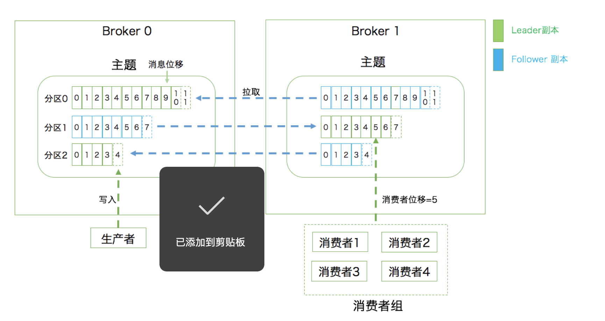

#### 1.传输协议

+ 点对点模型：系统 A 发送的消息只能被系统 B 接收，其他任何系统都不能读取 A 发送的消息
+ 发布订阅模型：主题topic(消息容器)。发布者，订阅者

kafka同时支持这两种协议

### 2.消息队列的作用

+ 削峰填谷：缓冲上下游瞬时突发流量，使其更平滑
+ 松耦合：
+ 异步：

### 3.kafka术语

基本概念

+ 主题topic：发布订阅的对象是主题topic。
+ 生产者producer：向主题发布消息的客户端应用程序
+ 消费者comsumer：订阅主题的消息的应用程序

客户端和服务度

+ 生产者和消费者统称为客户端
+ 服务端由broker进程组成，负责接收和处理客户端发送过来的请求，以及对消息进行持久化。

数据副本replica

+ 领导者副本(leader replica)，与客户端进行交互
+ 追随者副本(Follower replica)，被动追随领导者副本，不对外服务。
+ 生产者总是向领导者副本写数据；消费者总是从领导者读数据
+ 向领导者副本发送请求，请求领导者把最新生产的消息发给它。

分区

+ 每个主题划分成多个分区（Partition），每个分区是一组有序的消息日志。生产者生产的每条消息只会被发送到一个分区中
+ 生产者向分区写入消息，每条消息在分区中的位置信息由一个叫位移（Offset）的数据来表征。总是从零开始。

总结：

- 第一层是主题层，每个主题可以配置 M 个分区，而每个分区又可以配置 N 个副本。
- 第二层是分区层，每个分区的 N 个副本中只能有一个充当领导者角色，对外提供服务；其他 N-1 个副本是追随者副本，只是提供数据冗余之用。
- 第三层是消息层，分区中包含若干条消息，每条消息的位移从 0 开始，依次递增。
- 最后，客户端程序只能与分区的领导者副本进行交互。

持久化

+ 消息日志（Log）来保存数据，一个日志就是磁盘上一个只能追加写（Append-only）消息的物理文件。顺序 I/O 写操
+ 定期删除消息回收磁盘
+ 日志段机制：日志细分成多个日志段，消息被追加到最新的一个日志段，写满一个日志段，自动分成一个新的日志段，并将老的日志封存起来。定期检查日志段。

消费组：

+ 多个消费者实例共同组成一个组来消费一组主题

+ 消费者组内某个消费者实例挂掉后，其他消费者实例自动重新分配订阅主题分区的过程

   