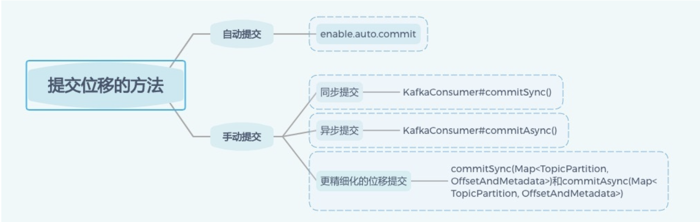
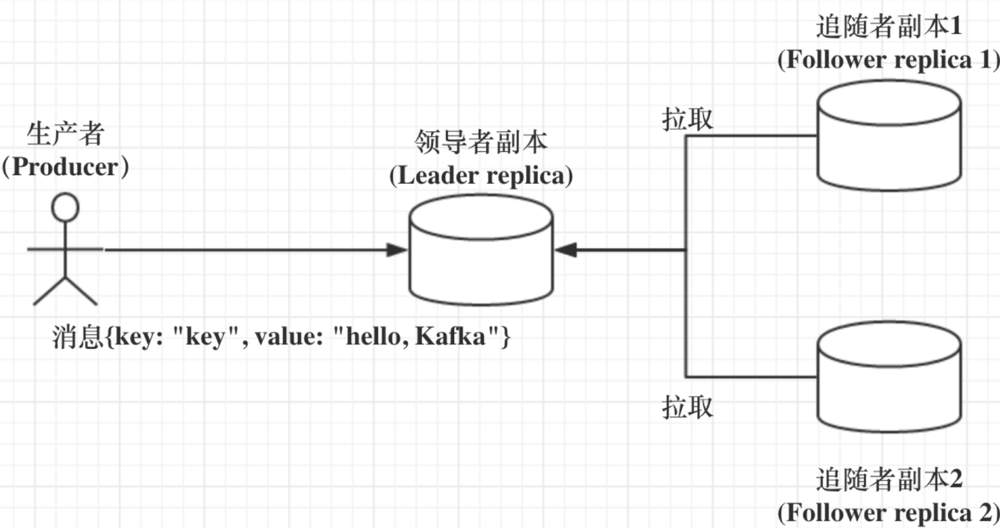
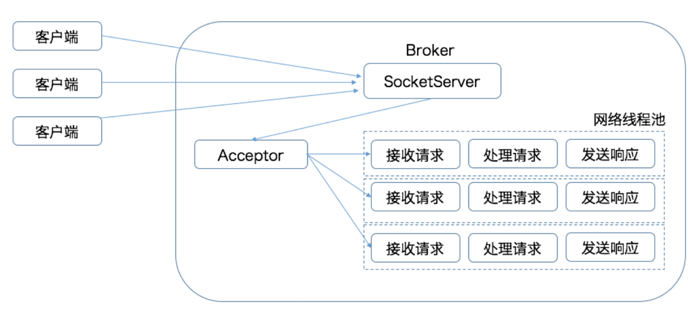
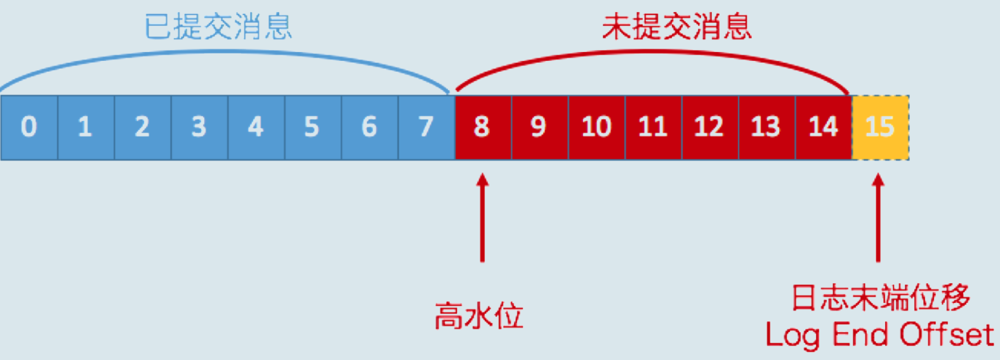

# 生产者消息分区机制原理剖析

### 为什么分区

kafka组织方式：主题--分区--消息。

为什么不采用多个主题，而是多个分区？

分区的作用就是提供负载均衡的能力。不同的分区被放在不同节点的机器上，而对数据读写的粒度也都针对分区，这样每个节点的机器都能独立地执行各自分区的读写请求处理。并且可通过添加新的节点机器来增加整体系统的吞吐量。


### 分区策略

生产者将消息发送到哪个分区的算法

+ 轮询策略。最常用的策略
+ 随机策略。随意地将消息放置到任意一个分区上
+ 按消息键保序策略。都是直接将消息创建时间封装进 Key 里面的。一旦消息被定义了 Key，那么你就可以保证同一个 Key 的所有消息都进入到相同的分区里面


## 压缩

消息层次分为：消息集合和消息。

消息集合：一个消息集合包含若干条日志项（record item）

#### 何时压缩

压缩可能发生在两个地方：生产者端和 Broker 端。

生产者程序中配置 compression.type 参数即表示启用指定类型的压缩算法

#### 何时解压缩

Consumer 端后，由 Consumer 自行解压缩还原成之前的消息

**Producer 端压缩、Broker 端保持、Consumer 端解压缩**


# 无消息丢失配置怎么实现？

Kafka 只对“已提交”的消息（committed message）做有限度的持久化保证。

Kafka 的若干个 Broker 成功地接收到一条消息并写入到日志文件后，它们会告诉生产者程序这条消息已成功提交

### 最佳实践

+ 不要使用 producer.send(msg)，而要使用 producer.send(msg, callback)
+ 设置 acks = all。acks 是 Producer 的一个参数，代表了你对“已提交”消息的定义。如果设置成 all，则表明所有副本 Broker 都要接收到消息，该消息才算是“已提交”
+ 设置 retries 为一个较大的值。这里的 retries 同样是 Producer 的参数，对应前面提到的 Producer 自动重试。当出现网络的瞬时抖动时，消息发送可能会失败，此时配置了 retries > 0 的 Producer 能够自动重试消息发送，避免消息丢失
+ 设置 unclean.leader.election.enable = false。这是 Broker 端的参数，它控制的是哪些 Broker 有资格竞选分区的 Leader。如果一个 Broker 落后原先的 Leader 太多，那么它一旦成为新的 Leader，必然会造成消息的丢失
+ 设置 replication.factor >= 3。这也是 Broker 端的参数。其实这里想表述的是，最好将消息多保存几份，毕竟目前防止消息丢失的主要机制就是冗余。
+ 设置 min.insync.replicas > 1。这依然是 Broker 端参数，控制的是消息至少要被写入到多少个副本才算是“已提交”。设置成大于 1 可以提升消息持久性


## 生产者如何管理tcp

#### 为什么使用tcp

在创建 KafkaProducer 实例时，生产者应用会在后台创建并启动一个名为 Sender 的线程，该 Sender 线程开始运行时首先会创建与 Broker 的连接


## 幂等生产者和事务生产者

- 最多一次（at most once）：消息可能会丢失，但绝不会被重复发送。
- 至少一次（at least once）：消息不会丢失，但有可能被重复发送。
- 精确一次（exactly once）：消息不会丢失，也不会被重复发送。

kafka默认第二种：至少一次（at least once）：消息不会丢失，但有可能被重复发送。即使 Producer 端重复发送了相同的消息，Broker 端也能做到自动去重

#### 幂等性 Producer

enable.idempotence 被设置成 true 后，Producer 自动升级成幂等性 Producer，其他所有的代码逻辑都不需要改变。Kafka 自动帮你做消息的重复去重

## 事务

Kafka 自 0.11 版本开始也提供了对事务的支持，目前主要是在 read committed 隔离级别上做事情。它能保证多条消息原子性地写入到目标分区，同时也能保证 Consumer 只能看到事务成功提交的消息。

- 和幂等性 Producer 一样，开启 enable.idempotence = true。
- 设置 Producer 端参数 transctional. id。最好为其设置一个有意义的名字。

## 消费者组

1. Consumer Group 下可以有一个或多个 Consumer 实例。这里的实例可以是一个单独的进程，也可以是同一进程下的线程。在实际场景中，使用进程更为常见一些。
2. Group ID 是一个字符串，在一个 Kafka 集群中，它标识唯一的一个 Consumer Group。
3. Consumer Group 下所有实例订阅的主题的单个分区，只能分配给组内的某个 Consumer 实例消费。这个分区当然也可以被其他的 Group 消费。

当 Consumer Group 订阅了多个主题后，组内的每个实例不要求一定要订阅主题的所有分区，它只会消费部分分区中的消息

**Consumer 实例的数量应该等于该 Group 订阅主题的分区总数**


## 重平衡(**Rebalance**)

**Rebalance 本质上是一种协议，规定了一个 Consumer Group 下的所有 Consumer 如何达成一致，来分配订阅 Topic 的每个分区**

#### Rebalance的条件

+ 组成员数发生变更。比如有新的 Consumer 实例加入组或者离开组
+ 订阅主题数发生变更。
+ 订阅主题的分区数发生变更。Kafka 当前只能允许增加一个主题的分区数。当分区数增加时，就会触发订阅该主题的所有 Group 开启 Rebalance


## 位移主题

**位移主题的 Key 中应该保存 3 部分内容：<Group ID，主题名，分区号 >**

**当 Kafka 集群中的第一个 Consumer 程序启动时，Kafka 会自动创建位移主题**


## 重平衡的避免

Coordinator，它专门为 Consumer Group 服务，负责为 Group 执行 Rebalance 以及提供位移管理和组成员管理。

所有 Broker 都有各自的 Coordinator 组件。

Rebalance发生的时机：

- 组成员数量发生变化
- 订阅主题数量发生变化
- 订阅主题的分区数发生变化

组成员数量变化而引发的 Rebalance 该如何避免：

+ 新增组的新实例。增加 Consumer 实例的操作都是计划内的，可能是出于增加 TPS 或提高伸缩性的需要
+ 实例减少。某些情况下，Consumer 实例会被 Coordinator 错误地认为“已停止”从而被“踢出”Group

当 Consumer Group 完成 Rebalance 之后，每个 Consumer 实例都会定期地向 Coordinator 发送心跳请求，表明它还存活着。session.timeout.ms，就是被用来表征此事的。该参数的默认值是 10 秒，即如果 Coordinator 在 10 秒之内没有收到 Group 下某 Consumer 实例的心跳，它就会认为这个 Consumer 实例已经挂了。

Consumer 还提供了一个允许你控制发送心跳请求频率的参数，就是 heartbeat.interval.ms。这个值设置得越小，Consumer 实例发送心跳请求的频率就越高。频繁地发送心跳请求会额外消耗带宽资源。

Consumer 端还有一个参数，用于控制 Consumer 实际消费能力对 Rebalance 的影响，即 max.poll.interval.ms 参数。它限定了 Consumer 端应用程序两次调用 poll 方法的最大时间间隔。它的默认值是 5 分钟，表示你的 Consumer 程序如果在 5 分钟之内无法消费完 poll 方法返回的消息，那么 Consumer 会主动发起“离开组”的请求，Coordinator 也会开启新一轮 Rebalance。

```
设置 session.timeout.ms = 6s。
设置 heartbeat.interval.ms = 2s。
要保证 Consumer 实例在被判定为“dead”之前，能够发送至少 3 轮的心跳请求，即 session.timeout.ms >= 3 * heartbeat.interval.ms
```


# Kafka中位移提交

**Consumer 需要为分配给它的每个分区提交各自的位移数据**

**从用户的角度来说，位移提交分为自动提交和手动提交；从 Consumer 端的角度来说，位移提交分为同步提交和异步提交**

+ 自动提交： Kafka Consumer 在后台默默地为你提交位移。自动提交可能会出现重复消费。
+ 手动提交： enable.auto.commit 设置为false。通过**KafkaConsumer#commitSync()**和**KafkaConsumer#commitAsync()**
+  


# Kafka副本机制详解

1.  **提供数据冗余**。即使系统部分组件失效，系统依然能够继续运转，因而增加了整体可用性以及数据持久性。
2. ** 提供高伸缩性**。支持横向扩展，能够通过增加机器的方式来提升读性能，进而提高读操作吞吐量。
3.  **改善数据局部性**。允许将数据放入与用户地理位置相近的地方，从而降低系统延时。

#### 副本定义

所谓副本（Replica），本质就是一个只能追加写消息的提交日志

#### 副本角色

基于领导者的副本机制

 

+ 每个分区在创建时都要选举一个副本，称为领导者副本，其余的副本自动称为追随者副本
+ 追随者副本是不对外提供服务的
+ 当领导者副本挂掉了，Kafka 依托于 ZooKeeper 提供的监控功能能够实时感知到，并立即开启新一轮的领导者选举，从追随者副本中选一个作为新的领导者

### 设计的好处

+ 方便实现"**Read-your-writes**"

  当你使用生产者 API 向 Kafka 成功写入消息后，马上使用消费者 API 去读取刚才生产的消息

+ 方便实现单调读"**Monotonic Reads**"

  看到某条消息一会儿存在一会儿不存在

##### In-sync Replicas（ISR）

ISR 中的副本都是与 Leader 同步的副本，相反，不在 ISR 中的追随者副本就被认为是与 Leader 不同步的

**Broker 端参数 replica.lag.time.max.ms 参数值**。 Follower 副本落后 Leader 副本的时间不连续超过 10 秒，那么 Kafka 就认为是同步的，即使此时 Follower 副本中保存的消息明显少于 Leader 副本中的消息。


## 请求处理

Kafka 共定义了多达 45 种请求格式。**所有的请求都是通过 TCP 网络以 Socket 的方式进行通讯的**。

Kafka 使用的是**Reactor 模式**

 

Acceptor 线程采用轮询的方式将入站请求公平地发到所有网络线程中。


## 控制器controller

主要作用在apache zookeeper 的帮助下管理和协调整个kafka集群。集群中任意一台broker都能当，但是运行过程只能用一个控制器。

1. 主题管理（创建、删除、增加分区）
2. 分区重分配
3. preferred领导者选举
4. 集群成员管理
5. 数据服务


## Kafka 中的高水位和 Leader Epoch 机制

高水位的作用：

1. 定义消息可见性，即标识分区下哪些消息是可以被消费
2. 帮助kafka完成副本同步

 

分区高水位以下的消息被认为是已提交的，反之是未提交的。消费者只能消费已提交消息

LEO(log end offset)：下一条日志的写入位置

LEO总是大于等于高水位。


## 主题日常管理

#### 创建主题

```shell
bin/kafka-topics.sh --bootstrap-server broker_host:port --create --topic my_topic_name  --partitions 1 --replication-factor 1
```

##### 查询主题

```shell
bin/kafka-topics.sh --bootstrap-server broker_host:port --list
```

##### 查询单个主题

```shell
bin/kafka-topics.sh --bootstrap-server broker_host:port --describe --topic <topic_name>
```

##### 修改主题分区

```shell
bin/kafka-topics.sh --bootstrap-server broker_host:port --alter --topic <topic_name> --partitions < 新分区数 >
```

##### 主题分区迁移

```shell
bin/kafka-topics.sh --bootstrap-server broker_host:port --delete  --topic <topic_name>
```

