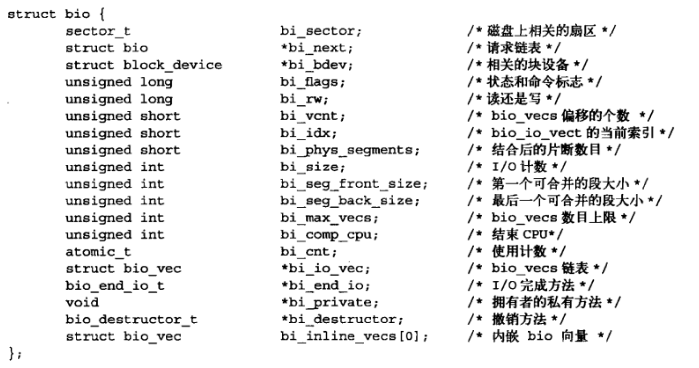

# 块I/O层

系统中能够随机访问固定大小数据片的硬件设备称作块设备，大小固定的数据盘被称作块。另外一种设备就是字符设备，按照字符流的方式被有序访问。两种设备的区别能否随机访问。

#### 1. 剖析一个块设备

​		块设备中最小的可寻址单元是扇区，最常见是512字节。根据软件不同，最小逻辑可寻址单元----块。块是扇区的整数倍。另外，内核还要求块大小是2的整数倍，而且不能超过一个页的长度。

​		扇区——设备的最小寻址单元，有时称为`硬扇区`或`设备块`
​		块——文件系统里面最小的寻址单元，有时称为`文件块`或`IO块`


### 2. 缓冲区和缓存区头

当一个块被调入内存时，它要存储在缓冲区。每个缓冲区与一个块对应，它相当于是磁盘块在内存中的表示。块包含一个或多个扇区，但是不能超过一个页面。每一个缓冲区都有对应的描述符buffer_head,称为缓冲区头。

```c
struct buffer_head {
		unsigned long b_state;
		struct buffer_head *b_this_page;
		struct page *b_page;		// 与缓冲区对应的内存物理页
  	sector_t b_blocknr;
  	size_t b_size;
  	char *b_data;		//相应的块
  	struct block_device *b_dev;	//块设备中的逻辑块号
  	bh_end_io_t *b_end_io;
  	void *b_private;
  	struct list_head b_assoc_buffers;
  	struct address_space *b_assoc_map;
  	atomic_t b_count;
}
```

​		在操作缓冲区头之前，增加缓冲区头引用计数，确保该缓冲区头不会被分配出去；当完成缓冲区头的操作之后，还必须减少引用计数。缓冲区头描述磁盘块和物理内存缓冲区之间的映射关系。在2.6内核以前，缓冲区头不仅是磁盘块到物理内存的映射，而且还是块IO操作的容器。

### 3 bio结构体

该结构代表了正在现场的以片段链表形式组织的块io操作。一个片段是一个小块的内存缓冲区。




#### 3.1  io向量

bi_io_vec指向一个bio_vec结构体数组，


​		每一个块io请求都通过一个bio结构体表示。每个请求包含一个或多个块，这些块存储在bio_vec结构体数组中。结构体描述了每个片段物理页中的实际位置，并且像向量一样被组织在一块。io操作的第一个片段由b_io_vec结构体所指向，其他的片段在其后依次位置，共有bi_vcnt个片段。当块IO层开始执行请求、需要使用各个片段时，bi_idx域会不断更新。

​		bi_idx域指向数组中的当前bio_vec片段，块io层通过它可以跟踪块io操作的完成进度。

#### 3.2 对比

bio的好处

+ bio结构体很容易高端内存，因为它处理的是物理页而不是直接指针
+ bio结构体即可以代表普通页io，同时也可以代表直接io
+ bio结构体执行分散-集中块io操作，

#### 4. 请求队列

​		块设备将它们挂起的块io请求保存在请求队列中，该队列由reques_queue结构体表示，包含一个双向链表以及相关控制信息。请求队列中的每一项都是单独的请求，由reques结构体表示。

​		因为一个请求可能要操作多个连续的磁盘块，所以每个请求可以由多个bio结构组成。		

#### 5.  io调度程序

​		磁盘寻址是整个计算机最慢的操作之一。为了优化寻址操作，在提交前先执行预操作----合并和排序。在内核中负责提交io请求的子系统叫做io调度程序。

##### 5.1 io调度程序的工作

​		io调度程序的工作是管理块设备的请求队列。合并指将两个或多个请求结合成一个新请求。如果队列已经存在一个请求，它访问的磁盘扇区和当前请求访问的磁盘扇区相邻，那么这两个请求可以合并为一个单个和多个相邻磁盘扇区操作的新请求。请求合并后只需要传递给磁盘一条寻址命令。

​		整个请求队列将按扇区增长方向有序排序。

##### 5.2 linus 电梯

1. 如果队列中已存在一个对相邻磁盘扇区操作的请求，那么新请求将和这个已经存在的请求合并成一个请求
2. 如果队列中存在一个驻留时间过长的请求，那么新请求将被插入到队列尾部，防止其他旧的请求级饥饿发生
3. 如果队列中以扇区方向为序存在合适的插入位置，那么新的请求将被插入到该位置，保证队列中的请求是被访问磁盘物理位置为序进行排序
4. 如果不存在合适的请求插入位置，请求将被插入队列尾部

##### 5.3  最终期限io调度程序

​		在最终期限io调度程序中，每个请求都有一个超时时间。默认情况下，读请求的超时时间是500ms, 写请求的超时是5s。最终期限io调度请求也以磁盘位置为次序维护请求队列，这个队列叫排序队列。最终期限io调度程序也会执行合并请求和插入请求，但也会以请求类型为依据将它们插入额外的队列中。读请求按次序插入特定的FIFO队列中，写请求被插入到特定的写FIFO队列中。

​		

​		

##### 5.4 预测io调度程序

​	预测io调度程序保持良好的读响应的同时也能提供良好的全局吞吐量。预测io调度程序基础也是最后期限io调度程序。预测io调度程序也实现了三个队列，并为每个请求设置了超时时间，这点与最后期限io调度程序一样。它增加预测启发能力。请求提交后并不直接返回处理其他请求，而是会有意空闲片刻。这几ms，对应用程序来说是个提交其他读请求的好机会。

##### 5.5 完全公正的排队io调度程序  Complete Fair Queuing, CFQ

​		CFQ io调度程序在于每一个提交的io的进程都有自己的队列。CFQ IO调度程序以时间片轮转调度队列，从每个队列选取请求数，然后进行下一轮调度。

##### 5.6  空操作的io调度程序

​		维护请求队列以近乎FIFO的顺序队列，块设备驱动程序便可以从这种队列中摘取请求。

##### 5.7  io调度程序的选择

| 参数     | io调度程序     |
| -------- | -------------- |
| a's      | 预测           |
| cfq      | 完全工作的排队 |
| deadline | 最终期限       |
| noop     | 空操作         |

