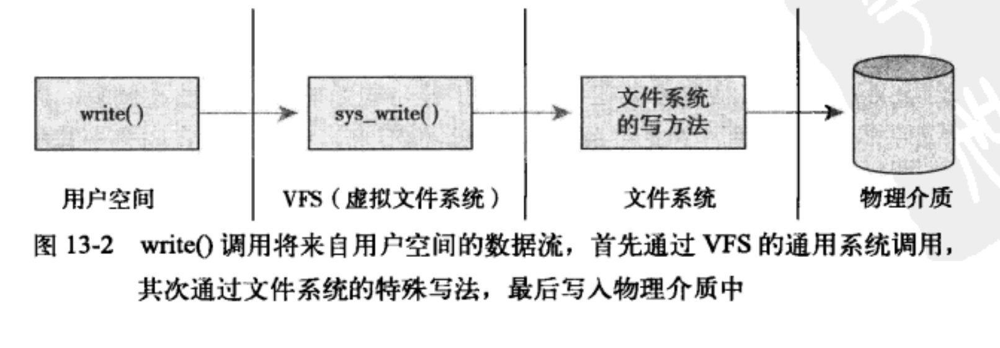
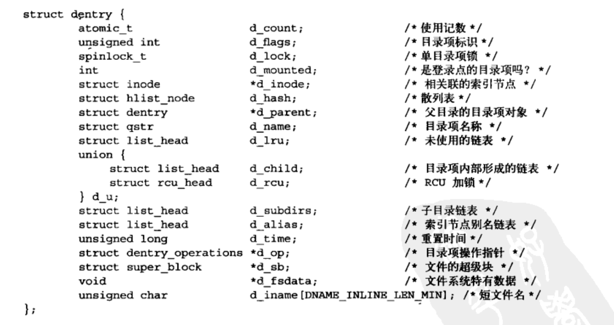
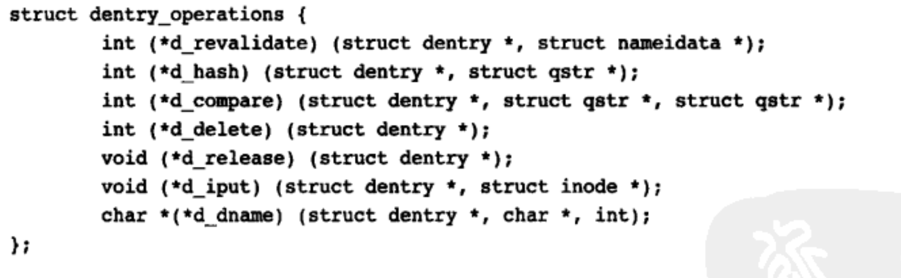

# 虚拟文件系统

虚拟文件系统VFS作为内核子系统，为用户空间程序提供了文件和文件系统相关的接口。通过虚拟文件系统，程序可以利用标准的Uinx系统调用对不同的文件系统，甚至不同介质上的文件系统进行读写操作。

### 1. 通用的文件系统接口

​		VFS使得用户可以直接使用open()、read()和write()这样的系统调用而无须考虑具体文件系统和实际的物理介质。正是由于现代操作系统引入抽象层，通过虚拟接口访问文件系统，才使得这种协作性和泛型存取成为可能。
​		新的文件系统和新类型的存储介质都能找到进入linux之路，而程序无须重写，甚至无须重新编译。

### 2. 文件系统抽象层

​		之所以可以使用这种通用接口对所有类型的文件系统进行操作，是因为 内核在他的底层文件系统接口上建立一个抽象层。VFS抽象层之所以能衔接各种各样的文件系统，是因为他定义了所有文件系统都支持的、基本的、概念上的接口和数据结构。同时实际文件系统也将自身的诸如“如何打开文件”，“目录是什么”等概念在形式上与vfs的定义保持一致。

​		内核通过抽象层能够方便、简单地支持各种类型的文件系统。实际文件系统通过编程提供vfs所期望的抽象接口和数据结构，这样，内核就可以豪不费力的和任何文件系统协同工作，并且这样提供给用户空间的接口。

​		

### 3. Unix文件系统

​		Unix使用了四种和文件系统相关的传统抽象概念：文件、目录项、索引节点和安装点(挂载点)。

​		从本质上讲文件系统是特殊的数据分层存储结构，它包括文件、目录和相关的控制信息。文件系统的通用操作包含创建、删除和安装等。在unix中，文件系统被安装在一个特定的安装点上，该安装点在全局层次结构中被称为命名空间。文件其实可以做一个有序字节串，字节串中第一个字节是文件的头，最后一个字节是文件的尾。文件操作有读，写，创建和删除。

​		文件通过目录组织起来。目录可以容纳相关文件，也可以包含其他目录，层层嵌套形成文件路径。路径的每一部分都被称作目录条目。在unix中，目录属于普通文件，他列出包含在其中的所有文件。VFS把目录当做文件对待，所有可以对目录执行和文件相同的操作。

​		Unix系统将文件的相关信息和文件本身这两个概念加以区分。文件的元数据用来控制权限，大小，拥有者，创建时间。文件的元数据被存储在一个单独的数据结构--索引节点(inode)中。

### 4.  VFS对象及其数据结构

VFS中有四个主要对象类型：

+ 超级块对象，它代表一个具体的已安装文件系统
+ 索引节点对象，它代表一个具体文件
+ 目录项对象，它代表一个目录项，是路径的一个组成部分
+ 文件对象，他代表进程打开的文件。

每个主要对象中都包含一个操作对象，这些操作对象描述了内核针对主要对象可以使用的方法：

+ super_operations对象，其中包括内核针对特定文件系统所能调用的方法，比如write_inode和sync_fs()
+ Inode_operations对象，其中包括内核针对特定文件所能调用的方法，create()和link()
+ dentry_operations对象,  包括针对特定目录所能调用方法，d_compare()和d_delete()
+ file_operations对象，其中包括进程针对已打开文件所能调用的方法

### 5 超级块对象 super_block结构表示

```c
 1 struct super_block {
 2     struct list_head    s_list;        /* Keep this first */
 3     dev_t            s_dev;        /* search index; _not_ kdev_t */
 4     unsigned char        s_dirt;
 5     unsigned char        s_blocksize_bits;
 6     unsigned long        s_blocksize;
 7     loff_t            s_maxbytes;    /* Max file size */
 8     struct file_system_type    *s_type;
 9     const struct super_operations    *s_op;
10     const struct dquot_operations    *dq_op;
11     const struct quotactl_ops    *s_qcop;
12     const struct export_operations *s_export_op;
13     unsigned long        s_flags;
14     unsigned long        s_magic;
15     struct dentry        *s_root;
16     struct rw_semaphore    s_umount;
17     struct mutex        s_lock;
18     int            s_count;
19     atomic_t        s_active;
20 #ifdef CONFIG_SECURITY
21     void                    *s_security;
22 #endif
23     const struct xattr_handler **s_xattr;
24 
25     struct list_head    s_inodes;    /* all inodes */
26     struct hlist_bl_head    s_anon;        /* anonymous dentries for (nfs) exporting */
27 #ifdef CONFIG_SMP
28     struct list_head __percpu *s_files;
29 #else
30     struct list_head    s_files;
31 #endif
32     struct list_head    s_mounts;    /* list of mounts; _not_ for fs use */
33     /* s_dentry_lru, s_nr_dentry_unused protected by dcache.c lru locks */
34     struct list_head    s_dentry_lru;    /* unused dentry lru */
35     int            s_nr_dentry_unused;    /* # of dentry on lru */
36 
37     /* s_inode_lru_lock protects s_inode_lru and s_nr_inodes_unused */
38     spinlock_t        s_inode_lru_lock ____cacheline_aligned_in_smp;
39     struct list_head    s_inode_lru;        /* unused inode lru */
40     int            s_nr_inodes_unused;    /* # of inodes on lru */
41 
42     struct block_device    *s_bdev;
43     struct backing_dev_info *s_bdi;
44     struct mtd_info        *s_mtd;
45     struct hlist_node    s_instances;
46     struct quota_info    s_dquot;    /* Diskquota specific options */
47 
48     int            s_frozen;
49     wait_queue_head_t    s_wait_unfrozen;
50 
51     char s_id[32];                /* Informational name */
52     u8 s_uuid[16];                /* UUID */
53 
54     void             *s_fs_info;    /* Filesystem private info */
55     unsigned int        s_max_links;
56     fmode_t            s_mode;
57 
58     /* Granularity of c/m/atime in ns.
59        Cannot be worse than a second */
60     u32           s_time_gran;
61 
62     /*
63      * The next field is for VFS *only*. No filesystems have any business
64      * even looking at it. You had been warned.
65      */
66     struct mutex s_vfs_rename_mutex;    /* Kludge */
67 
68     /*
69      * Filesystem subtype.  If non-empty the filesystem type field
70      * in /proc/mounts will be "type.subtype"
71      */
72     char *s_subtype;
73 
74     /*
75      * Saved mount options for lazy filesystems using
76      * generic_show_options()
77      */
78     char __rcu *s_options;
79     const struct dentry_operations *s_d_op; /* default d_op for dentries */
80 
81     /*
82      * Saved pool identifier for cleancache (-1 means none)
83      */
84     int cleancache_poolid;
85 
86     struct shrinker s_shrink;    /* per-sb shrinker handle */
87 
88     /* Number of inodes with nlink == 0 but still referenced */
89     atomic_long_t s_remove_count;
90 
91     /* Being remounted read-only */
92     int s_readonly_remount;
93 };
```

#### 6 超级快操作

```c
struct super_operations {
        //该函数在给定的超级块下创建并初始化一个新的索引节点对象
   	struct inode *(*alloc_inode)(struct super_block *sb);
        //释放指定的索引结点 。
	void (*destroy_inode)(struct inode *);
        //VFS在索引节点被修改时会调用此函数。
   	void (*dirty_inode) (struct inode *, int flags);
        // 将指定的inode写回磁盘。
	int (*write_inode) (struct inode *, struct writeback_control *wbc);
        //删除索引节点。
	int (*drop_inode) (struct inode *);
        
	void (*evict_inode) (struct inode *);
        //用来释放超级块
	void (*put_super) (struct super_block *);
        //使文件系统的数据元素与磁盘上的文件系统同步，wait参数指定操作是否同步。
	int (*sync_fs)(struct super_block *sb, int wait);
	int (*freeze_fs) (struct super_block *);
	int (*unfreeze_fs) (struct super_block *);
        //获取文件系统状态。把文件系统相关的统计信息放在statfs中
	int (*statfs) (struct dentry *, struct kstatfs *);
	int (*remount_fs) (struct super_block *, int *, char *);
	void (*umount_begin) (struct super_block *);
 
	int (*show_options)(struct seq_file *, struct dentry *);
	int (*show_devname)(struct seq_file *, struct dentry *);
	int (*show_path)(struct seq_file *, struct dentry *);
	int (*show_stats)(struct seq_file *, struct dentry *);
#ifdef CONFIG_QUOTA
	ssize_t (*quota_read)(struct super_block *, int, char *, size_t, loff_t);
	ssize_t (*quota_write)(struct super_block *, int, const char *, size_t, loff_t);
#endif
	int (*bdev_try_to_free_page)(struct super_block*, struct page*, gfp_t);
	long (*nr_cached_objects)(struct super_block *, int);
	long (*free_cached_objects)(struct super_block *, long, int);
};

```

该结构体的每一项都是执行超级操作函数的指针。超级块操作函数执行文件系统和索引节点的底层操作。
当文件系统需要超级块执行操作时，首先要在超级块对象中寻找需要的操作方法。比如，如果一个文件系统要写自己的超级块，需要调用:

```c
sb->s_op->write_super(sb);
//sb是指向文件系统超级块的指针，沿着该指针进入超级块操作函数表s_op，并从表中希望得到的write_super()函数，该函数执行写入超级块的实际操作。
```

```c
//在给定的超级快下创建和初始化一个新的索引节点对象
struct iNode *alloc_inode(struct super_block *sb);
//用于释放给定的索引节点
void destroy_inode(struct inode *inode);
//VFS在索引节点脏时会调用此函数
void dirty_inode(struct inode *inode);
//用于将给定的索引节点写入磁盘
void write_inode(struct inode *inode,int *inode);
//在最后一个指向索引节点的引用被释放后，VFS会调用该函数
void drop_inode(struct inode *inode);
//从磁盘上删除给定的索引节点
void delete_inode(struct inode *inode)；
//在卸载文件系统由VFS调用，用来释放超级块
void put_super(struct super_block *sb);
//用给定的超级块更新磁盘上的超级块
void write_super(struct super_block *sb);
//使文件系统的数据元与磁盘上的文件系统同步
int sync_fs(struct super_block *sb, int wait);
//禁止对文件系统做改变，在使用给定的超级块更新磁盘上的超级块
void write_super_lockfs(struct super_block *sb);
```

### 7 索引节点对象

```c
 1 struct inode {
 2     umode_t            i_mode;
 3     unsigned short        i_opflags;
 4     kuid_t            i_uid;
 5     kgid_t            i_gid;
 6     unsigned int        i_flags;
 7 
 8 #ifdef CONFIG_FS_POSIX_ACL
 9     struct posix_acl    *i_acl;
10     struct posix_acl    *i_default_acl;
11 #endif
12 
13     const struct inode_operations    *i_op;
14     struct super_block    *i_sb;
15     struct address_space    *i_mapping;
16 
17 #ifdef CONFIG_SECURITY
18     void            *i_security;
19 #endif
20 
21     /* Stat data, not accessed from path walking */
22     unsigned long        i_ino;
23     /*
24      * Filesystems may only read i_nlink directly.  They shall use the
25      * following functions for modification:
26      *
27      *    (set|clear|inc|drop)_nlink
28      *    inode_(inc|dec)_link_count
29      */
30     union {
31         const unsigned int i_nlink;
32         unsigned int __i_nlink;
33     };
34     dev_t            i_rdev;
35     loff_t            i_size;
36     struct timespec        i_atime;
37     struct timespec        i_mtime;
38     struct timespec        i_ctime;
39     spinlock_t        i_lock;    /* i_blocks, i_bytes, maybe i_size */
40     unsigned short          i_bytes;
41     unsigned int        i_blkbits;
42     blkcnt_t        i_blocks;
43 
44 #ifdef __NEED_I_SIZE_ORDERED
45     seqcount_t        i_size_seqcount;
46 #endif
47 
48     /* Misc */
49     unsigned long        i_state; /*索引节点的状态标志*/
50     struct mutex        i_mutex;
51 
52     unsigned long        dirtied_when;    /* jiffies of first dirtying */
53     unsigned long        dirtied_time_when;
54 
55     struct hlist_node    i_hash; /*指向哈希链表的指针*/
56     struct list_head    i_io_list;    /* backing dev IO list */
57 #ifdef CONFIG_CGROUP_WRITEBACK
58     struct bdi_writeback    *i_wb;        /* the associated cgroup wb */
59 
60     /* foreign inode detection, see wbc_detach_inode() */
61     int            i_wb_frn_winner;
62     u16            i_wb_frn_avg_time;
63     u16            i_wb_frn_history;
64 #endif
65     struct list_head    i_lru;        /* inode LRU list 指向索引节点链表的指针*/
66     struct list_head    i_sb_list; /*指向超级块的指针*/
67     union {
68         struct hlist_head    i_dentry;
69         struct rcu_head        i_rcu;
70     };
71     u64            i_version;
72     atomic_t        i_count;
73     atomic_t        i_dio_count;
74     atomic_t        i_writecount;
75 #ifdef CONFIG_IMA
76     atomic_t        i_readcount; /* struct files open RO */
77 #endif
78     const struct file_operations    *i_fop;    /* former ->i_op->default_file_ops */
79     struct file_lock_context    *i_flctx;
80     struct address_space    i_data;
81     struct list_head    i_devices;
82     union {
83         struct pipe_inode_info    *i_pipe;
84         struct block_device    *i_bdev;
85         struct cdev        *i_cdev;
86         char            *i_link;
87     };
88 
89     __u32            i_generation;
90 
91 #ifdef CONFIG_FSNOTIFY
92     __u32            i_fsnotify_mask; /* all events this inode cares about */
93     struct hlist_head    i_fsnotify_marks;
94 #endif
95 
96     void            *i_private; /* fs or device private pointer */
97 };
```

### 8 索引节点操作


### 9 目录项对象

VFS把目录当做文件对待，在/bin/vi中，bin是特殊的目录文件而vi只是一个普通文件，路径中的每个组成部分都有一个索索引节点对象表示。

为了方便查找操作，VFS引入目录项的概念。每个dentry代表路径的一个特定部分。/bin/vi,   /、bin、vi都是目录项对象。前两个是目录，后一个是文件。

目录项对象由dentry结构体表示：


#### 9.1 目录项状态

目录项对象有三种有效状态：被使用、未被使用和负状态。

一个被使用的目录项对应一个有效的索引节点，有多个使用者，d_count值为正值。

一个未被使用的目录项对应一个有效的索引节点，有多个使用者，d_count值为0。

一个负状态的目录项没有索引节点。d_inode索引节点已经被删除了，或路径不再正确。该目录项依然保留，以便快速解析。

#### 9.2 目录项缓存

+ “被使用”目录项链表。该链表通过索引节点对象中的i_dentry项连接相关的索引节点，因为一个给定的索引节点可能有多个连接

+ “最近被使用的”双向链表。该链表包含未被使用和负状态的项目项对象。

+ 散列表和对应的散列函数用来快速地将给定路径解析为相关目录项对象

  ​	散列表由数组dentry_hashtable表示，其中每一个元素都是一个指向具有相同键值的目录项对象链表的指针。散列值由d_hash()函数计算。散列表通过d_lookup函数，查找匹配的项。
  ​	VFS会在目录项缓存中搜索路径名，直接使用。如果不存在，VFS就必须自己通过遍历文件为每个路径分量解析路径，解析完毕后，再将目录项对象加入dcache中。

#### 10. 目录项操作

​		dentry_operation结构体指明了VFS操作目录项的所有方法



1.判断目录对象是否有效

```c
int d_revalidate(struct dentry *dentry, struct nameidata*)
```

VFS准备从dcache中使用一个目录项时，会调用该函数。
2.生成散列值

```c
int d_hash(struct dentry *dentry, struct qstr *name)
```

3.比较两个文件名

```c
int d_compare(struct dentry *dentry, struct qstr *name1, struct qstr *name2)
```

4.d_delete锁

```c
int d_delete(struct dentry *dentry)
```

当目录项对象的d_count计数值等于0时，VFS调用该函数。

5.释放目录项对象

```c
void d_iput(struct dentry *dentry, struct inode *inode)
```

### 11.文件对象

文件对象表示进程已打开的文件。该对象是相应的open()系统调用创建，由close()调用撤销。因此多个进程可以同时打开和操作同一个文件，所以一个文件也可能存在多个对应的文件对象。目录项对象才表示已打开的实际文件。

```c
struct file{
		union{
				struct list_head fu_list;		/* 文件对象链表 */	
				struct rcu_head  fu_rchead;	/* 释放之后的RCU的链表 */
		}f_u；
		struct path	f_path;							/* 包含目录项 */
  	struct file_operation	*f_op;		/* 文件操作表 */
  	spinlock_t f_lock;						  /* 单个文件结构锁 */
  	atomic_t f_count;								/* 文件对象的使用计数 */
  	unsigned  int  f_flags;					/* 当打开文件时所指定的标志 */
  	mode_t	f_mode;									/* 文件的访问模式 */
  	loff_t  fown_struct  f_pos;			/* 文件当前的位移量 */
    struct fown_struct  f_owner;    /* 拥有者通过信号进行异步I/0数据的传送 */
  	const struct cred;							/* 文件的信任状 */
  	struct file_ra_state	f_ra;			/* 预读状态 */
  	u64	f_version;									/* 版本号 */
  	void *f_security;								/* 安全模块 */
  	void *private_data;							/* tty 设备驱动的钩子 */
  	struct list_head f_ep_links;		/* 事件池链表 */
  	spinlock_t	f_ep_lock;					/* 事件池锁 */
  	struct address_space	*f_mapping; /* 页缓存映射 */
    unsigned long 	f_mnt_write_state /* 调试状态*/  
}
```

### 12. 文件操作

```c
struct file_operations {
        struct module *owner;
        loff_t (*llseek) (struct file *, loff_t, int);
        ssize_t (*read) (struct file *, char __user *, size_t, loff_t *);
        ssize_t (*write) (struct file *, const char __user *, size_t, loff_t *);
        ssize_t (*aio_read) (struct kiocb *, const struct iovec *, unsigned long, loff_t);
        ssize_t (*aio_write) (struct kiocb *, const struct iovec *, unsigned long, loff_t);
        int (*readdir) (struct file *, void *, filldir_t);
        unsigned int (*poll) (struct file *, struct poll_table_struct *);
        long (*unlocked_ioctl) (struct file *, unsigned int, unsigned long);
        long (*compat_ioctl) (struct file *, unsigned int, unsigned long);
        int (*mmap) (struct file *, struct vm_area_struct *);
        int (*open) (struct inode *, struct file *);
        int (*flush) (struct file *, fl_owner_t id);
        int (*release) (struct inode *, struct file *);
        int (*fsync) (struct file *, loff_t, loff_t, int datasync);
        int (*aio_fsync) (struct kiocb *, int datasync);
        int (*fasync) (int, struct file *, int);
        int (*lock) (struct file *, int, struct file_lock *);
        ssize_t (*sendpage) (struct file *, struct page *, int, size_t, loff_t *, int);
        unsigned long (*get_unmapped_area)(struct file *, unsigned long, unsigned long, unsigned long, unsigned long);
        int (*check_flags)(int);
        int (*flock) (struct file *, int, struct file_lock *);
        ssize_t (*splice_write)(struct pipe_inode_info *, struct file *, loff_t *, size_t, unsigned int);
        ssize_t (*splice_read)(struct file *, loff_t *, struct pipe_inode_info *, size_t, unsigned int);
        int (*setlease)(struct file *, long, struct file_lock **);
        long (*fallocate)(struct file *file, int mode, loff_t offset,loff_t len);
        int (*show_fdinfo)(struct seq_file *m, struct file *f);
};
```

### 13 和文件系统相关的数据结构

file_system_type用来描述各种特定文件系统类型，第二个结构体是vfsmount用来描述安装文件系统的实例。

```c
struct file_system_type {
  const char *name;
  int  fs_flags;
  struct super_block *(*get_sb);		//读取超级块
  void (*kill_sb);
  struct module *owner;
  struct file_system_type  *next;
  struct list_head  fs_supers;
  
  struct lock_class_key s_lock_key;
  struct lock_class_key s_umount_key;
  struct lock_class_key i_lock_key;
  struct lock_class_key i_mutex_key;
  struct lock_class_key i_mutex_dir_key;
  struct lock_class_key i_alloc_sem_key;
}
```

当文件系统被实际安装时，将有一个vfsmount结构体在安装点被创建。

```c
struct vfsmount {
		struct list_head mnt_hash;
		struct vfsmount *mnt_parent;
  	struct dentry *mnt_mountpoint;
  	struct dentry *mnt_root;
  	struct super_block *mnt_sb;
  	struct list_head mnt_mounts;
  	struct list_head mnt_child;
  	int		mnt_flags;
  	char	*mnt_devname;
  	struct list_head mnt_list;
  	struct list_head mnt_expire;
  	struct list_head mnt_share;
  	struct list_head mnt_slave_list;
  	struct list_head mnt_slave;
  	struct vfsmount  *mnt_master;
  	struct mnt_namespace *mnt_namespace;
  	int mnt_id;
  	int mnt_group_id;
  	atomic_t mnt_count;
  	int mnt_expiry_mark;
  	int mnt_pinned;
  	int mnt_ghosts;
  	atomic_t _mnt_writes;
}
```

### 14 和进程相关的数据结构

```c
struct files_struct{
		atomic_t count;  			 /* 结构使用计数 */
  	struct fdtable *fdt;	 /* 指向其他fd表的指针 */
  	struct fdtable fdtab;	 /* 基fd表 */
  	spinlock_t   file_lock; /* 单个文件的锁 */
    int next_fd; /* 缓存下一个可用的fd */  
  	struct embedded_fd_set close_on_exec_init; 
  	struct embedded_fd_set open_fds_init;
  	struct file *fd_array[NR_OPEN_DEFAULT];
}
```

fd_array数组指针指向已打开的文件对象。

```c
struct fs_struct{
	int 		users;	/* 用户数目 */
	rwlock_t lock;	/* 保护该结构体 */
	int  umask;			/* 掩码 */
	int in_exec;		/* 正在执行的文件 */
	struct path root;	/* 根目录路径 */
	struct path pwd; /* 当前工作目录的路径 */
}
```

该结构体包含了当前进的当前工作目录和跟目录

```c
struct mmt_namespace{
	atomic_t 					count;		/* 结构的使用计数 */
  struct vfsmount   *root;		/* 根目录的安装点对象 */
  struct list_head  list;			/* 安装点链接 */
  wait_queue_head_t poll;			/* 轮询的等待队列 */
  int               event;		/* 事件计数 */
}
```

list域是连接已安装文件系统的双向链表，它包含的元素组成了全体命名空间。数据结构都是通过进程描述符连接起来的。对多数进程来说，他们的描述符都指向唯一的files_struct和fs_struct结构体。但是那些克隆标志CLONE_FILES或CLONE_FS创建的进程，会共享这两个结构体。

