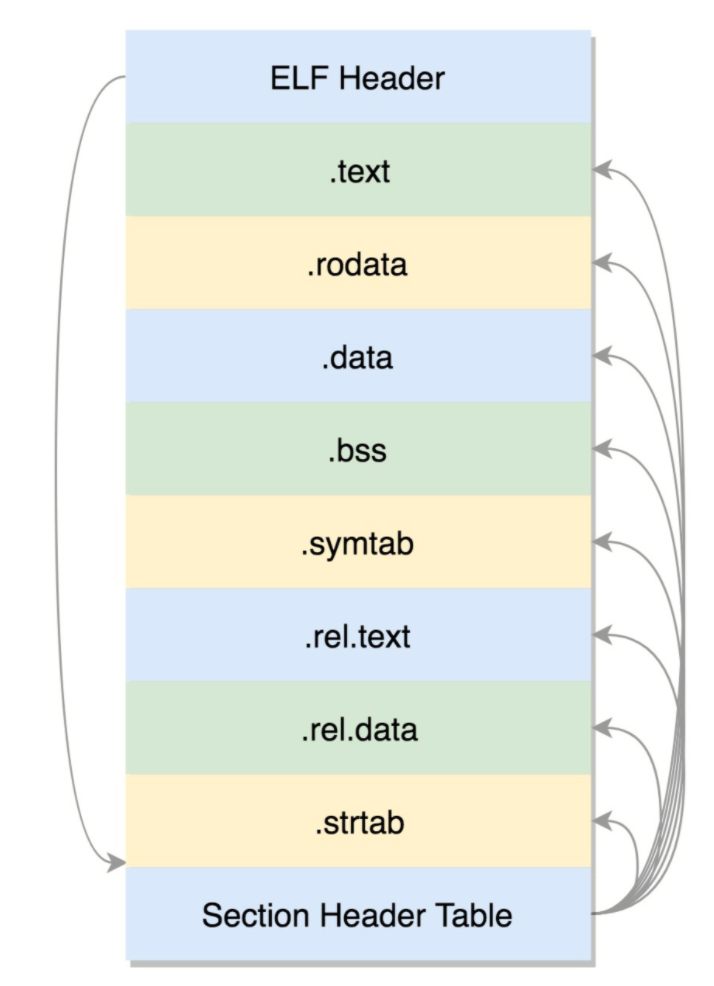
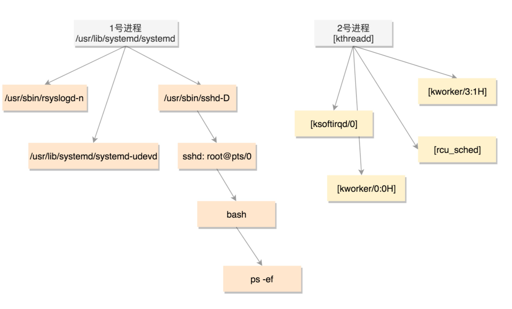
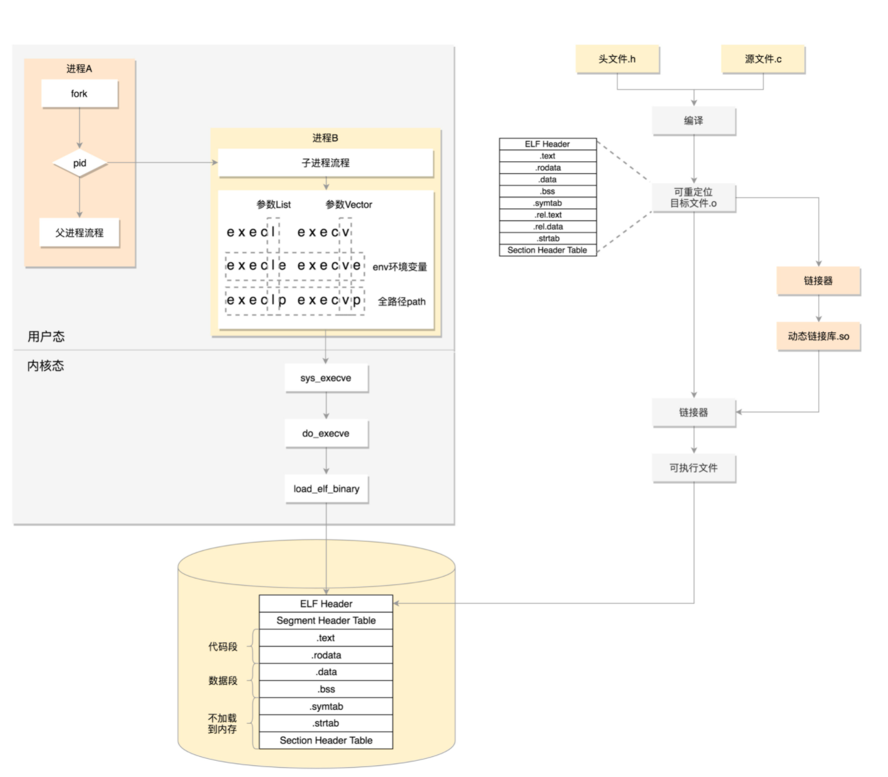

一、程序的二进制格式

在Linux系统中运行一个可执行的ELF文件时，内核首先需要识别这个文件，然后解析并装载它以构建进程的内存空间，最后切换到新的进程来运行。

在linux下面，二进制也要有严格的格式。**ELF**（Executeable and Linkable Format，可执行与可链接格式）
		编译过程：
		

​				编译过程，最终编译成为.o 文件，这就是 ELF 的第一种类型，**可重定位文件**（Relocatable File）。
​				这个文件的格式是这样的：
​				

​				ELF 文件的头是用于描述整个文件的。

​						.text：放编译好的二进制可执行代码
​						.data：已经初始化好的全局变量
​						.rodata：只读数据，字符串常量，const的变量
​						.bss：未初始化全局变量，运行时会置0
​						.symtab：符号表，函数和变量
​						.strtab：字符串表、字符串常量和变量名

​			静态链接库一旦链接进去，代码和变量的 section 都合并了，因而程序运行的时候，就不依赖于这个库是否存在

​			**动态链接库**（Shared Libraries），不仅仅是一组对象文件的简单归档，而是多个对象文件的重新组合，可被多个程序共享
​			系统在 /lib 和 /usr/lib 文件夹下寻找动态链接库。如果找不到就会报错，我们可以设定 LD_LIBRARY_PATH 环境变量，程序运行时会在此环境变量指定的文件夹下寻找动态链接库
​			

​	运行程序为进程

​	既然所有的进程都是从父进程 fork 过来的，那总归有一个祖宗进程，这就是咱们系统启动的 init 进程

​		

​												
​						