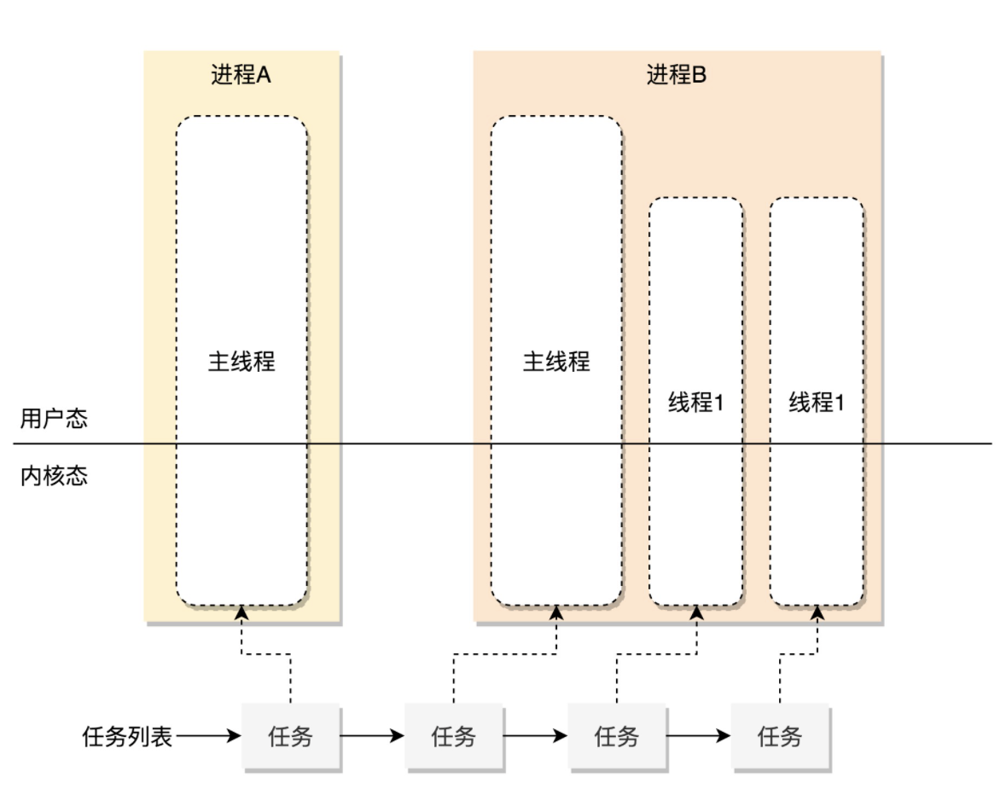
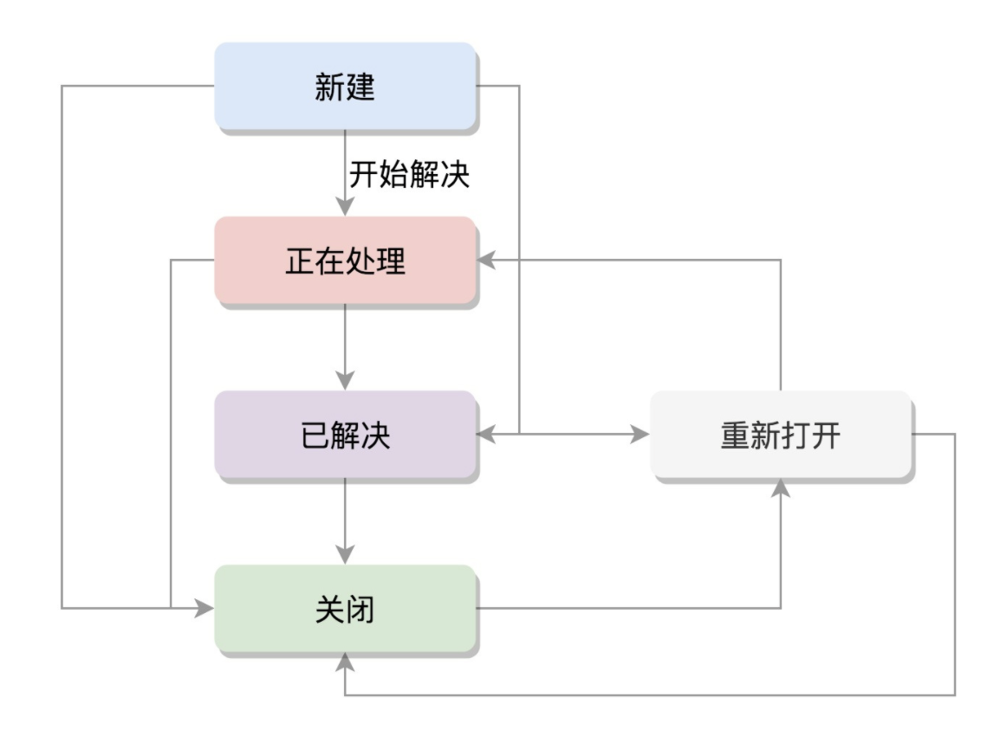
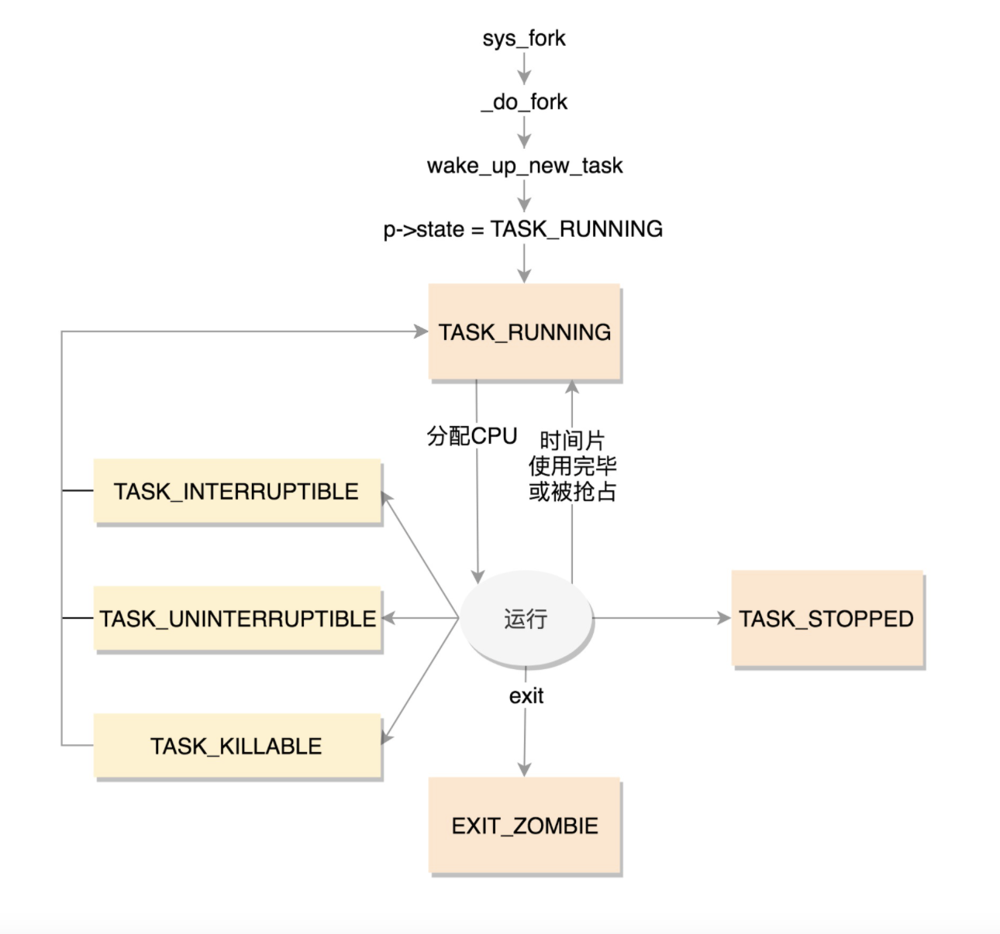
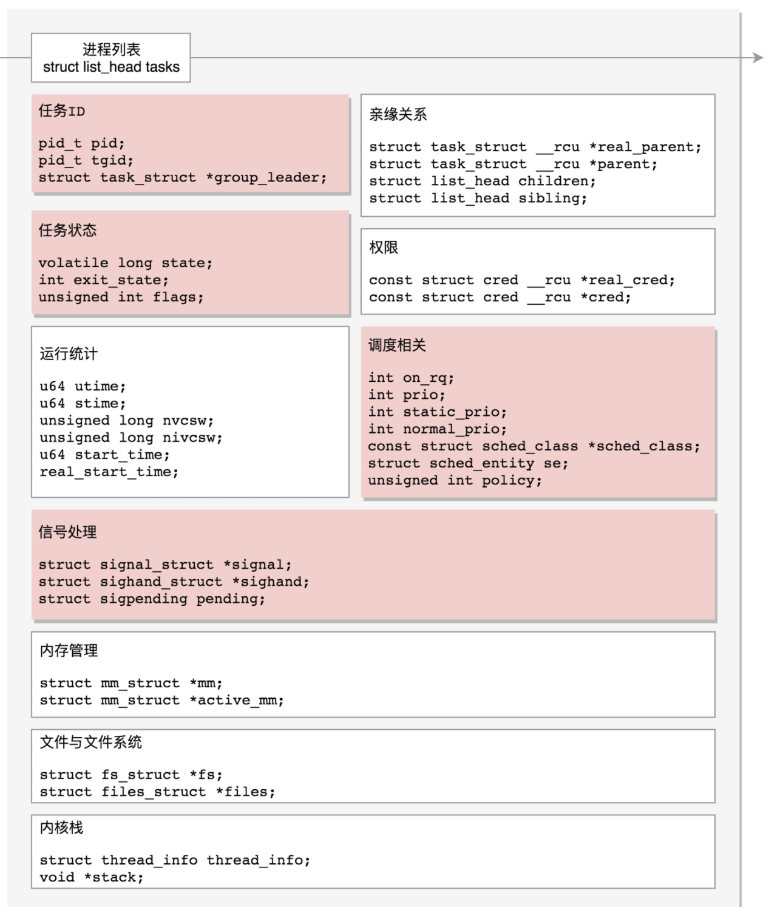

Linux 里面，无论是进程，还是线程，到了内核里面，我们统一都叫任务（Task），由一个统一的结构**task_struct**进行管理：

​			

 Linux 内核也应该先弄一个**链表**，将所有的 task_struct 串起来

```
struct list_head		tasks;
···
pid_t pid;
pid_t tgid;
struct task_struct *group_leader;
```

pid 是 process id，tgid 是 thread group ID，group_leader 指向的就是进程的主线程

信号处理

```
/* Signal handlers: */
struct signal_struct		*signal;
struct sighand_struct		*sighand;
sigset_t			blocked;		//被阻塞暂不处理
sigset_t			real_blocked;
sigset_t			saved_sigmask;
struct sigpending		pending;	//等待处理
//信号处理函数默认使用用户态的函数栈，当然也可以开辟新的栈专门用于信号处理，这就是 sas_ss_xxx 这三个变量的作用。
unsigned long			sas_ss_sp;
size_t				sas_ss_size;
unsigned int			sas_ss_flags;
```

任务状态


```
 volatile long state;    /* -1 unrunnable, 0 runnable, >0 stopped */
 int exit_state;
 unsigned int flags;
```

state

```
/* Used in tsk->state: */
#define TASK_RUNNING                    0
#define TASK_INTERRUPTIBLE              1
#define TASK_UNINTERRUPTIBLE            2
#define __TASK_STOPPED                  4
#define __TASK_TRACED                   8
/* Used in tsk->exit_state: */
#define EXIT_DEAD                       16
#define EXIT_ZOMBIE                     32
#define EXIT_TRACE                      (EXIT_ZOMBIE | EXIT_DEAD)
/* Used in tsk->state again: */
#define TASK_DEAD                       64
#define TASK_WAKEKILL                   128
#define TASK_WAKING                     256
#define TASK_PARKED                     512
#define TASK_NOLOAD                     1024
#define TASK_NEW                        2048
#define TASK_STATE_MAX                  4096
```



TASK_RUNNING 并不是说进程正在运行，而是表示进程在时刻准备运行的状态。当处于这个状态的进程获得时间片的时候，就是在运行中；如果没有获得时间片，就说明它被其他进程抢占了，在等待再次分配时间片。

在 Linux 中，有两种睡眠状态。

一种是**TASK_INTERRUPTIBLE**，**可中断的睡眠状态**。这是一种浅睡眠的状态，也就是说，虽然在睡眠，等待 I/O 完成，但是这个时候一个信号来的时候，进程还是要被唤醒。只不过唤醒后，不是继续刚才的操作，而是进行信号处理

另一种睡眠是**TASK_UNINTERRUPTIBLE**，**不可中断的睡眠状态**。这是一种深度睡眠状态，不可被信号唤醒，只能死等 I/O 操作完成

新的进程睡眠状态，**TASK_KILLABLE，可以终止的新睡眠状态**

