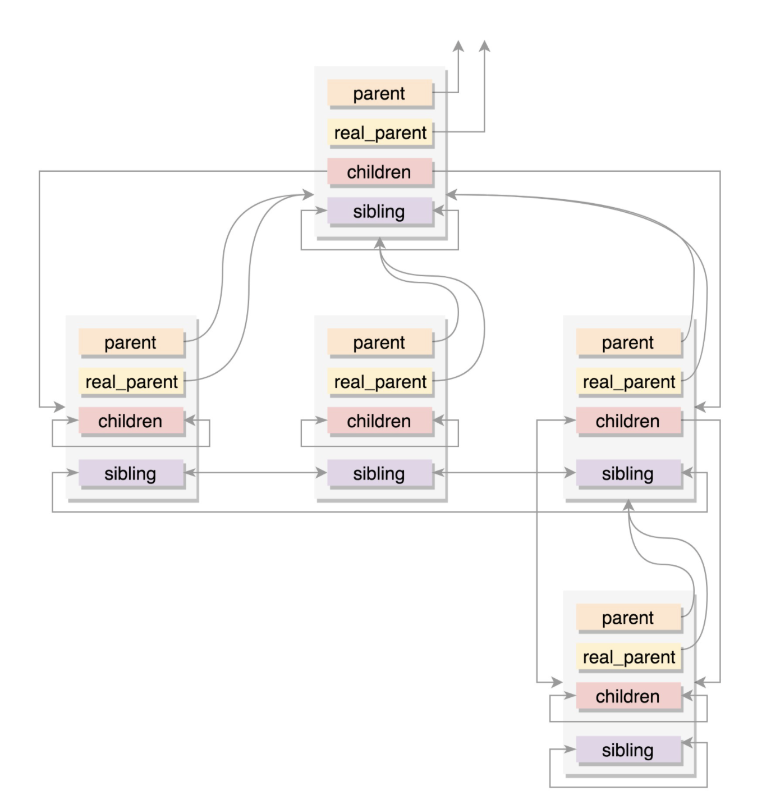

进程运行时的统计信息

```
u64				utime;// 用户态消耗的 CPU 时间
u64				stime;// 内核态消耗的 CPU 时间
unsigned long			nvcsw;// 自愿 (voluntary) 上下文切换计数
unsigned long			nivcsw;// 非自愿 (involuntary) 上下文切换计数
u64				start_time;// 进程启动时间，不包含睡眠时间
u64				real_start_time;// 进程启动时间，包含睡眠时间
```

进程的亲缘关系

```
struct task_struct __rcu *real_parent; /* real parent process */
struct task_struct __rcu *parent; /* recipient of SIGCHLD, wait4() reports */
struct list_head children;      /* list of my children */
struct list_head sibling;       /* linkage in my parent's children list */
```

- parent 指向其父进程。当它终止时，必须向它的父进程发送信号。
- children 表示链表的头部。链表中的所有元素都是它的子进程。
- sibling 用于把当前进程插入到兄弟链表中



进程的权限
		

```
/* Objective and real subjective task credentials (COW): */
const struct cred __rcu         *real_cred;
/* Effective (overridable) subjective task credentials (COW): */
const struct cred __rcu         *cred;
```

```
struct cred {
......
        kuid_t          uid;            /* real UID of the task */
        kgid_t          gid;            /* real GID of the task */
        kuid_t          suid;           /* saved UID of the task */
        kgid_t          sgid;           /* saved GID of the task */
        kuid_t          euid;           /* effective UID of the task */
        kgid_t          egid;           /* effective GID of the task */
        kuid_t          fsuid;          /* UID for VFS ops */
        kgid_t          fsgid;          /* GID for VFS ops */
......
        kernel_cap_t    cap_inheritable; /* caps our children can inherit */
        kernel_cap_t    cap_permitted;  /* caps we're permitted */
        kernel_cap_t    cap_effective;  /* caps we can actually use */
        kernel_cap_t    cap_bset;       /* capability bounding set */
        kernel_cap_t    cap_ambient;    /* Ambient capability set */
......
} __randomize_layout;
```

第一个是 uid 和 gid，注释是 real user/group id。一般情况下，谁启动的进程，就是谁的 ID

第二个是 euid 和 egid，注释是 effective user/group id。一看这个名字，就知道这个是起“作用”的

第三个是 fsuid 和 fsgid，也就是 filesystem user/group id。这个是对文件操作会审核的权限。
文件权限除了r、w、x外还有s、t、i、a权限：
s：文件属主和组设置SUID和GUID，文件在被设置了s权限后将以root身份执行。在设置s权限时文件属主、属组必须先设置相应的x权限，否则s权限并不能正真生效（c h m o d命令不进行必要的完整性检查，即使不设置x权限就设置s权限，chmod也不会报错，当我们ls -l时看到rwS，大写S说明s权限未生效）。Linux修改密码的passwd便是个设置了SUID的程序，普通用户无读写/etc/shadow文件的权限确可以修改自己的密码。
我们可以通过字符模式设置s权限：chmod a+s filename，也可以使用绝对模式进行设置