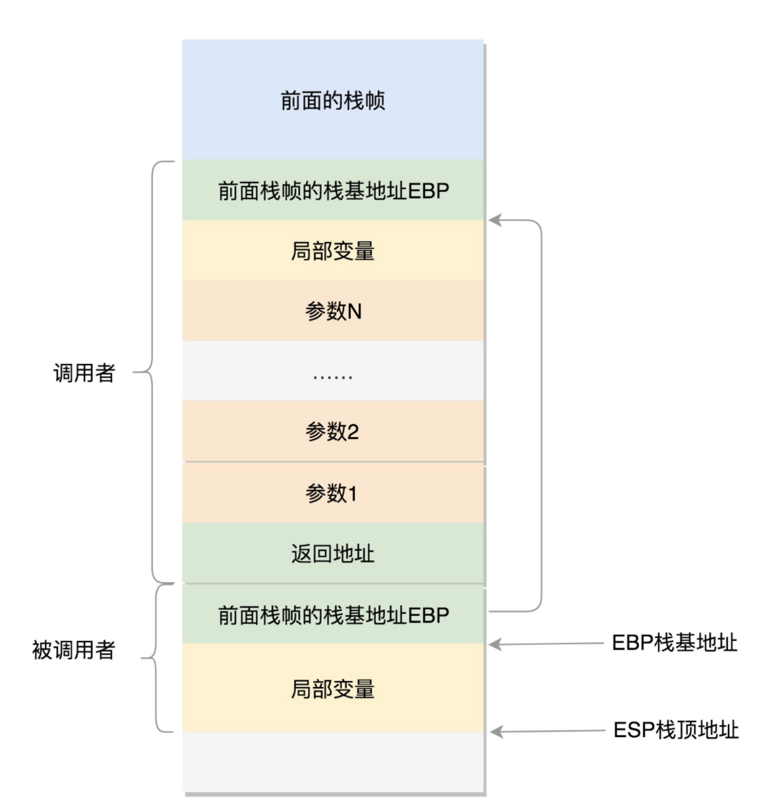
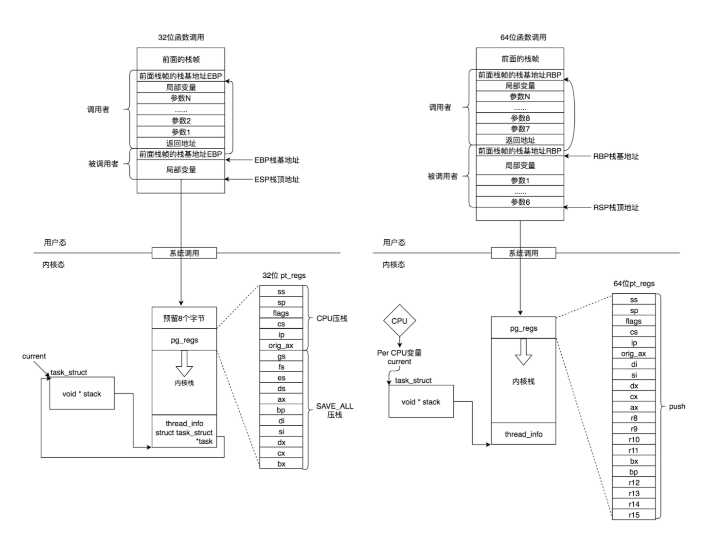

用户态函数栈
在进程的内存空间里面，栈是一个从高地址到低地址，往下增长的结构，也就是上面是栈底，下面是栈顶，入栈和出栈的操作都是从下面的栈顶开始的

在 CPU 里，**ESP**（Extended Stack Pointer）是栈顶指针寄存器，入栈操作 Push 和出栈操作 Pop 指令，会自动调整 ESP 的值。另外有一个寄存器**EBP**（Extended Base Pointer），是栈基地址指针寄存器，指向当前栈帧的最底部。

Linux 给每个 task 都分配了内核栈

