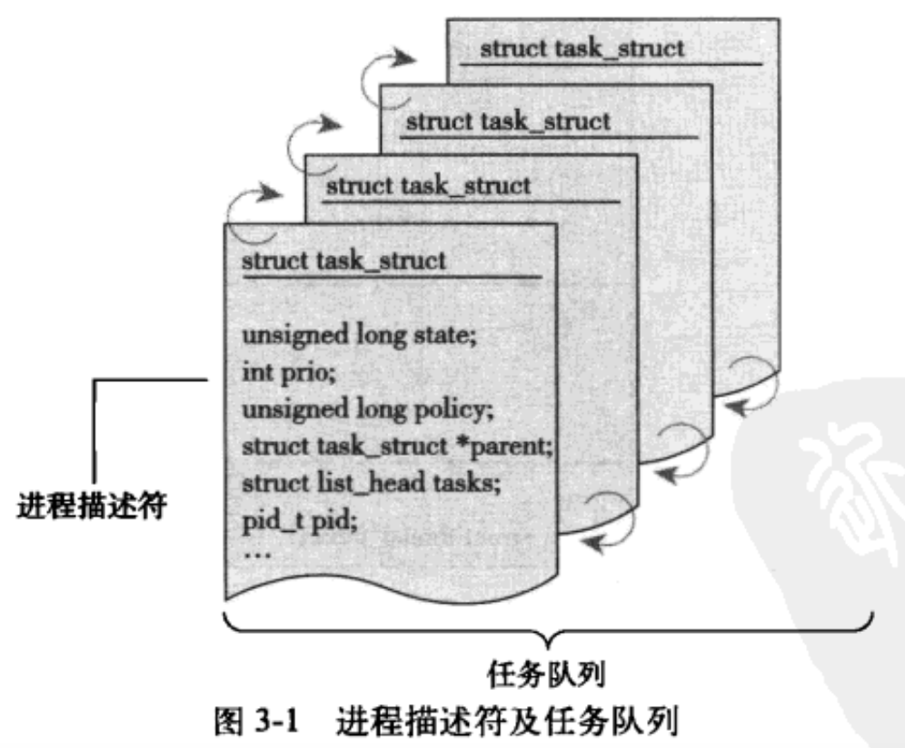
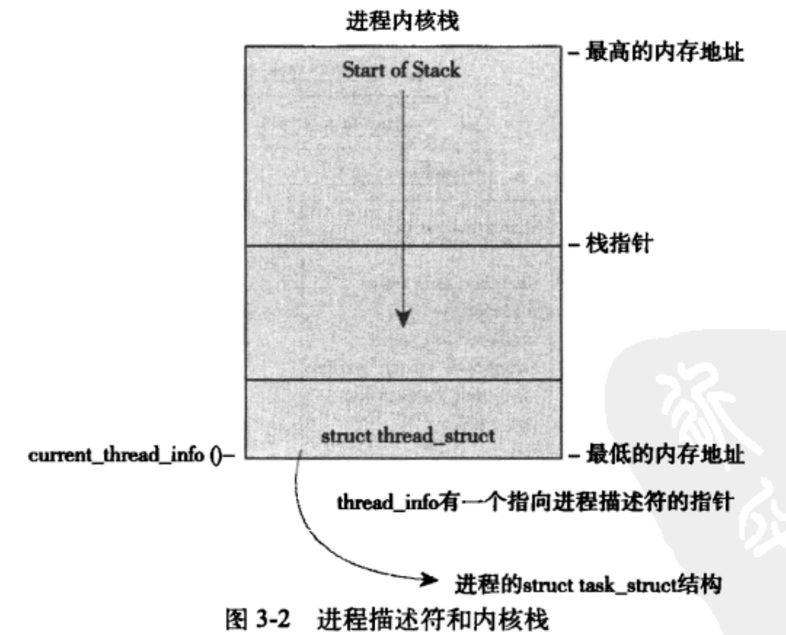
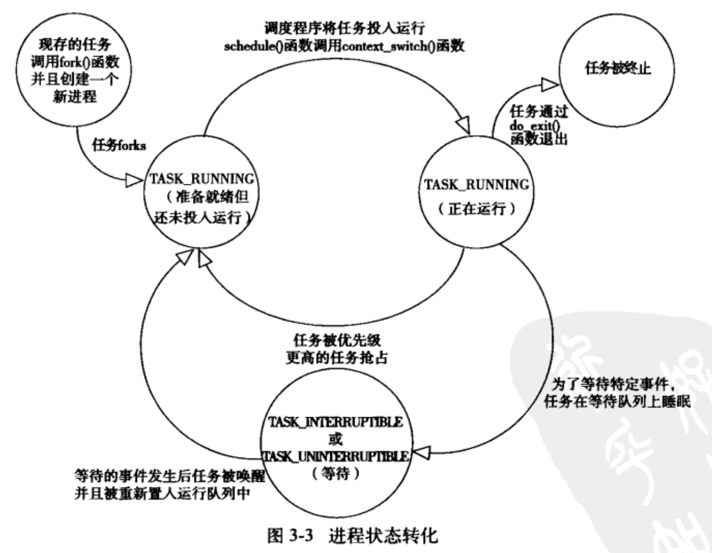

​	进程还要包含其他资源，打开的文件，挂起的信号，内核内部数据，处理状态，具有内存映射的内存地址以及执行线程，全局变量的数据段。

​	线程是进程中活动的对象，每个线程都拥有一个独立的程序计数器、进程栈和一组进程寄存器。内核调度的对象是线程。

现代操作系统，进程提供两种虚拟机制：虚拟处理器和虚内存。线程之间共享虚拟内存，却拥有各自的虚拟处理器。
在linux系统中，通常是调用fork（）系统的结果，该系统调用复制一个现有进程来创建一个全新的进程。
fork()系统调用从内核返回两次：一次回到父进程，一次回到新产生的子进程。创建的进程都是为了立即执行新的程序，而接着调用exec()函数创建新的地址空间，并把新的程序载入其中。最终程序通过exit()系统调用退出执行。父进程可以通过wait4()系统调用查询子进程是否总结。进程退出执行后被设置为僵死状态。

###### 进程描述符以及任务结构

内核把进程的列表存放在任务队列（task list）的双向循环链表中。链表的每一项都是task_struct的进程描述符。

linux通过slab分配器分配task_struct，达到对象复用和缓存着色，只需在内核栈的尾端创建一个struct_thread_info

```
struct thread_info{
	struct task_struct *task;
	struct exec_domain *exec_domain;
	__u32	 						 flags;
	__u32							 status;
	__u32							 cpu;
	int								 preempt_count;
  mm_segment_t       addr_limit;
  struct  restart_block restart_block;
  void							 *sysenter_return;
  int								 uaccess_err;
}
```



###### 进程描述符的存放

内核通过PID(process identification value)来表示每个进程.最大默认值为32768（short int 短整型的最大值），存放进程进程描述符中。

###### 进程状态

进程描述符state描述了进程的当前状态，系统的进程必然处于5个状态

+ TASK_RUNNING(运行) ---- 进程是可执行，正在执行，等待执行。
+ TASK_INTERRUPTIBLE(可中断)  ---- 进程正在睡眠，等待被唤醒。
+ TASK_UNINTERRUPTIBLE(不可中断) ---- 除了就算是接收到信号也不会被唤醒或准备投入运行之外，这个状态与可打断状态相同。这个状态的进程通常必须在等待时不受干扰或等待事件很快出现。
+ __TASK_TRACED  ---- 被其他进程跟踪的进程
+ __TASK_STOPPED (进程停止) ——进程停止运行。没有也不能投入运行。这种状态在接收到SIGSTOP,SIGTSTP,SIGTTIN,SIGTTOU等信号。
  

###### 设置进程的状态

```c
set_task_state(task,state)
```

###### 进程的上下文环境

可执行程序代码是进程的重要组成部分。这些代码从一个可执行文件载入到进程的地址空间。一般程序在用户空间执行，执行了系统调用或者触发异常，就会陷入内核空间。此时，称内核”代表进程执行“并处于进程上下文中。（current宏，是一个全局指针，指向当前进程的struct task_struct结构体，即表示当前进程。）

###### 进程家族树

linux中所有的进程都是PID为1的init进程的后代。每个进程都有个父进程，同个父进程的进程之间称为兄弟进程。每个task_struct中有个执行父进程的parent指针，而且还有包含子进程的链表

###### 进程的创建

linux中通过fork()和exec().通过fork()拷贝当前进程。exec读取可执行文件并将其载入地址空间执行。

###### 写时拷贝 copy-on-write

只有在写入的时候数据才会被复制。再次之前就是只是共享

###### fork()

linux通过clone()这个系统调用实现fork();fork()、vfork()、__clone() 根据各自需要参数标志去调用clone()。然后由clone()调用do_fork().do_for调用了，copy_process函数。

+ 调用dup_tast_struct()为新进程创建一个内核栈、thread_info 和task_struct,这些值和当前进程相同
+ 检查并确保新创建的这个子进程，当前用户所拥有的进程数目没有超过给它分配的资源的限制。
+ 子进程着手使自己和父进程区分开来。进程描述符许多成员变量都要被请0或设为初始值。
+ 子进程的状态设置为TASK_UNINTERRUPTIBLE,以保证他不会投入运行。
+ copy_process()调用copy_flags()以更新task_struct的flags成员
+ 调用alloc_pid()分配一个pid
+ 根据传递clone()参数标志。copy_process 拷贝或共享打开的文件、文件系统信息、信号处理函数、进程地址空间和命名空间。
+ 最后，copy_process()做扫尾工作并返回一个指向子进程的指针

在回到do_fork()函数，如果copy_process函数成功返回，新建的子进程被唤醒并让其投入运行。

###### vfork()

除了不拷贝父进程的页表项。和fock()功能相同。

##### 线程在linux的实现

该机制提供了同一程序内共享内存地址空间运行的一组线程。共享打开文件和其他资源，支持并发程序设计。linux仅仅创建四个进程并分配四个普通的task_struct结构。建立这四个进程时指定共享某些资源

###### 创建线程

clone(CLONE_VM | CLONE_FS | CLONE_FILES| CLONE_SIGHAND, 0 )

父子进程共享地址空间、文件系统资源、文件描述符和信号处理程序。

| 参数标志      | 含义                             |
| ------------- | -------------------------------- |
| CLONE_FILES   | 父子进程共享打开的文件           |
| CLONE_FS      | 父子进程共享文件系统信息         |
| CLONE_NEWNS   | 为子进程创建新的命名空间         |
| CLONE_PARENT  | 执行子进程和父进程拥有同一个进程 |
| CLONE_PTRACE  | 继续调试子进程                   |
| CLONE_SETTID  | 将TID回写至用户空间              |
| CLONE_SETTLS  | 为子进程创建新的TLS              |
| CLONE_SIGHAND | 共享信号处理函数以及被阻断的信号 |
| CLONE_SYSVSEM | 共享system v sem_undo            |
| CLONE_THREAD  | 父子进程放入相同的线程组         |
| CLONE_VFORK   |                                  |
| CLONE_STOP    | 以TASK_STOPPED 状态开始进程      |
| CLONE_VM      | 共享内存空间                     |

###### 内核线程

内核线程没有独立地址空间。内核经常需要后台执行一些操作。内核只能由其他的内核线程创建。

```
struct task_struct *kthread_create(int (*kthread)(void *data)
																	void *data
																	const char namefmt[],
																	...)
```

内核线程启动后就一直运行知道调用do_exit(),或者内核的其他部分调用kthread_stop退出。

###### 进程的终结

当一个进程终结时，内核必须释放他所占有的资源。大部分任务通过do_exit()

+ 将task_struct中标志的成员设置为PE_EXITING
+ 调用del_timer_sync 删除任一内核定时器。
+ 如果BSD的进程记账功能是开启的，do_exit()调用acct_update_integrals()输出记账信息
+ 然后调用exit_mm()函数释放进程占用的mm_struct 。 
+ 接下来调用sem_exit()函数。
+ 调用exit()和exit_fs(),分别递减文件描述符、文件系统数据引用计数。
+ 存放在task_struct的exit_code 成员中的任务代码置为由exit（）提供的退出代码
+ 调用exit_notify()向父进程发送信号，给子进程重新找养父，并把进程状态设置EXIT_ZOMBIE
+ do_exit()调用schedule()切换至新的进程。

###### 删除进程描述符

​		尽管线程已经不再运行了，但是系统还是保留了进程描述符。进程的终结和进程描述符的删除是分开的。在父进程获得已终结的子进程信息后，或者通知内核它并不关注那些信息后，子进程task_struct结构才会释放。
​		当最终需要释放进程描述符的时候，release_task()会被调用。

+ __exit_signal(),该函数调用 _unhash_process()。后者又调用detach_pid从pidhash上删除该进程，同时也要任务列表删除该程序。
+ __exit_signal ()释放目前僵死进程所使用的所有剩余资源，进行最终统计和记录
+ 如果这个进程是线程组最后一个进程，并且领头进程已经死掉，那么release_task() 就要通知僵死的领头进程的父进程
+ release_task()调用put_task_struct()释放进程内核栈和thread_info结构所占的页。并释放tast_struct所占的slab高速缓存

###### 孤儿进程

父进程在子进程之前退出，必须有机制保证子进程能找到一个新的父亲。否则孤儿进程永远处于僵死的状态，白白浪费资源。