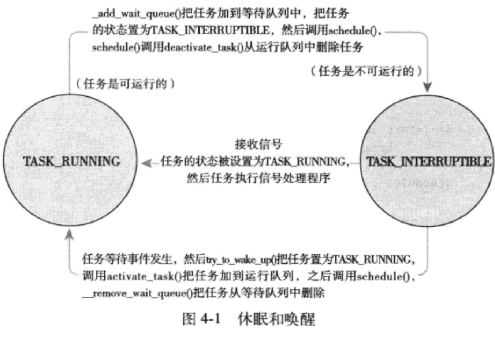

# 多任务

多任务系统可以划分成两类：非抢占式多任务和抢占式任务。linux提供抢占式任务模式。由调度程序来决定什么时候停止一个进程的运行，以便其他进程得到执行的机会。

## linux的调度

进程分为i/o密集型和cpu密集型。调度策略通常在两个矛盾的目标中间寻找平衡：进程响应迅速和最大系统利用率

##### 进程的优先级

linux采用了两种不同优先级范围。一种是nice值，它的范围是-20 到 +19，越大的nice值优先级越小。第二种就是实时优先级，其值是可以配置的，0-99（不包括0和99）.实时优先级的值越高优先级越高。

##### 时间片

进程被强占之前所能运行的时间。一个进程能否投入运行，跟时间片和运行的优先级有关。

##### 调度策略的活动和linux调度算法

###### linux调度器类

​		linux调度器类是以模块方式提供的，称为调度器类。允许不同类型的进程可以有针对性的选择调度算法。每个调度器都有一个优先级，按照优先遍历调度类。拥有一个可执行进程的最高优先的调度器类胜出。

​		完全公平调度(CFS)是针对普通进程的调度类。SCHED_NORMAL。允许每个进程运行一个时间、循环轮转、选择运行最少的进程作为下一个运行的进程，而不是采用时间片。CFS在所有可运行进程总数基础上计算出一个进程应该运行多久，而不是依靠nice计算时间片。nice值在CFS中被作为进程获得的处理器运行比的权重：高值nice(越低优先级)进程获得更低使用权重。	

##### unix系统中的进程调度

​	在unix系统上，优先级以nice值形式输出给用户空间，在现实中的问题。
将nice映射到时间片上来的问题

+ 将nice映射到时间片上，就需将nice单位值对应到处理器的决定时间。但这样做将导致进程切换无法最优化进行。
+ 把进程加1减1带来效果极大的取决于其nice的初始值。
+ 需要一个绝对时间片，而且必须是节拍器的整数倍。
+ 基于优先级调度器为了优化交互任务而唤醒相关进程的问题。

##### 公平调度

CFS:进程调度的效果应如系统具备一个理想中的完美多任务处理器。在这种系统中每个进程将能获得1/n的处理器时间。n表示可运行进程的数量。进程的切换会有消耗，也会降低缓存的性能。CFS的做法是允许每个进程运行一段时间、循环轮转、选择运行最少的进程作为下一个运行的进程。nice值在CFS中被作为获得处理器运行的权重比并且设置了一个最小值，默认情况下是1ms。

##### Linux调度实现CFS

四个组成部分：

+ 时间记账
+ 进程选择
+ 调度器入口
+ 睡眠和唤醒

###### 时间记账

所有的调度器都必须对进程的运行时间记账。一个进程的时间片为0，会被非零的进程抢占。

1. 调度器实体结构

   ```c
   struct sched_entity{
   		struct load_weight load;
   		struct rb_node     run_node;
   		struct list_head   group_node;
   		unsigned int       on_rq;
   		u64								 exec_start;
   		u64							   sum_exec_runtime;
   		u64								 vruntime;
   		u64                prev_sum_exec_runtime;
   		u64								 last_wakeup;
   		u64								 avg_overlap;
   		u64								 nr_migrations;
   		u64								 start_runtime;
   		u64								 avg_wakeup;
   }
   ```

   调度器实体结构作为一个名为se的成员变量嵌入进程描述符。

2. 虚拟实时
   进程的虚拟运行时间，单位为ns，用来记录程序运行了多久还要运行多久。

###### 进程选择

CFS调度算法的核心：选择最小vruntime的任务。CFS使用红黑树来组织可运行进程行列。

1. 挑选下一个任务
   运行rbtree树中最左边叶子节点所代表的那个进程。实现这个过程函数式pick_next_entity

   ```
   static struct sched_entity *__pick_next_entity(struct cfs_rq *cfs_rq)
   {
   	struct rb_node *left = cfs_rq->rb_leftmost;	//
   	if (!left) {
   			return null;
   	}
   	return rb_entry(left, struct sched_entity, run_node)
   }
   ```

2. 向树加入进程

   ```
   static void enqueue(struct cfs_rq *cfs_rq,struct sched_entity *se, int flags){
   		if (!(flags & ENQUEUE_WEKEUP) || (flags & ENQUEUE_MIGRATE)) {
   			se->vruntime += cfs_rq->min_vruntime;
   		}
   }
   update_curr(cfs_rq)
   account_entity_enqueue(cfs_rq, se)
   if (flags & ENQUEUE_WAKEUP) {
   		place_entity(cfs_rq, se, 0);
   		enqueue_sleepr(cfs_rq, se);
   }
   update_status_enqueue(cfs_rq, se);
   check_spread(cfs_rq, se);
   if (se != cfs_rq->curr) {
   		__enqueue_entity(cfs_rq, se);
   }
   ```

   ```c
   static void __enqueue_entity(struct cfs_rq *cfs_rq, struct sched_entity *se)
   {
   		struct rb_node **link = &cfs_rq->task_timeline.rb_node;
   		struct rb_node *ratent = null;
   		struct sched_entity = *entry;
   		s64 key = entity_key(cfs_rq, se);
   		int leftmost = 1;
   		/* 在红黑树种查找适合的位置 */
   		while(*link) {
   				parent = *link;
   				entry  = rb_entry(parent, struct sched_entity, run_node)
   				if (key< entity_key(cfs_rq, entry) {
   						link = &parent->rb_left;
   				} else {
   						link = &parent->rb_light;
   						leftmost = 0;
   				}
   		}
       /*
       *	维护一个缓存，其中存放树最左叶子节点
       */ 
       if (leftmost)
               	cfs_rq->rb_leftmost = &se->run_node;
       rb_link_node(&se->run_node, link);
       rb_insert_color(&se->run_node, &cfs_rq->tasks_timeline);
   }
   ```

   3.从树中删除进程

   ```c
   //删除动作发生在进程阻塞或者终止时。
   static void dequeue_entity(struct cfs_rq *cfs_rq, struct sched_entity *se, int sleep) {
     /*更新当前任务的运行时统计数据*/
     update_curr(cfs_rq);
     update_stats_dequeue(cfs_rq, se);
     clear_buddies(cfs_rq, se);
     
     if (se != cfs_rq->curr)
       		__dequeue(cfs_rq, se);
     account_entity_dequeue(cfs_rq, se);
     update_min_vruntime(cfs_rq)	
   }
   
   static void __dequeue_entity(struct cfs_rq *cfs_rq, struct sched_entity *se) 
   {
    		if (cfs_rq->rb_leftmost == &se->run_node) {
         	struct rb_node *next_node;
         
         	next_node = rb_next(&se->run_node);
         	cfs_rq->rb_leftmost = next_node;
       }
     	rb_erase(&se->run_node, &cfs_rq->tasks_timeline);
   }
   ```

   

###### 调度器入口

​	进程调度的主要入口点是函数schedule()。schedule()通常都需要和一个具体的调度类相关联。调度类有一个可运行的队列，来表示下一个该运行的进程。它会调用pick_next_task(),会以优先级为序，从高到低，依次检查每个调度类，并且从最高优先级的调度类中，选择最高优先级的进程：

```c
static inline struct task_struct *pick_next_task(struct rq *rq) 
{
			const struct sched_class *class;
			struct task_struct *p;
			if (likely(rq->nr_running == rq->cfs.nr_running)) {
        p = fair_sched_class.pick_next_task(rq);
        if (likely(p)) 
          	return p;
      }
  		class = sched_class_hgihest;
  		for(;;) {
        p = class->pick_next_task(rq);
        if (p) 
|						return p;
        class = class->next;
      }
}
```

###### 睡眠和唤醒

休眠的进程处于一个特殊不可执行状态休眠就必须以**轮询**的方式实现。休眠的一个常见的原因就是文件IO

+ 等待队列

  ```c
  DEFINE_WAIT(wait);				//1.创建一个等待队列的项
  add_wait_queue(q, *wait);	//2.进程把自己加入等待队列
  while (!condition) {			//我们正在等待的事件
  	prepare_to_wait(&q, &wait, TASK_INTERRUPTIBLE);	//3.讲进程状态变更为TASK_INTERRUPTIBLE 或 TASK_UNINTERRUPTIBLE
    //4.如果设置为讲进程状态变更为TASK_INTERRUPTIBLE则信号唤醒进程。
    if (signal_pending(current))	//5.当进程被唤醒的时候，它会再次检查条件是否为真。
      		/* 处理信号 */
    schedule();										//如果是退出循环，不是再次调用schedule()
  }
  finish_wait(&q, &wait);					//6.进程将自己设置为TASK_RUNNING并调用finish_wait()把自己移除等待队列
  ```

+ 唤醒
  唤醒操作通过函数wake_up().它调用try_to_wake_up()，该函数负责进程设置为TASK_RUNNING状态，调用enqueue_task()将此进程放入红黑树。

###### 抢占和上下文切换

context_switch()函数负责。

+ 调用声明在<asm/mmu_context.h> switch_mm(), 把虚拟内存从上一个进程映射切换到新进程中。

+ 调用声明在<asm/system.h>switch_to，上一个进程的处理器状态切换到新进程的处理器状态。保存、恢复栈信息和寄存器信息。
  

  ​	

  

  

  内核提供一个标志need_resched标志来表明是否需要重新执行一次调度。当进程被抢占时scheduler_tick()就会设置这个标志。当一个优先级很高的进程进入可执行的状态的时候，try_to_wake_up()也会设置这个字段。

  ​		

  | 函数                     | 目标                                                     |
  | ------------------------ | -------------------------------------------------------- |
  | set_tsk_need_resched()   | 设置指定进程中的need_resched标志                         |
  | clear_tsk_need_resched() | 清除指定进程中的need_resched标志                         |
  | need_resched()           | 检查need_resched标志的值，如果被设置就返回真，否则返回假 |

  ###### 用户抢占

  用户抢占发生在：

  + 从系统调用返回用户空间时
  + 从中断处理程序返回用户空间时

  ###### 内核抢占

  ​	在2.6版本内核中，内核引入抢占。只要是调度安全，内核就可以在任何时间进行抢占。只要没有锁就可以抢占。

  ​	为了支持内核抢占，为每个进程的thread_info引入preempt_count计数器。初始值为1，加锁+1，释放锁-1。值为零的时候可以进行抢占。
  ​	内核抢占会发生在：

  + 中断处理程序正在执行，且返回内核空间
  + 内核代码再一次具有可抢占性的时候
  + 内核中的任务显式调用schedule()
  + 如果内核中的任务阻塞

  ###### 实时调度策略

  linux提供两种实时调度策略：SCHED_FIFO和SCHED_RR。

  ​	SCHED_FIFO实现一种简单的，先入先出的调度算法：它不是使用时间片。处于可运行状态的SCHED_FIFO级的进程会比任何SCHED_NORMAL级的进程都先得到调度。一旦一个SCHED_FIFO级别的进程处于可执行状态，就会一直执行下去，直到它自己受到阻塞或显示地释放处理器为止。只有更高优先级的SCHED_FIFO或者SCHED_RR任务才能抢占SCHED_FIFO任务。

  ​	SCHED_RR级的进程在耗尽事先分配给它的时间就不能在执行。也就是说，SCHED_RR是带有时间片的SCHED_FIFO。当SCHED_RR任务耗尽它的时间片，在同一个优先级的其他实时进程被轮流调度。

  ​	两种实时算法实现都是静态优先级。内核不为实时进程计算动态优先级。

  ​	linux的实时调度算法提供了一种软实时工作方式。软实时的含义是，内核调度进程，尽力使进程在它的限定时间来到前运行，但内核不保证总能满足这些进程的要求。

  ​	默认的实时优先级范围是从0到99

  ###### 与调度相关的系统调用

  ​	

  | 系统调用                 | 描述                     |
  | ------------------------ | ------------------------ |
  | nice()                   | 设置进程的nice值         |
  | sched_setscheduler()     | 设置进程的调度策略       |
  | sched_getscheduler()     | 获取进程的调度策略       |
  | sched_setparam()         | 设置进程的实时优先级     |
  | sched_getparam()         | 获取进程的实时优先级     |
  | sched_get_priority_max() | 获取实时优先的最大值     |
  | sched_get_priority_min() | 获取实时优先的最小值     |
  | sched_rr_get_interval()  | 获取进程的时间片值       |
  | sched_setaffinity()      | 设置进程的处理器的亲和力 |
  | sched_getaffinity()      | 获取进程的处理器的亲和力 |
  | sched_yield()            | 暂时让出处理器           |

  ​	sched_setscheduler()和sched_getscheduler()最重要的工作在于读取或改写进程task_struct的policy和rt_priority的值。

  ​	sched_setparam()和sched_getparam()分别用于设置和获取进程的实时优先级。实时调度策略的最大优先级是MAX_USER_RT_PRIO减1，最小优先级等于1.
  ​	对于一个普通的进程，nice()函数可以将给定的进程的静态优先级增加一个给定的量。

  ###### 与处理器绑定的有关系统调用

  ​	linux调度程序提供强制的处理器绑定机制，试图使进程尽量在同一个处理器上运行，保存在task_struct的cpu_allowed这个位掩码标志。

  ###### 放弃处理器时间

  ​	linux通过sched_yield()系统调用，提供一种让进程显示的讲处理器时间让给其他等待执行的进程的机制。它是通过将进程从移动队列中移到过期队列中。实时进程不会过期。
