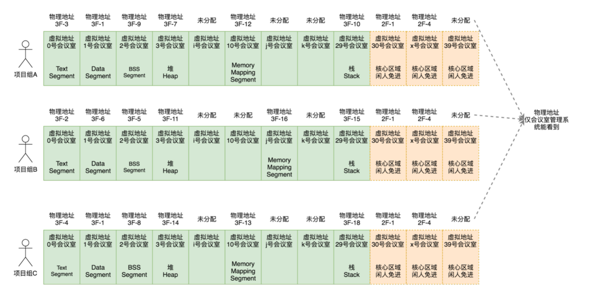

物理地址对于进程不可见，谁也不能直接访问这个物理地址。操作系统会给进程分配一个虚拟地址。所有进程看到的这个地址都是一样的，里面的内存都是从 0 开始编号。
在程序里面，指令写入的地址是虚拟地址。操作系统会提供一种机制，讲不同的进程的虚拟地址和不同内存的物理地址映射起来。

**规划虚拟地址空间**

操作系统的内存管理主要分为三个方面：
①物理内存的管理
②虚拟内存的管理
③虚拟内存和物理内存的映射

程序使用内存：
	代码需要放在内存
	全局变量
	常量字符串
	函数栈
	堆
	对glibc的调用，所以glibc的代码以so文件的形式存在，也需要放在内存
内核也要分配内存：
	内核的代码也要在内存里面
	内核中也有全局变量
	每个进程都要有一个task_struct
	每个进还有一个内核栈
	在内核里面也有动态分配的内存

对于内存的访问，用户态的进程使用虚拟地址,内核态也使用虚拟地址。虚拟的内存空间一分为二，内核空间以及用户空间。用户空间在下在低地址，内核在高地址。
	

Text segment  是存放二进制可执行代码的位置。
Data segment 存放静态变量。
BSS segment  存放未初始化静态变量。
堆段是往高地址增长，是用来动态分配内存的区域，malloc就是在这里分配。
Memory Mapping Seament 。这块地址用来把文件映射进内存，如果二进制的执行文件依赖于某个动态链接库，就是在这个区域里面将 so 文件映射到了内存中。
栈(stack)地址段。主线程的函数调用的函数栈就是在这里。

