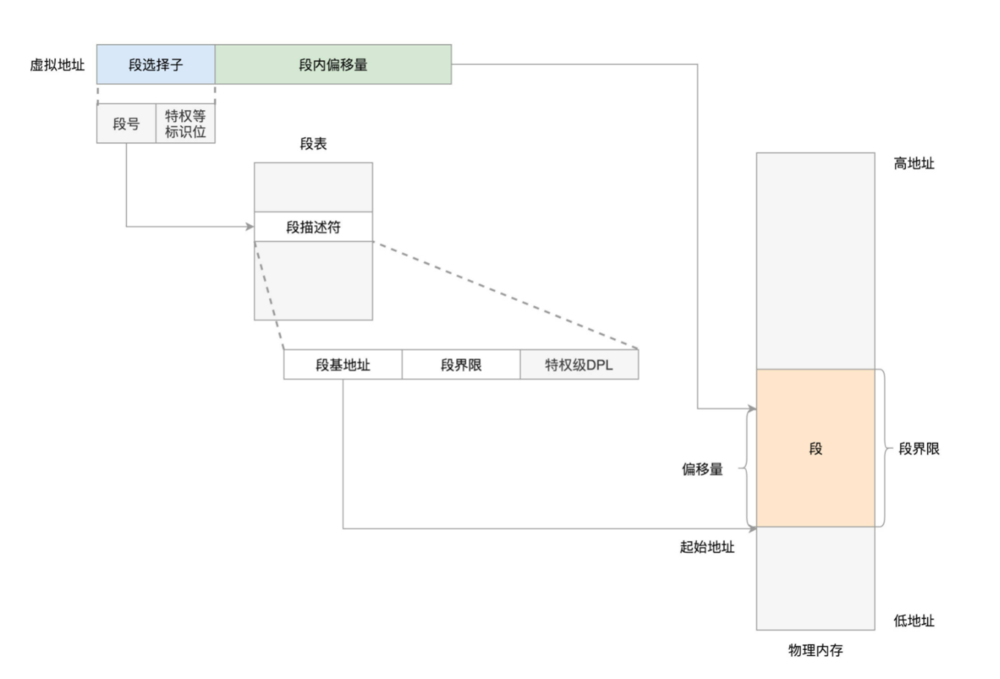
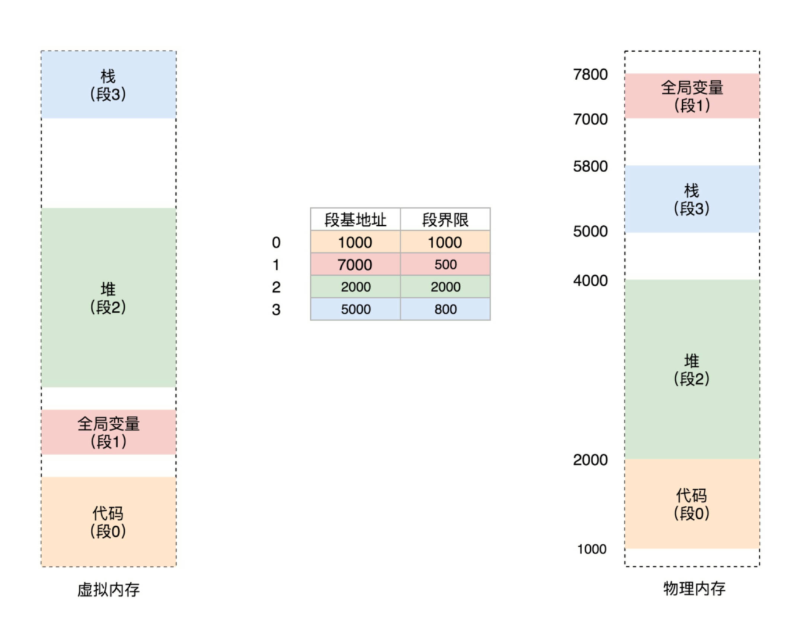
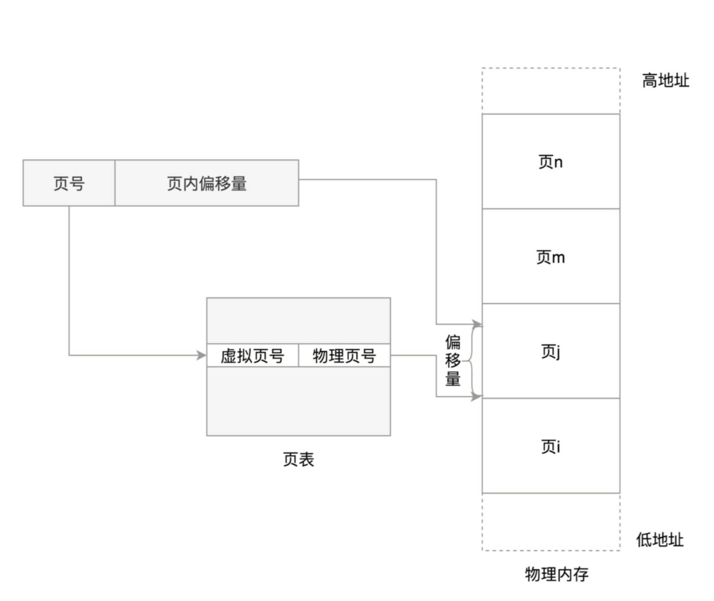
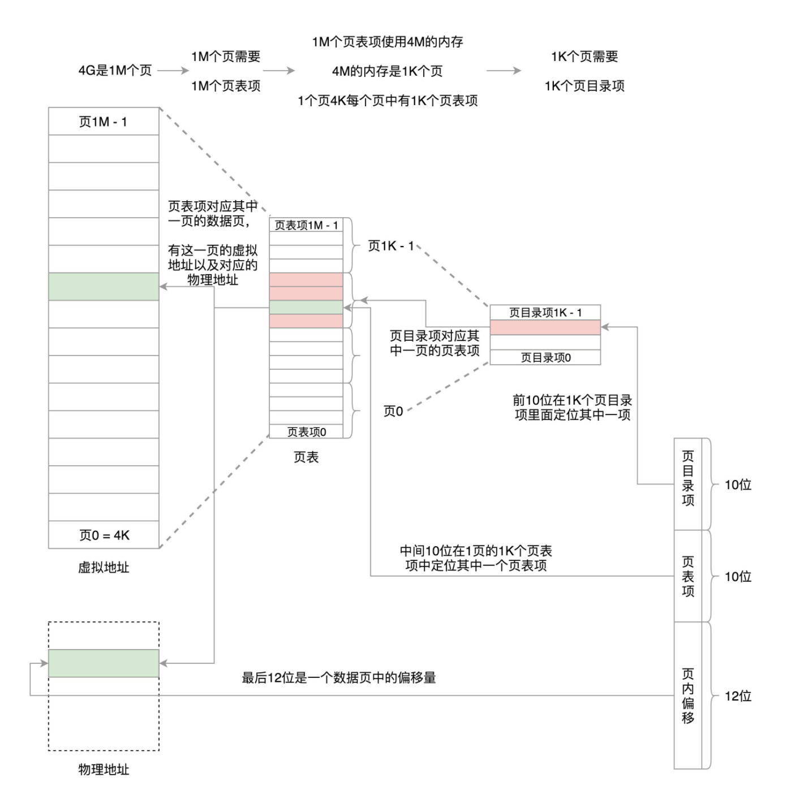
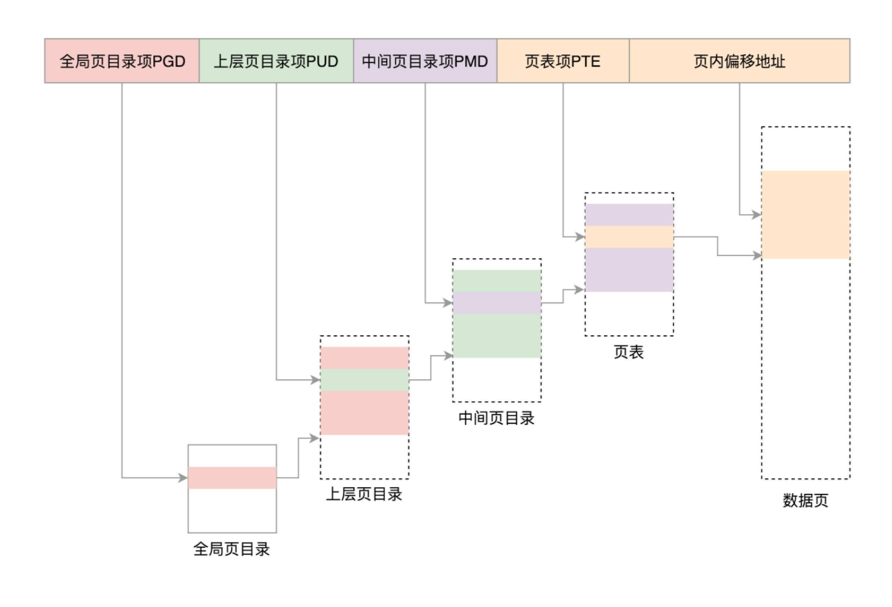

分段机制下的虚拟地址由两部分组成，**段选择子**和**段内偏移量**。段选择子就保存在咱们前面讲过的段寄存器里面。段选择子里面最重要的是**段号**，用作段表的索引。段表里面保存的是这个段的**基地址**、**段的界限**和**特权等级**等。虚拟地址中的段内偏移量应该位于 0 和段界限之间。如果段内偏移量是合法的，就将段基地址加上段内偏移量得到物理内存地址。

在 Linux 里面，段表全称**段描述符表**（segment descriptors），放在**全局描述符表 GDT**（Global Descriptor Table）里面，会有下面的宏来初始化段描述符表里面的表项。
一个段表项由段基地址 base、段界限 limit，还有一些标识符组成。

分段可以做权限审核，例如用户态 DPL 是 3，内核态 DPL 是 0

其实 Linux 倾向于另外一种从虚拟地址到物理地址的转换方式，称为**分页**（Paging）。

对于物理内存，操作系统把它分成一块一块大小相同的页，这样更方便管理，例如有的内存页面长时间不用了，可以暂时写到硬盘上，称为**换出**。一旦需要的时候，再加载进来，叫作**换入**。这样可以扩大可用物理内存的大小，提高物理内存的利用率。

这个换入和换出都是以**页**为单位的。页面的大小一般为 4KB。为了能够定位和访问每个页，需要有个页表，保存每个页的起始地址，再加上在页内的偏移量，组成线性地址，就能对于内存中的每个位置进行访问了。

虚拟地址分为两部分，**页号**和**页内偏移**。页号作为页表的索引，页表包含物理页每页所在物理内存的基地址。这个基地址与页内偏移的组合就形成了物理内存地址。

32 位环境下，虚拟地址空间共 4GB。如果分成 4KB 一个页，那就是 1M 个页。每个页表项需要 4 个字节来存储，那么整个 4GB 空间的映射就需要 4MB 的内存来存储映射表

页表再分页，4G 的空间需要 4M 的页表来存储映射。我们把这 4M 分成 1K（1024）个 4K，每个 4K 又能放在一页里面，这样 1K 个 4K 就是 1K 个页，这 1K 个页也需要一个表进行管理，我们称为页目录表，这个页目录表里面有 1K 项，每项 4 个字节，页目录表大小也是 4。

当然对于 64 位的系统，两级肯定不够了，就变成了四级目录，分别是全局页目录项 PGD（Page Global Directory）、上层页目录项 PUD（Page Upper Directory）、中间页目录项 PMD（Page Middle Directory）和页表项 PTE（Page Table Entry）。
	

