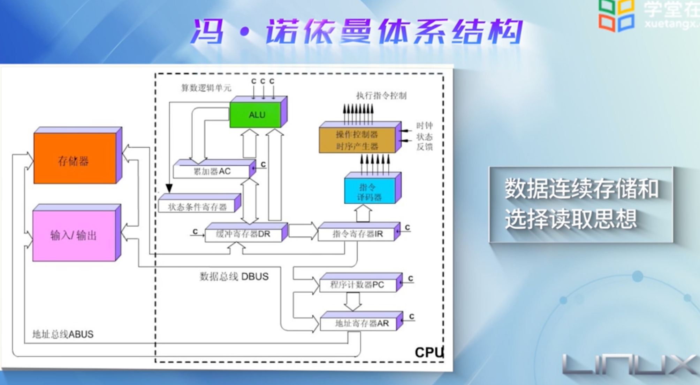
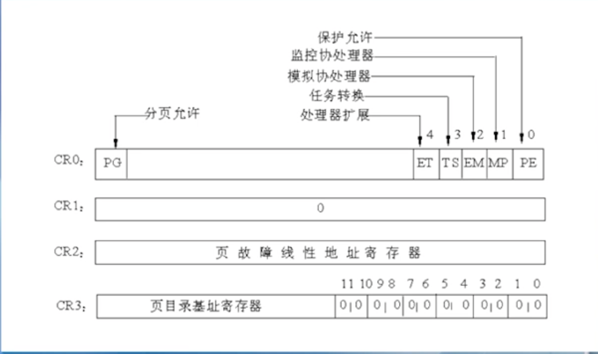
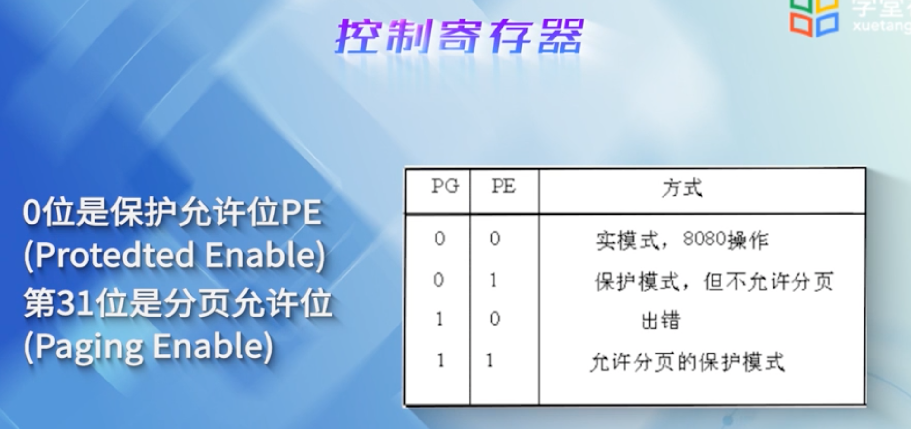
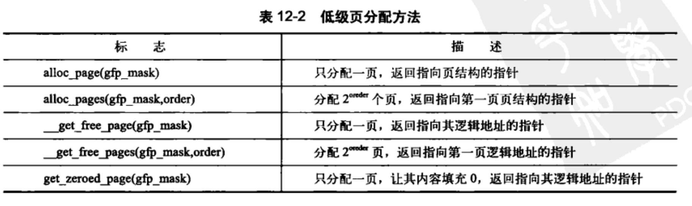
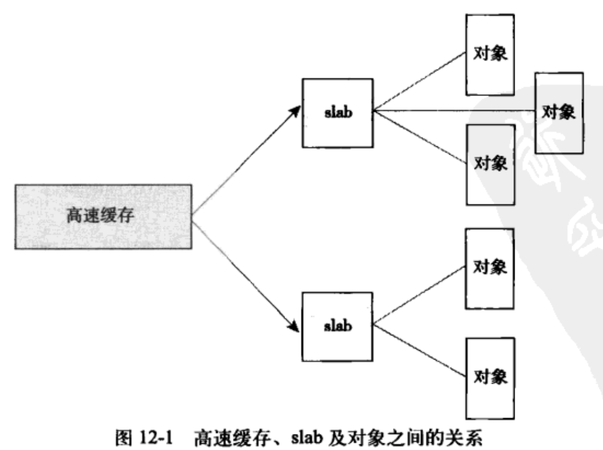
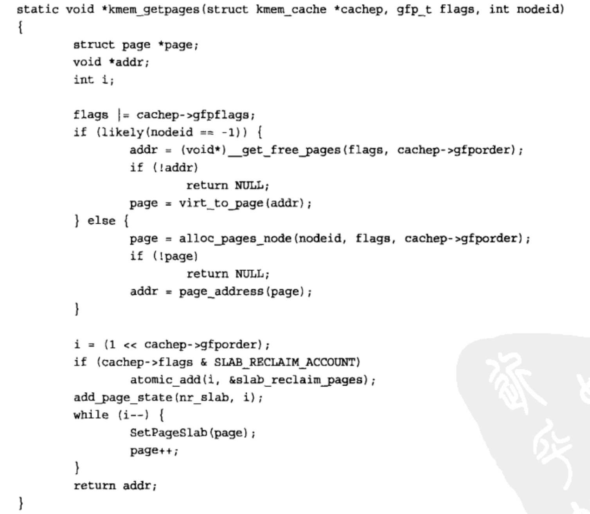

0位是 保护允许位PE (protected eable)，31位是分页允许位(paging enable)




1.页

内核把物理页作为内存管理的基本单位。
处理器最小可寻址单位通常为字(字节)。
内存管理单元MMU（memory manager unit）以页为单位，来管理页表。
大多数32位体系结构支持4kb页

```c
//物理页的数据结构
struct page {
  unsigned long 				flags;	//存放状态，是否为脏
  atomic_t      				_count; //存放页的引用计数
  atomic_t      				_mapcount; //
  struct address_space *mapping;
  pgoff_t								index;
  struct list_head  		lru;
  void  								*virtual; //页的虚拟地址
}
```


2.区
内核把页划分成不同的区（zone）。没有实际的意义，只是逻辑上的分组。linux必须处理由于硬件存缺陷引起的内存寻址的问题

+ 一些硬件只能用某种特定内存地址来执行DMA
+ 一些体系结构内存的物理寻址范围比虚拟寻址大得多。有些内存不能永久地映射到内核空间

linux主要使用了四种区：

+ ZONE_DMA  --  用来执行DMA操作
+ ZONE_DMA32  -- 执行DMA操作，只能被32位设备访问
+ ZONE_NORMAL -- 能正常映射的页
+ ZONE_HIGHEM  -- 不能永久地映射到内核空间

linux把系统的页划分为区，形成不同的内存池。

```c
struct zone {
  	unsigned long 					watermark[NR_WMARK];	//最小值，最低和最高水位
  	unsigned long 				  lowmen_reserve[MAX_NR_ZONES];
  	struct per_cpu_pageset  pageset[NR_CPUS];
  	spinlock_t							lock;		//自旋锁，它防止结构被并发访问
  	struct zone_lru{
      			struct list_head list;
      			unsigned long nr_saved_scan;
    }	lru[NR_LRU_LISTS];
  	struct zone_reclaim_stat  reclaim_stat;
  	unsigned long 						pages_scanned;
  	unsigned long 						flags;
  	atomic_long_t							vm_stat[NR_VM_ZONE_STAT_ITEMS];
  	int 											prev_priorrity;
  	unsigned long 						innt inactive_ratio;
  	wait_queue_head_t					*wait_table;
  	unsigned long							wait_table_hash_nr_entries
    unsigned long							wait_table_bits;
  	struct pglist_data				*zone_pgdat;
  	unsigned long 						zone_start_pfn;
  	unsigned long							spanned_pages;
  	unsigned long 						present_pages;
  	const	char								*name;	//区名  "DMA","normal"，"highmem"
}
```

3.获得页
	以页为单位分配内存。

```c
//分配2^order个连续的物理页，并返回一个指向第一个页page结构体
struct page * alloc_pages(gfp_t gfp_mask, unsigned int order);
//该函数直接返回所请求的第一个页的逻辑地址
unsigned long __get_free_page(gfp_t gfp_mask, unsigned int order);
//填充为0的页
unsigned long __get_zeroed_page(gfp_t gfp_mask, unsigned int order);
```



​	释放页

```c
void __free_pages(struct page *page, unsigned int order);
void free_pages(unsigned long addr, unsigned int order);
void free_page(unsigned long addr);
```

Kmalloc()

```c
//返回一个指向内存的指针，内存块至少有size大小
void * kmalloc(size_t size, gfp_t flags);
```

gfp_mask标志
	分为三类，行为修饰符、区修饰符以及类型。

行为修饰符	

| 标志         | 描述                                   |
| ------------ | -------------------------------------- |
| __GFP_WAIT   | 分配器可以睡眠                         |
| __GFP_HIGH   | 分配器可以访问紧急事件缓冲池           |
| __GFP_IO     | 分配器可以启动磁盘IO                   |
| __GFP_FS     | 分配器可以启动文件系统IO               |
| __GFP_COLD   | 分配器可以启动文件系统IO               |
| __GFP_NOWARN | 分配器不打印失败警告                   |
| __GFP_REPEAT | 分配器分配失败时重复进行分配           |
| __GFP_NOFAIL | 分配器无线地重复进行分配。分配不能失败 |

 区修饰符

| 标志          | 描述                              |
| :------------ | --------------------------------- |
| __GFP_DMA     | 从ZONE_DMA分配                    |
| __GFP_DMA32   | 从ZONE_DMA32分配                  |
| __GFP_HIGHMEM | 从ZONE_HIGHMEM或者ZONE_NORMAL分配 |

  类型标志

| 标志         | 描述                                                         |
| :----------- | ------------------------------------------------------------ |
| GFP_ATOMIC   | 用在中断处理程序，下半部、持有自旋锁以及其他不能睡眠的地方   |
| GFP_NOWAIT   | 与GFP_ATOMIC相似，调用不会退出紧急内存池                     |
| GFP_NOIO     | 可以阻塞，不会启动磁盘io                                     |
| GFP_NOFS     | 必要是可能阻塞，也可能启动磁盘IO，但不会启动文件系统操作     |
| GFP_KERNEL   | 常规分配方式,可能会阻塞。这个标志在睡眠安全时用在进程上下文代码中，为了获得调用者所需内存。内核会尽力而为 |
| GFP_USER     | 常规分配方式,可能会阻塞。用于用户空间进程分配内存            |
| GFP_HIGHUSER | 从ZONE_HIGHMEM进行分配。用于用户空间进程分配内存             |
| GFP_DMA      | 从ZONE_DMA进行分配。设备驱动程序使用                         |


kfree()

```c
void kfree();//释放kmalloc()分配的内存
```

vmalloc()分配的内存地址是连续的，而物理地址无须连续


12.6 slab层

空闲链表相当于对象高速缓存。
slab分配层试图在几个基本原则需求一种平衡。

+ 频繁分配和回收的数据结构也会频繁分配和释放，应当缓存
+ 频繁分配和回收必然导致内存碎片。为了避免这种线程，空闲链表的缓存也会连续的存放。
+ 回收的对象可以立即投入下一次分配
+ 如果分配器知道对象大小，页大小和总的高速缓存大小这样的概念，他会做出更明智的决策
+ 如果让部分缓存专属于单个处理器，那么，分配和释放就可以在smp锁的情况下进行
+ 如果分配器是于NUMA相关的，它就可以冲相同的内存节点为请求者进行分配
+ 对存放的对象进行着色，以防多个对象映射到相同的高速缓存行

slab层的设计
          slab层把不同的对象划分为所谓的高速缓存组，其中每个高速缓存组都存放不同类型的对象。
每种对象对应一种高速缓存。高速缓存又被划分为slab。每个slab都是由一个或多个物理上连续的页组成。
         每个slab都包含一些对象成员，被缓存的数据结构。slab三种状态：满、半满、空。先从半满的slab中分配，没有部分满的slab，从空的slab进行分配。没有空闲的slab就只能创建一个slab。


```c
struct slab {
		struct list_head list;		  /* 满、部分或空链表*/
  	unsigned long    colouroff; /* slab 着色的偏移量 */
  	void             *s_mem; 		/* 在slab中的第一个对象 */
  	unsigned int		 inuse;     /* slab中已分配的对象数 */
  	kmem_bufctl_t    free;      /* 第一个空闲的对象 */
}
```

slab分配器可以创建新的slab，通过__get_free_pages()低级内核分配器进行分配


slab层的管理在每个高速缓存的基础上，通过提供给整个内核一个简单的接口来完成的。

```c
struct kmem_cache * kmem_cache_create(
  const char *name,	//高速缓存的名字
  size_t size, 			//元素大小
  size_t align, 		//第一个对象的偏移，
  unsigned long flags, 
  void (*ctor)(void *)	//构造函数，新的页追加到高速缓存才被调用
);
//返回一个指向高速缓存的指针
/* flag标志值
SLAB_HWCACHE_ALIGN 所有对象按高速缓存行对齐
SLAB_POISON        用已知的值（a5a5a5a5）填充slab
SLAB_RED_ZONE      在已分配的内存周围插入`红色警戒区`以探测缓冲越界
SLAB_PANIC         分配失败时提醒slab层
SLAB_CACHE_DMA     使用DMA内存给slab分配空间
*/
```

撤销一个高速缓存

```c
int kmem_cache_destory(struct kmem_cache *cachep);
//高速缓存中slab都必须为空
//调用kmem_cache_destroy的时候，不能访问高速缓存
成功0，失败非0
```

1.从缓存中分配
创建高速缓存之后，通过下列函数获取对象：

```c
void * kmem_cache_alloc(struct kmen_cache *cachep, gfp_t flags));
//返回一个对象的指针
```

释放对象

```c
void kmem_cache_free(struct kmem_cache *cachep, void *objp);
```


# 在栈上的静态分配

每个进程的整个调用链必须放在自己的内核栈，中断处理程序也曾经使用它们所在中断的进程内核栈。使用一个页面的内核栈，中断处理程序就不放在栈中了。为了解决这个问题提出中断栈。中断栈为每个进程提供一个用于中断处理程序的栈。

在栈上面大量静态分配。栈溢出多出来的数据就会直接溢出来，覆盖进邻数据。所以动态分配是非常明智的

##### 高端内存的映射

高端内存的页不能永久映射到内核地址空间上。因此，alloc_pages()以__GFP_HIGHMEM标志获得的页不可能有逻辑地址。

###### 永久映射

映射一个给定的page结构到内核地址空间。

```c
void *kmap(struct page *page);
//高端内存、低端内存都能用。page对应低端内存的一页，函数只会返回该也得虚拟地址。如果到在高端内存，则建立一个永久映射，在返回地址。
//这个函数可以睡眠，因此kmap只能在进程上下文中
```

接触映射

```c
void kunmap(struct page *page)
```

###### 临时映射

创建一个映射而当前上下文又不能睡眠时，使用临时映射。有一组保留的映射，可存放新建的临时映射。内核可以原子地把高端内存中一个也映射到某个保留的映射中。

```c
void *kmap_atomic(struct page *page, enum km_type type)
```

取消映射

```c
void kunmap_atomic(void *kvaddr, enum km_type type)
```

##### 每个cpu的分配


