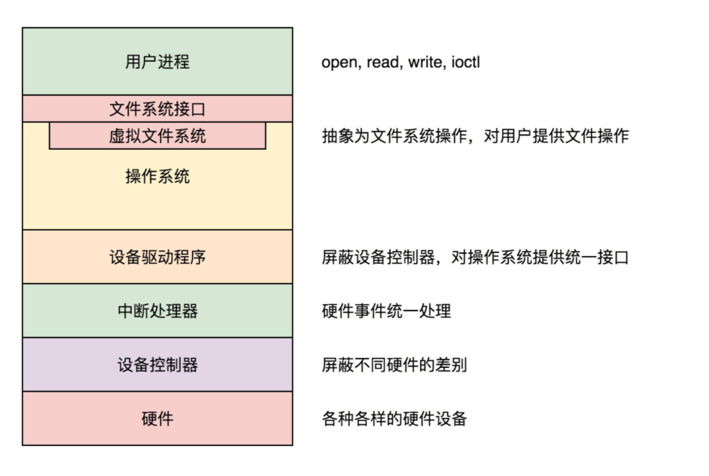

## 用设备控制器屏蔽设备差异

**设备控制器**（Device Control Unit）的组件

输入输出设备我们大致可以分为两类：**块设备**（Block Device）和**字符设备**（Character Device）。

- 块设备将信息存储在固定大小的块中，每个块都有自己的地址。硬盘就是常见的块设备。
- 字符设备发送或接受的是字节流。而不用考虑任何块结构，没有办法寻址。鼠标就是常见的字符设备

由于块设备传输的数据量比较大，控制器里往往会有缓冲区。CPU 写入缓冲区的数据攒够一部分，才会发给设备。CPU 读取的数据，也需要在缓冲区攒够一部分，才拷贝到内存。

CPU 如何同控制器的寄存器和数据缓冲区进行通信呢？

- 每个控制寄存器被分配一个 I/O 端口，我们可以通过特殊的汇编指令（例如 in/out 类似的指令）操作这些寄存器。
- 数据缓冲区，可内存映射 I/O，可以分配一段内存空间给它，就像读写内存一样读写数据缓冲区。如果你去看内存空间的话，有一个原来我们没有讲过的区域 ioremap，就是做这个的。

控制器的寄存器一般会有状态标志位，可以通过检测状态标志位，来确定输入或者输出操作是否完成。第一种方式就是**轮询等待**，就是一直查，一直查，直到完成。当然这种方式很不好，于是我们有了第二种方式，就是可以通过**中断**的方式，通知操作系统输入输出操作已经完成。

一种**软中断**，例如代码调用 INT 指令触发，一种是**硬件中断**，就是硬件通过中断控制器触发的

有的设备需要读取或者写入大量数据。如果所有过程都让 CPU 协调的话，就需要占用 CPU 大量的时间，比方说，磁盘就是这样的。这种类型的设备需要支持 DMA 功能，也就是说，允许设备在 CPU 不参与的情况下，能够自行完成对内存的读写。实现 DMA 机制需要有个 DMA 控制器帮你的 CPU 来做协调。

CPU 只需要对 DMA 控制器下指令，说它想读取多少数据，放在内存的某个地方就可以了，接下来 DMA 控制器会发指令给磁盘控制器，读取磁盘上的数据到指定的内存位置，传输完毕之后，DMA 控制器发中断通知 CPU 指令完成。

## 驱动程序屏蔽设备控制器差异

设备驱动程序中是一些面向特殊设备控制器的代码。不同的设备不同。但是对于操作系统其它部分的代码而言，设备驱动程序应该有统一的接口。就像下面图中的一样，不同的设备驱动程序，可以以同样的方式接入操作系统，而操作系统的其它部分的代码，也可以无视不同设备的区别，以同样的接口调用设备驱动程序。

中断流程

