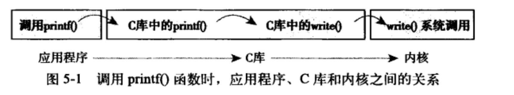

1. fork 创建进程
   	 在 Linux 里，要创建一个新的进程，需要一个老的进程调用 fork 来实现，其中老的进程叫作**父进程**（Parent Process），新的进程叫作**子进程**（Child Process）。
      	 对于 fork 系统调用的返回值，如果当前进程是子进程，就返回 0；如果当前进程是父进程，就返回子进程的进程号。
      	 在操作系统中，每个进程都有自己的内存，互相之间不干扰，有独立的**进程内存空间**。
        对于进程的内存空间来讲，放程序代码的这部分，我们称为**代码段**（Code Segment）。
        对于进程的内存空间来讲，放进程运行中产生数据的这部分，我们称为**数据段**（Data Segment）。

   

2. 内存分配： brk和mmap
        当分配的内存数量比较小的时候，使用 brk，会和原来的堆的数据连在一起。
        当分配的内存数量比较大的时候，使用 mmap。
3. 文件管理
        对于已经有的文件，可以使用open打开这个文件，close关闭这个文件。
        对于没有的文件，可以使用creat创建文件 。
        打开文件以后，可以使用lseek跳到文件的某个位置
        可以对文件的内容进行读写，读的系统调用是read，写是write
4. Linux一切皆文件
   linux一切皆文件，socket也是文件，标准输出**stdout 文件**，进程的输出可以作为另一个进程的输入，这种方式称为**管道**，管道也是一个文件，**文件夹**也是一个文件，每个文件，Linux 都会分配一个**文件描述符**（File Descriptor），这是一个整数。有了这个文件描述符，我们就可以使用系统调用，查看或者干预进程运行的方方面面。
5. 异常处理和信号处理
   在执行一个程序的时候，在键盘输入“CTRL+C”，这就是中断的信号，正在执行的命令就会中止退出。
   如果非法访问内存，例如你跑到别人的会议室，可能会看到不该看的东西。
   硬件故障，设备出了问题，当然要通知项目组。
   用户进程通过kill函数，将一个用户信号发送给另一个进程。
6. 进程间的通信
   不需要一段很长的数据，这种方式称为**消息队列**（Message Queue）。由于一个公司内的多个项目组沟通时，这个消息队列是在内核里的，我们可以通过msgget创建一个新的队列，msgsnd将消息发送到消息队列，而消息接收方可以使用msgrcv从队列中取消息。
   **共享内存**的方式，这时候，我们可以通过shmget创建一个共享内存块，通过shmat将共享内存映射到自己的内存空间，然后就可以读写了
7. 网络通信
   网络服务是通过套接字 Socket 来提供服务的，Socket 系统调用建立一个 Socket。Socket 也是一个文件，也有一个文件描述符，也可以通过读写函数进行通信。

# 系统调用

内核提供了用户进程和内核进行交互的一组接口，系统调用。通过系统调用，用户程序可以受限的访问硬件设备。系统调用提供了创建进程和已有的进程的进行通信的机制。

### 1. 与内核通信

系统地用它为用户空间提供了一种硬件的抽象接口，读写文件不许考虑磁盘类型和介质。 系统调用保证了系统稳定和安全，作为硬件设备和应用程序之间的中间人，内核基于权限、用户类型和其他的一些规则对需要的访问进行裁决。

### 2. API、POSTX和C库

### 3. 系统调用

要访问系统调用，通常通过c库中定义的函数调用来进行。他们通常都需要定义零个、一个或多个参数而且可能产生一些副作用。

