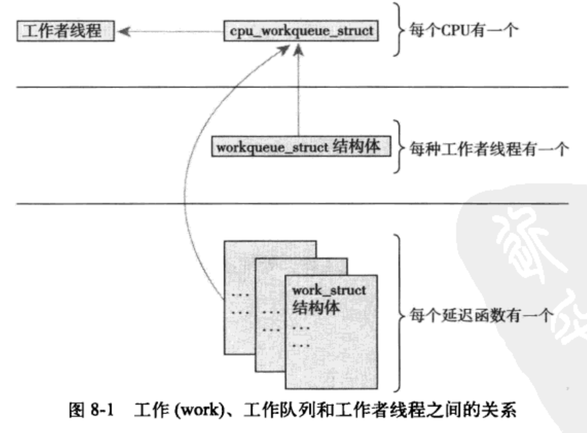

## 下半部和推后执行的工作

中断程序的局限：

+ 中断处理程序以异步方式执行，它有可能会打断其他重要代码。
+ 中断处理程序执行过程会屏蔽该中断的其他中断，会禁止中断后硬件和操作系统通信
+ 由于中断处理程序需要对硬件进行操作，通常有很高的时限要求
+ 中断程序不再进程上下文运行，所以它不能被阻塞


#### 1.下半部

下半部的任务就是执行与中断处理相关但是中断程序本身不执行的工作。尽量将中断处理程序的工作都交给下半部执行。

##### 1.1 为什么要用下半部

中断处理程序在运行的时候，当前的中断线在所有处理器都会被屏蔽。中断处理程序与其他程序异步执行。

#### 1.2 下半部的环境

1. 任务队列
   	内核开发者引入了任务队列机制来实现工作的推后执行。每个队列都包含一个有等待调用的函数组成的链表。
2. 软中断和tasklet
      软中断是一组静态定义的下半部接口，有32个，可以在所有处理器上同时执行。
     tasklet基于软中断实现的。

##### 内核定时器

​	把操作推迟到某个确定的时间段之后执行。

### 2.软中断的实现

​	软中断在编译期间静态分配的。由softirq_action结构表示

```c
//它定义在<linunx/interrupt.h>
struct softirq_action{
		void (*action)(struct softirq_action *);
};
```

```c
//kernel/softirq.c
static struct softirq_action softirq_vec[NR_SOFTRQS]；
//每个被注册的软中断都占据该数组的一项
```

1.软中断处理程序action的函数原型

```c
void softirq_handler(struct softirq_action *)
```

2.执行软中断
	一个注册的软中断必须在被标记后才会执行。中断处理程序会在返回前标记它的软中断。
	待处理的软中断会被检查和执行。

+ 从一件硬件中断代码处返回时。
+ 在ksoftirqd内核线程中
+ 在那些现实检查和执行待处理的软中断代码中。

软中断都要在do_softirq()中执行。

```c
u32 pengding;
/* local_softirq_pending宏的返回值是待处理软中断的32位位图*/
pending = local_softirq_pending();
if(pending) {
  struct softirq_action *h;
  set_softirq_pending(0);	/* 实际软中断位图清零 */
  h = softirq_vec;	/* 指针h指向softirq_vec的第一项 */
  do {
    if (penging & 1)
				h->action(h);
    	h++;
    	pending >>= 1;
  } while(pending);
}
```

###### 使用软中断

1. 分配索引
   通过在<linux/interrupt>中定义的一个枚举类型来静态声明软中断。

   | tasklet         | 优先级 | 软中断描述           |
   | --------------- | ------ | -------------------- |
   | HI_SOFTIRQ      | 0      | 优先级高的takslets   |
   | TIMER_SOFTIRQ   | 1      | 定时器的下半部       |
   | NET_TX_SOFTIRQ  | 2      | 发送网络数据包       |
   | NET_RX_SOFTIRQ  | 3      | 接受网络数据包       |
   | BLOCK_SOFTIRQ   | 4      | BLOCK装置            |
   | TASKLET_SOFTIRQ | 5      | 正常优先级的tasklets |
   | SCHED_SOFTIRQ   | 6      | 调度程度             |
   | HRTIMER_SOFTIRQ | 7      | 高分比率定时器       |
   | RCU_SOFTIRQ     | 8      | RCU锁定              |

2. 注册你的处理程序

   接着，在运行通过调用open_softirq()注册软中断处理程序。

   ```
   open_softirq(NET_TX_SOFTIRQ, net_tx_action)；
   open_softirq(NET_RX_SOFTIRQ, net_tx_action)；
   ```

#### 3.tasklet

##### tasklet的实现

因为tasklet是通过软中断实现，所以本身也是软中断。tasklet由两类中断代表：HI_SOFTIRQ和TASKLET_SOFTIRQ

1. Tasklet结构体

   ```
   struct tasklet_struct {
   		struct tasklet_struct *next;	/* 链表中的下一个tasklet */
   		unsigned long state;			/* tasklet的状态 */
   		atomic count;
   		void (*func())(unsigned long) 
   		unsigned long data; 
   }
   ```

2. 调度tasklet
   已调度的tasklet存放在tasklet_vec和tasklet_hi_vec 。tasklet由tasklet_schedule()和tasklet_hi_schedule()函数进行调度。tasklet_schedule的执行过程：

   + 检查状态是否为TASKLET_STATE_SCHED。如果是，表示已经调度过了。
   + 调用__task_schedule()
   + 保存中断状态，然后禁止中断状态。
   + 把需要调度的tasklet加到每个处理器的tasklet_vec链表和tasklet_hi_vec链表的表头。
   + 唤起TAKLET_SOFTIRQ和HI_SOFTIRQ软件断。
   + 恢复中断原状态并返回

3. 使用tasklet

   ```
   DECLARE_TASKLET(name, func, data)
   DECLARE_TASKLET_DISABLED(name, func, data);
   ```

   两个宏根据给定的名称静态创建一个task_struct结构。当tasklet被调度以后，给定的函数func会被执行。

   tasklet_schedule()函数并传递给它相应的tasklet_struct的指针，该tasklet就会被调用。
   tasklet_schedule(&my_tasklet);

   一个tasklet总在调度他的处理器上面执行。你可以调用tasklet_disable()函数来禁止某个指定的tasklet。调用tasklet_kill()函数从挂起的队列中去掉一个tasklet。该函数的参数是指向某一个tasklet的tasklet_struct。

   ###### ksoftirqd

   每个处理器都有一组辅助处理软中断的内核线程。如果软中断出现的频率就很高，再加上他们又将自己重新设置为可执行的状态能力，那么就会导致用户空间进程无法得到足够多处理器时间，因此处于饥饿的状态。


### 4.工作队列

工作队列可以工作推后，交由一个内核线程去执行。这个下半部总会在进程上下文中执行。这样，通过工作队列执行的代码能占尽进程上下文的所有优势。工作队列允许重新调度甚至是睡眠。

##### 工作队列的实现

工作队列子系统是一个用于创建内核线程的接口，通过它创建的进程负责执行由内核其他部分排到队列里的任务。他创建这些线程叫做工作者线程。工作队列可以让你的驱动程序创建一个专门的工作者线程来处理需要推后的工作。工作队列子系统提供了一个缺省的线程来处理，events/n。n是处理器的编号。每个处理对应一个线程。
	

```c
struct workqueue_struct{
		struct cpu_workqueue_struct cpu_wq[NR_CPUS]；//数组的每一项对应一个处理器
		struct list_head list;
		const char *name;
		int singlethread;
		int freezeable;
		int rt;
}
```

```c
struct cpu_workqueue_struct {
  spinlock_t lock;				/* 锁保护这种结构 */
  struct list_head worklist;
  wait_queue_head_t more_work;
  struct work_struct *current_struct;
  struct workqueue_struct *wq;
  task_t *thread;
}
```

每个工作者线程类型关联一个自己的workqueue_struct。所有的工作者线程都是用普通的内核线程实现的。他们都要执行work_thread()函数。这个函数初始化，会进入一个死循环。当有操作被插入队列里的时候，线程就会被唤醒。

```c
struct work_struct{
	atomic_long_t data;
	struct list_head entry;
	work_func_t func
}
```

这些结构体被连接成链表，在每个处理器上的每种类型的队列都对应这样一个链表。

work_thread()函数的核心流程。

```c
for(;;) {
	prepare_to_wait(&cwq->more_work, &wait, TASK_INTERRUTIBLE);
  if (list_empty(&cwq->worklist))
    schedule();
  finish_wait(&cwq->more_work, &wait);
  run_workqueue(cwq);
}
```

+ 线程将自己设置为休眠状态，并把自己加入到带灯队列
+ 如果工作链表是空的，线程调用schedule()函数进入睡眠状态
+ 如果链表中有对象，线程不会睡眠。相反，它将自己设置成TASK_RUNNING，逃脱等待队列
+ 如果链表非空，调用run_workqueue()函数执行被推后的工作。

```c
//run_workqueue
while(!list_empty(&cwq->worklist)){
  struct work_struct *work;
  work_func_t f;
  void *data;
  
  work = list_entry(cwq->worklist.next, struct work_struct, entry);
  f = work->func;
  list_del_init(cwq->worklist.next);
  work_clear_pending(work);
  f(work);
}
/*
*	1.当链表不为空时，选取下一个节点对象
* 2.获取我们希望执行的函数func以及参数data
* 3.把该节点从链表上解下来，将待处理标志位pending清零
* 4.调用函数
* 5.重复执行
*/
```

3.工作队列实现机制总结



​	位于最高一层的工作者线程。系统允许有多种类型的工作者线程存在。对于指定的一个类型，系统的每个cpu都有一个该类的工作者线程。工作处理最底层，是驱动程序创建这些需要推后执行的工作，work_struct结构表示。这个结构体重有个指针指向一个函数，函数负责处理需要推后执行的具体任务。工作会被提交给具体某个的工作者线程。工作者线程被唤醒并执行这些排好的任务。

##### 	使用工作队列

1. 创建推后的工作。

   ```c
   DECLARE_WORK(name, void(*func)(void *), viod *data);
   ```

   这样会静态的创建一个名为name，处理函数为func，参数为data的work_struct结构体。同样，也可以在运行时通过指针创建一个工作：

   ```c
   INIT_WORK(struct work_struct *work, void(*func)(void *), void *data);
   ```

   这会动态地初始化一个work指向的工作，处理函数为func， 参数为data

2. 工作队列处理函数

   ```c
   void work_handler(void *data);
   ```

   这个函数会由一个工作者线程执行，函数会运行在进程上下文。允许响应中断，并且不会拥有任何锁。尽管操作处理函数运行在进程上下中，但它不能访问用户空间，因为内核线程在用户空间没有相关内存映射。通常在发生系统调用是，内核会代表用户空间的进程运行，此时它才能访问用户空间。

3. 对工作进行调度
   想要把给定的工作的处理函数提交给缺省的events工作线程，只需调用：

   ```c
   schedule_work(&work);
   ```

   work马上就会被调度，一旦其所在的处理器上的工作者线程被唤醒，它就会被执行。也可以调度的时候指定时间执行。

   ```c
   schedule_delayed_work(&work, delay);
   ```

4. 刷新操作

   ```c
   void flush_scheduled_work(void)；
   ```

   ```c
   int cancel_deylayed_work(struct work_struct *work)
   ```

5. 创建新的工作队列

   ```c
   //创建一个新的任务和与之相关的工作者线程
   struct workqueue_struct *create_workqueue(const char *name);
   //name参数用于该内核线程的命名
   ```


#### 5.下半部机制的选择

软中断、tasklet、和工作队列。

| 下半部   | 上下文 | 顺序执行保障       |
| -------- | ------ | ------------------ |
| 软中断   | 中断   | 没有               |
| tasklet  | 中断   | 同类型不能同时进行 |
| 工作队列 | 进程   | 没有               |

#### 6. 在下半部之间加锁

​		使用tasklet的一个好处在于，他自己负责执行的序列化保障:两个相同类型的tasklet不允许同时执行。

​		如果进程上下文和一个下半部共享数据，在访问这些数据之前，你需要禁止下半部的处理并得到锁的使用权。做这些是为了本地和SMP的保护并且防止死锁的出现。
​		如果中断上下文和一个下半部共享数据，在访问数据之前，你需要禁止中断并得到锁的作用权。

#### 7.禁止下半部


​		一般单纯禁止下半部的处理是不够的。为了保证共享数据的安全，更常见的做法是，先得到一个锁然后禁止下半部的处理。如果需要禁止所有的下半部处理，可以调用local_bh_disable()函数。允许下半部进行处理，可以调用local_bh_enable()函数。
​		如果local_bh_disable()被调用了三次，只有当第四次调用local_bh_ebable()，软中断处理才会被激活。函数通过维护一个计数器。当计数器变为0，下半部才能够被处理。
