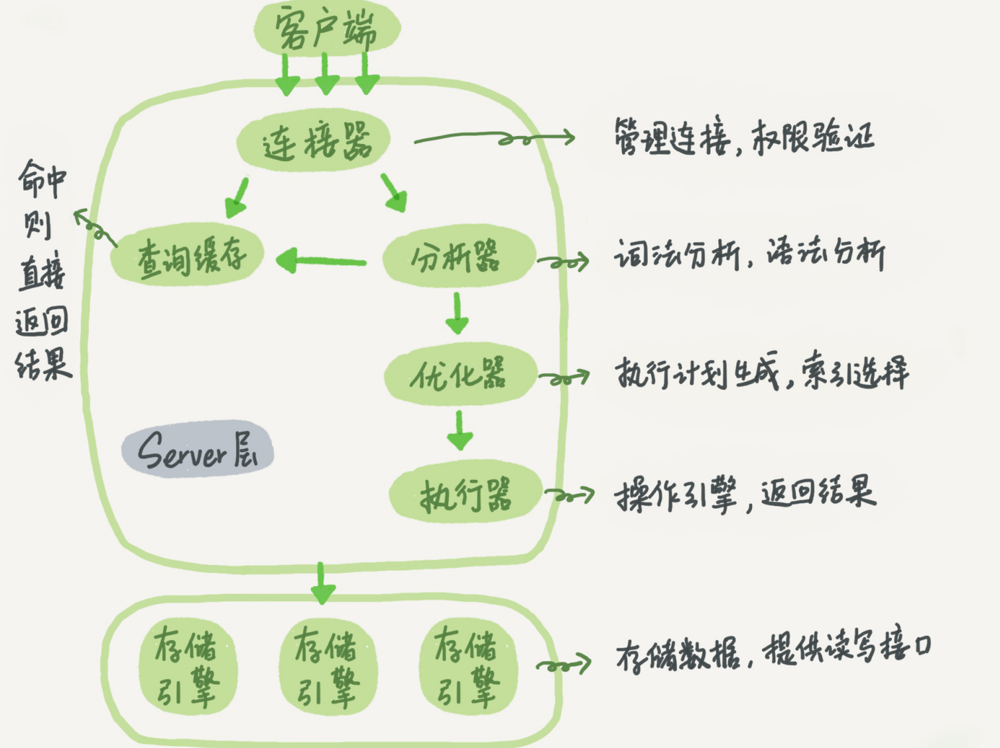

**server层包括连接器、查询缓存、分析器、优化器、执行器。**

1. 连接器——管理连接，权限验证

   ```
   mysql -h$ip -P$port -u$user -p
   ```

   每当有一个客户端进程连接到服务端进程时，服务端进程会起一个线程来专门处理。连接断开时，不会马上销毁线程，而是缓存起来，等待新的连接到来。这样可以减少频繁创建和销毁线程。

   长连接是指连接成功后，如果客户端持续有请求，则一直使用同一个连接。短连接则是指每次执行完很少的几次查询就断开连接，下次查询再重新建立一个。

   MySQL在执行过程中临时使用的内存是管理在连接对象里面的。这些资源会在连接断开的时候才释放。

2. 查询缓存
   mysql查询语句会被缓存起来key-value对的方式缓存起来，key是查询的语句，value就是查询的结果。但是一旦表更新，就清空这张表的所有查询缓存。所有不建议使用。mysql8.0删除掉查询缓存这个功能。

3. 分析器
   分析器主要对客户端提交的sql语句进行分析，检测语法是否正确。

4. 查询优化
   查询优化的作用在多个索引选择效率比较高索引，多表联查的连接顺序。

5. 执行器——操作存储引擎，返回结果
   执行流程：

   1. 调用InnoDB引擎接口取这个表的第一行，是否符合条件，如果不是则跳过，如果是则 

      将这行存在结果集中

   2. 调用引擎接口取“下一行”，重复相同的判断逻辑，直到取到这个表的最后一行。

   3. 执行器将上述遍历过程中所有满足条件的行组成的记录集作为结果集返回给客户端。

**存储引擎层负责数据存储和提取。**

