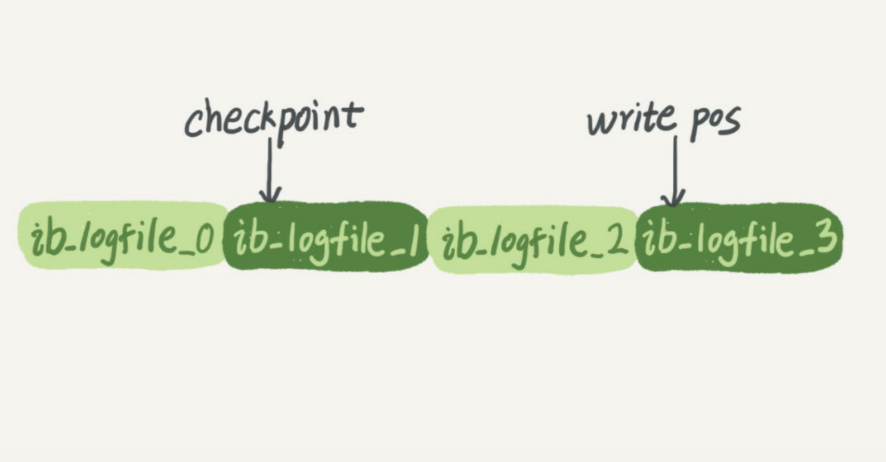
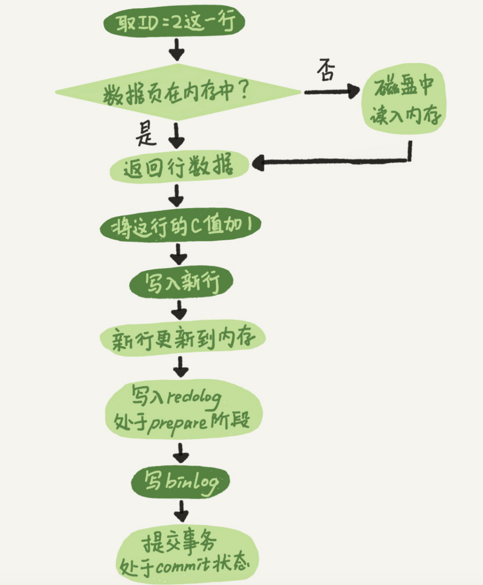

1. WAL(Write-Ahead Logging)，是先写日志，再写磁盘。
   当有一条记录需要更新，InnoDB引擎就会先把记录写到redo log里 面，并更新内存。InnoDB引擎会在系统空闲的时候，将这个操作记录更新到磁盘里面。

2. redo.log 重做日志

    
=======
   write pos是当前记录的位置，一边写一边后移，写到第3号文件(ib_lofile_3)末尾后就回到0号(ib_logfile_0)文件开头。

   write pos和checkpoint之间的部分，可以用来记录新的操作。如果write pos 追上checkpoint，这时候不能再执行新的更新，得停下来先擦掉一些记录，把 checkpoint推进一下

   保证即使数据库发生异常重启，之前提交的记录都不会丢失，这个能力称为crash--safe

3. bin.log 归档日志
   redo.log和bin.log区别

    1. redo log是InnoDB引擎特有的；binlog是MySQL的Server层实现的，所有引擎都可以使用。 

    2. redo log是物理日志，记录的是“在某个数据页上做了什么修改”；binlog是逻辑日志，记录的是这个语句的原始逻辑，比如“给ID=2这一行的c字段加1 ”。

    3.  redo log是循环写的，空间固定会用完；binlog是可以追加写入的。“追加写”是指binlog文件 

       写到一定大小后会切换到下一个，并不会覆盖以前的日志。

4. 两阶段提交
   

   