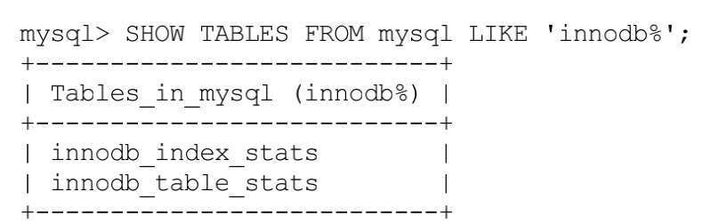

## innodb 统计数据

过InnoDB默认是以表为单位来收集和存储统计数据的。

InnoDB提供了两种存储统计数据的方式： 

+ 永久性的统计数据 ，存储在磁盘上。

+ 非永久性的统计数据，存储在内存中。

## 基于磁盘的永久性统计数据 

innodb_table_stats存储了关于表的统计数据，每一条记录对应着一个表的统计数据。 

innodb_index_stats存储了关于索引的统计数据，每一条记录对应着一个索引的一个统计项的统计数据。

