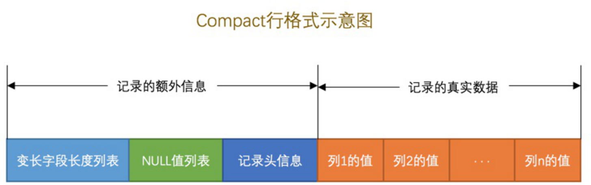
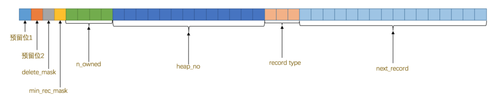

1. innodb页
   以**页**作为磁盘和内存之间交互的基本单位，InnoDB中页的大小一般为 **16** KB。
2. innodb行格式
   是以记录为单位来向表中插入数据的
3. compact行格式
   

+ 所有变长字段占用的字节长度都存放在记录的开头部位，从而形成一个变长字段长度列表，各变长字段数据占用的字节数按照列的顺序逆序存放。
+ **NULL**值列表，Compact行格式把这些值为NULL的列统一管理起来，存储到NULL值列表中
+ 记录头信息 ，一个用于描述记录的记录头信息，它是由固定的5个字节组成。

| 名称         | 单位bit | 描述                                                         |
| ------------ | ------- | ------------------------------------------------------------ |
| delete_mark  | 1       | 记录是否是删除                                               |
| min_rec_mask | 1       | 是不是B+树的每层非叶子节点中的最小记录                       |
| n_owned      | 4       | 表示当前记录拥有的记录数                                     |
| heap_no      | 13      | 表示当前记录在记录堆的位置信息                               |
| record_type  | 3       | 0表示普通记录，1表示B+树非叶子节点记录，2表示最小记录，3表示最大记录 |
| next_record  | 16      | 表示下一条记录的相对位置                                     |

4. 隐藏列

   | 列名           | 是否必须 | 占用空间(字节) | 描述           |
   | -------------- | -------- | -------------- | -------------- |
   | row_id         | 否       | 6              | 行id，唯一标识 |
   | transaction_id | 是       | 6              | 事务ID         |
   | roll_pointer   | 是       | 7              | 回滚字节       |

   