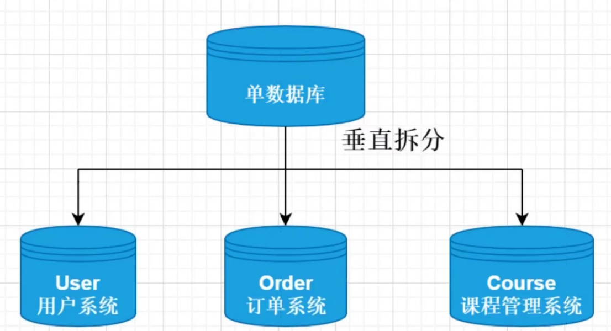
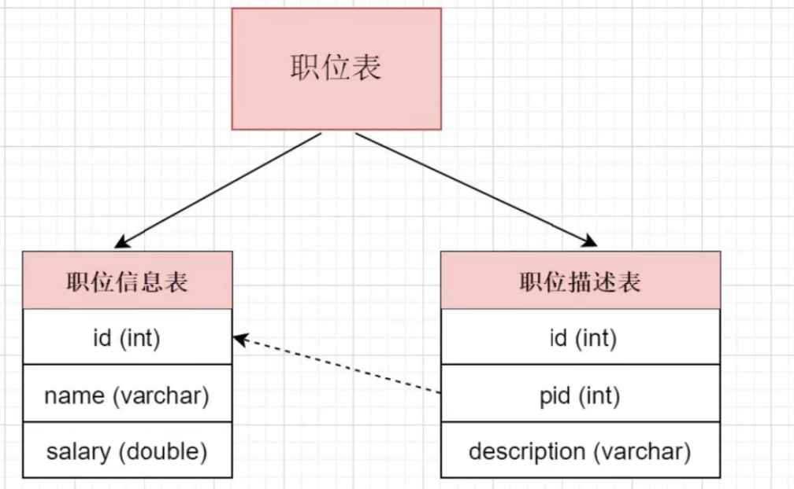
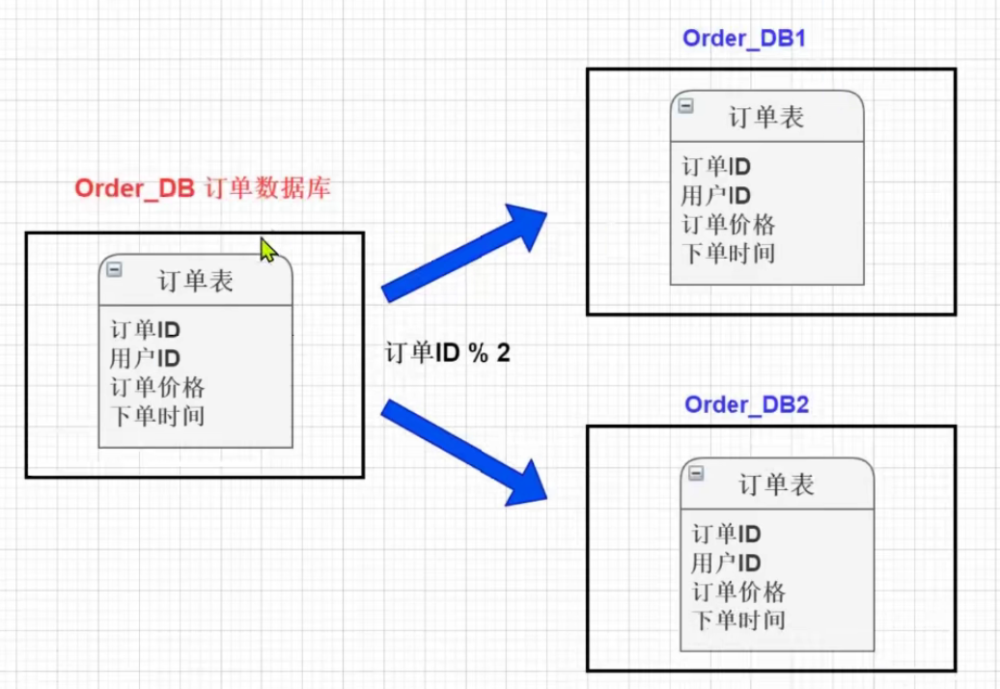
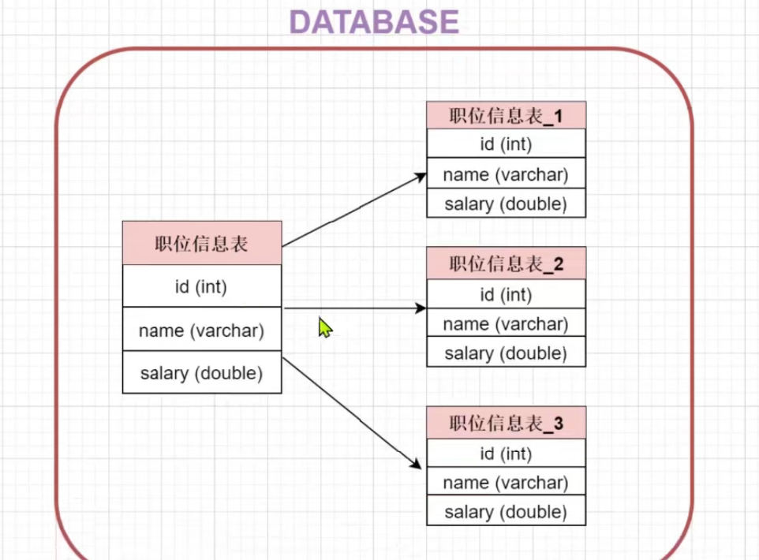

单表数据量超过1000万或100g的时候，速度会变慢

分库分表： 垂直分库、垂直分表、水平分库、水平分表

垂直分库：
	

垂直分表：
按照字段分成多个表

水平分库：

讲单张表的数据分到不同的数据库中，每个数据库具有相同的库与表，只是表数据集合不同。 
比如按照订单表的id是奇数还是偶数存储在不同的库中。

 水平分表：
针对数据量巨大的单张表，按照规则把一张表的数据切分到多张表里面去。

