## 理论知识体系

## 1、数据类型

#### 整型

+ TINYINT, SMALLINT, MEDIUMINT, INT, BIGINT 分别使用 8, 16, 24, 32, 64 位存储空间，一般情况下越小的列越好
+ 默认有符号
+ 无符号可以用unsigned修饰
+ int(M) 表示最大的显示宽度，int依然占4个字节

#### 浮点数

FLOAT 和 DOUBLE 为浮点类型，DECIMAL 为高精度小数类型。CPU 原生支持浮点运算，但是不支持 DECIMAl 类型的计算，因此 DECIMAL 的计算比浮点类型需要更高的代价。

FLOAT、DOUBLE 和 DECIMAL 都可以指定列宽，例如 DECIMAL(18, 9) 表示总共 18 位，取 9 位存储小数部分，剩下 9 位存储整数部分。

#### float, double, decimal如何选择

先说结论：
1、你要表示的浮点型数据转成二进制之后能被32位float存储，或者可以容忍截断，则使用float，这个范围大概为要精确保存6位数字左右的浮点型数据
2、double则是64位
3、DBA强烈推荐和金钱相关的类型都要存储为decimal类型

浮点型数据在存储的时候，必须转化成二进制。float存储格式为符号位占一位，后面接8位指数为，在加23位尾数部分。如果尾数过长就会发生截断。

#### 字符串

+ char，0-255字节，定长
+ varchar，0-65535字节，变长
+ tinytext，0-255字节，短文本字符串
+ sallint,  -32768〜32767
+ text，0-65535，长文本字符串
+ longtext，0-4295967295字节， 极大文本数据
+ tinyblob，0-255字节，二进制字符串
+ blob，0-65535，二进制形式的长文本
+ longblob，0-4295967295字节， 

char定长，varchar变长
VARCHAR会保留字符串末尾的空格，而 CHAR 会删除
char(m),varchar(m),m表示保存字符串的字符数
Varcahr(5),varchar(200)的所占在存储空间时一样的，但更长的列需要更长的内存。

#### 字符，字符集，unicode字符集，编码，utf8编码，比较规则

字符，各种文字，符号，表意文字。
字符集，一定数量字符的集合。
unicode字符集，所有字符的集合。4个字节表示所有字符。
编码，将每个字符用计算机数字表示。
utf-8编码，针对unicode字符集的编码，特点是可变长度字符编码，是一种前缀码。
utf-8编码表示规则：
	

#### 时间和日期

1. datetime
   1. 保存1001年到9999年日期和时间，精度为秒，8字节存储空间
   2. 时区无关
2. timestamp
   1. 和unix时间戳相同，1970年1月1日午夜以来的秒数，4个字节
   2. 时区有关

应该尽量使用 TIMESTAMP，因为它比 DATETIME 空间效率更高

```
https://segmentfault.com/a/1190000039139882
```


## 2、mysql基础架构

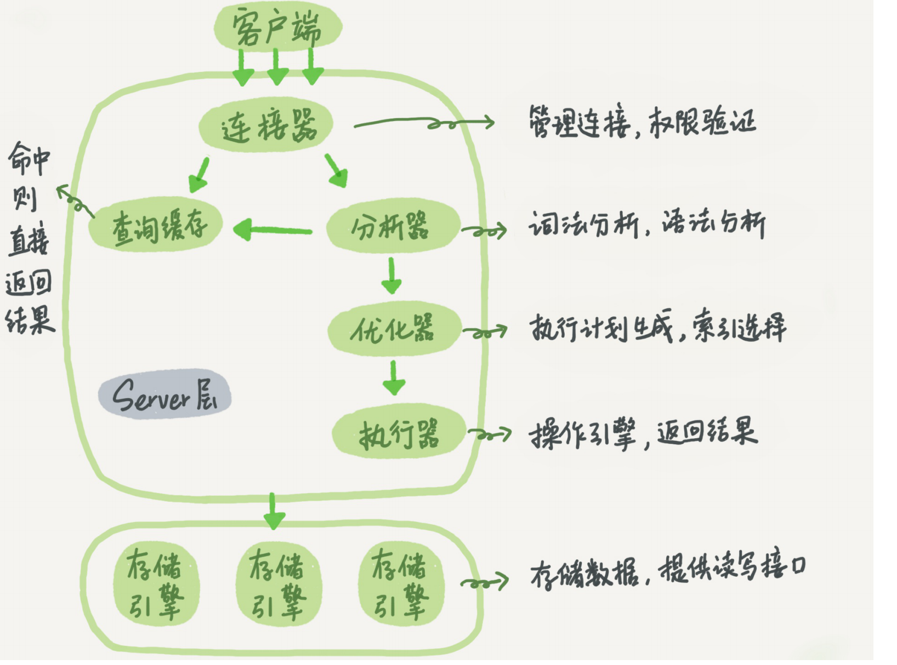

+ 分为server层和存储引擎层
+ server层包括连接器、查询缓存、分析器、优化器、执行器
+ 存储引擎层在负责数据存储和读取。5.5.5版本之后，默认innodb

查询缓存：查询结果以key-value缓存起来。mysql8.0已经被砍掉了。
分析器：先词法分析，识别各个字符串。在进行语法分析，校验语法规则。
优化器： 评估多个索引的成本，选择最优的一个；决定join的驱动表；
执行器：先进行执行条件的校验。根据引擎定义去调用相应的引擎接口


## 3、什么是Innodb数据页

磁盘和内存交互的基本单位， 一般为16k。

### innodb行格式

Compact、Redundant、Dynamic和Compressed四种。

#### Compact

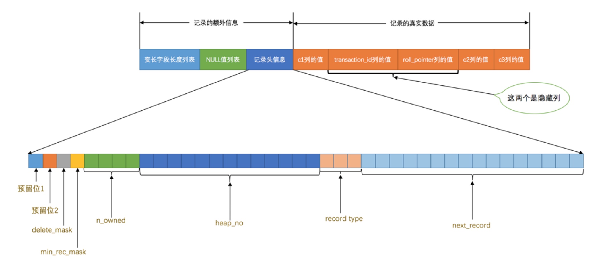

变成字段长度列表：**逆序存放**各变长字段占用的字节数

NULL值列表：没有null列则没有null值列表，有则按照1是bull，0不为null逆序排列

记录头信息：用于描述记录的一些相关信息

+ delete_mask：删除标记
+ min_rec_mask：B+树的每层非叶子节点中的最小记录都会添加该标记
+ record_type：0表示普通记录，1表示B+树非叶子节点记录，2表示最小记录，3表示最大记录
+ next_record：表示下一条记录的相对位置
+ n_owned: 页目录分组，表示组内记录条数

+ row_id :  不是必须，行id，唯一的标识一个记录
+ transaction_id：事务ID
+ roll_pointer：回滚指针

### innodb数据页结构


1. 记录在页中按照主键值由小到大顺序串联成一个单链表，但最小和最大记录存放在infimum和supernum部分
2. 页目录(page Directory)：在对页中的正常记录分组，存储每组的最后一条记录的地址偏移量，叫做槽
3. 页面头部(page header): 数据页存储记录的状态信息。比如，页目录的槽数量、可用空间的最小地址、当前页在b+中的层级、用户记录的数量等信息

总结：

1. 内存和磁盘的交互的基本单位是页，一页数据页通常是16k
2. 用户记录部分用来存储用户记录，用户记录通过next_record形成一个**有序**单链表。
3. 页目录部分存储着槽；槽是mysql对数据页中的记录在进行分组，组中最大一个记录的地址偏移量记。
4. 数据页定位一条记录过程：
   1. 二分法定位记录所在的槽
   2. 通过记录next_record遍历分组中的各个记录
5. 每一条记录除了存储本身的数据之外还要存储一些额外的信息。比如，变长字段长度列表、null值列表、以及头信息。在来就是一些隐藏列事务id，回滚指针


## 4、表空间

#### 表空间：是逻辑上面的概念，存储的对象是段。

+ 系统表空间：从MySQL5.5.7到MySQL5.6.6之间的各个版本中，我们表 

  中的数据都会被默认存储到这个 

+ 独立表空间：在MySQL5.6.6以及之后的版本中，每一个表建立一个独立表空间

#### 段(segment)

段（Segment）由一个或多个区组成，区在文件系统是一个**连续分配**的空间（在 InnoDB 中是连续的 64 个页），不过在段中不要求区与区之间是相邻的

#### 区(extent)

64个页就是一个区。

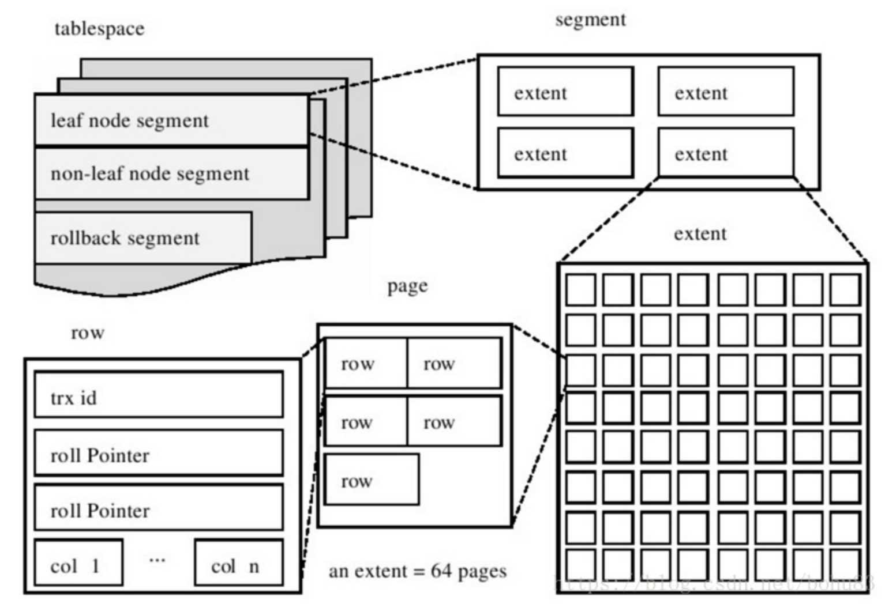

```
https://www.cnblogs.com/gered/p/13803642.html
```


## 5、InnoDb索引

#### 索引分类

1. 主键索引
   设定为主键后数据库自动建立索引，innodb为聚簇索引
2. 普通索引
   单列索引
3. 唯一索引
   索引值必须唯一，可以有多个null
4. 复合索引
   一个索引多个列

#### innoDb索引

数据页之间组成一个双向链表，数据页有最小id和页号，可以用来建立数据页的目录项。

复用数据页的结构来存储目录项。

用record_type=1来表示目录项记录

目录项记录过多，可以为目录项记录建立目录项记录

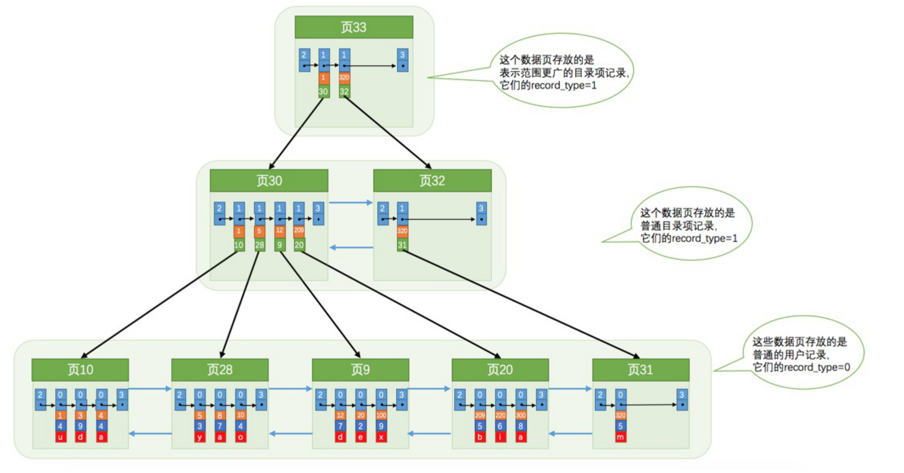

这种数据结构就是b+树，有如下特征：

+ 完整数据在最底层，也就是叶子节点上面
+ 同一层的节点通过页号形成一个双向链表
+ 非底层的节点只有部分数据，而且只记录页号和主键两列

innodb会自动为我创建聚簇索引，即主键值大小进行记录和页的排序，叶子节点有完整数据的索引。

#### 二级索引

一张表只有一个聚簇索引。所以，如果我们按照其他列和页号建立的索引的叶子节点则没有完整的数据。那么就需要到表聚簇索引进行一次查询，这个过程叫回表

#### 索引覆盖

非主键索引中就能查到的记录，而不需要查询主键索引中的记录，避免了回表的产生减少了树的搜索次数，显著提升性能

#### 索引下推

对于联合索引，当where条件可以在索引上面进行判断，就可以过滤掉不符合条件id，从而减少回表的次数

#### 最左匹配原则

对于联合索引，查询的列不是索引的最左前缀, 那MySQL不会将索引用于执行查询。

建立索引的时候可以使用列前缀作为索引值


## 6、联表

#### 1.驱动表和被驱动表

第一个需要查询的表，这个表称之为驱动表

驱动表产生的结果集中的每一条记录，分别需要到被驱动表表中查找匹配的记录。


#### 2.join类型

对于内连接的两个表，驱动表中的记录在被驱动表中找不到匹配的记录，该记录不会加入到最后的结果集，我们上边提到的连接都是所谓的内连接。 

对于外连接的两个表，驱动表中的记录即使在被驱动表中没有匹配的记录，也仍然需要加入到结果集

#### 3.where和on

内连接中的WHERE子句和ON子句是等价的。

把涉及两表的过滤条件都放到ON子句中，我们也一般把放到ON子句中的过滤条件也称之为连接条件

## 7、explain


## 8、buffer pool

mysql申请的一块连续的内存空间，加速读和写。

#### buffer pool组成

##### 控制块

缓存页单位都是16kb。**控制块**用于表示和管理缓存页，与缓存页是一一对应，控制信息包括表空间编号、页号、缓存页在buffer pool的地址、链表信息、锁信息等

##### free链的管理

free链用于管理所有空闲的缓存页。free链的基节点并不占用buffer pool的内存，而是单独申请的一块内存空间。

##### flush链表的管理

脏页，缓存页的数据和磁盘页的数据不一致。flush链表用于管理脏页

##### **LRU**链表的管理

buffer pool内存不够用要淘汰一些使用率比较低的缓存，提高缓存命中率。
LRU链表用于按照最近最少使用的原则去淘汰缓存：

+ 数据页不在buffer pool，会在加载内存，将控制块作为节点加入链表的头部
+ 缓存已经buffer pool之中，直接把对应控制块移到链表头部

##### 预读机制和分区域的LRU

预读机制，分线性预读和随机预读：

+ 线性预读，在区的页面被顺序访问超过innodb_read_ahead_threshold设定的值(默认56)，触发。会将下一个区的页面全部读到buffer pool。
+ 随机预读，在区中已经缓存了某个区的13个连续的页面，不论这些页面是不是顺序读取的，都会触发一次异步读取本区中所有其的页面到Buffer Pool的请求

全表扫描的语句执行的频率不高，每次执行都要把Buffer Pool中的缓存页大量替换，这严重的影响到其他查询对 Buffer Pool的使用，从 而大大降低了缓存命中率。

LRU链表按照一定比例分成两截：

+ young区域，使用频率非常高的缓存页
+ old区域，使用频率不是很高的缓存页

针对预读和全表扫描的优化：

+ 初次加载到Buffer Pool中的缓存页,控制块放到old头部。
+ 一个old区域的缓存在第一次访问之后，在一定时间间隔内(innodb_old_blocks_time控制)不会加入用youn区域的头部

#### 多个**Buffer Pool**实例

如果buffer pool 过大，可以进行切分一个个较小的实例。切分数量通过innodb_buffer_pool_instances控制。
当innodb_buffer_pool_size的值小于1G的时候设置多个实例是无效的，InnoDB会默认把innodb_buffer_pool_instances 的值修改为1

#### **innodb_buffer_pool_chunk_size**

自MySQL 5.7.5版本之后，可以在服务器运行过程中调整Buffer Pool大小。每个Buffer Pool实例由若干个chunk组成，每个chunk的大小可以在服务器启动时通过启动参数调整

#### 总结：

1.mysql申请一大块内存来作为缓存池，名字叫buffer pool。

2.buffer pool很大的时候，可以切分较小的buffer pool 实例，方便管理。

3.每个buffer pool 实例又是由多个chunk组成

4.chunk又被划分成一个个控制块和缓存页，控制块和缓存页一一对应，缓存页为16kb

5.控制块用于表示和控制缓存页的状态。mysql用free链表管理空闲的缓存页，flush链表管理磁盘和缓存数据不一致的脏页。

6.buffer pool 不够用时，就要淘汰一些利用率比较低的缓存，来提高缓存命中率。LRU链表按照最近最少使用原则淘汰缓存。

7.mysql的预读机制和全表扫描，会将使用频率很低的数据缓存进buffer pool。mysql对此进行针对性的优化。将LRU链表按照一定比例分成使用频率高热链和使用频率低的冷链。

+ mysql的预读机制针对优化，初次加载到Buffer Pool中的某个缓存页放到old区域的头部
+ 在old区域的缓存页进行第一次访问之后一定时间间隔内不会被从old区域移动到young区域的头部


## 9、redo log

#### WAL

WAL，write-ahead-logging，先写日志在写磁盘。

redo log 记录事务对数据所做的修改，解决了即时刷新一个完整数据的性能浪费、随机io读写慢速、断电内存丢失等。

redo log 的优点，顺序读并且占用空间小，只是记录数据页的修改。

#### 以组的形式写入redo日志

insert插入数据可能涉及到页分裂就会产生多条redo log，这些日志以一个MLOG_MULTI_REC_END类型的日志为结尾，分为一组。

#### redo log block

redo日志的基本单位为512字节的页，称为redo log block。

#### redo 日志缓冲区

写入磁盘是非常慢的io，通过缓存暂存数据，等数据量达到一定程度在一次写入磁盘，提高写入效率。redo log 同样有缓冲区用来加速日志写入。

#### **redo**日志刷盘时机

+ 写入log buffer的redo日志量已经占满了log buffer总容量的大约一半左右
+ 事务提交时 
+ 后台进程定时刷新
+ checkpoint的时候

#### redo 日志文件组

redo日志文件是以一个日志文件组的形式出现，前缀ib_logfile加上数字n命名。

#### redo 日志文件格式

前2048字节记录文件相关信息，剩下都是以512字节为基本单位的block。

#### checkpoint

采用了大小固定，循环写入的方式，当写到结尾时，会回到开头循环写日志。

`write pos `表示 `redo log `当前记录的 `LSN` (逻辑序列号)位置

**`check point `表示** 数据页更改记录刷盘后对应 `redo log `所处的 `LSN `(逻辑序列号)位置。

 `write pos `到 `check point `之间的部分是 `redo log `空着的部分，用于记录新的记录；

` check point `到 `write pos `之间是 `redo log `待落盘的数据页更改记录。

当 `write pos `追上 `check point `时，会先推动 `check point `向前移动，空出位置再记录新的日志
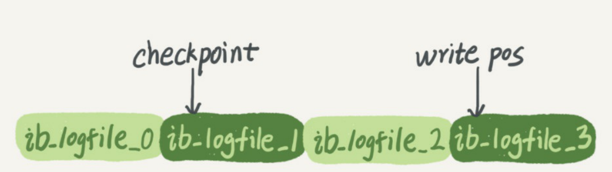

#### 总结：

1.要保证**持久性**就要将数据刷新到磁盘，会有两个性能问题数据更新少的数据页整页刷新性价不高，随机io特别慢。

2.暂时将数据改动以顺序的形式写入磁盘，文件为redo log

3.redo log 以 512字节大小block为基本单位进行管理，并且使用log buffer，加速磁盘写入

4.redo log 以 4个 为一组，循环写入。write pos为写入点，check point为校验点。

5.redo log 是 WAL机制，即先写日志，在写磁盘。


## 10、undo log

#### undo log的作用

+ 事务回滚
+ mvcc
+ 事务提交之前，会把修改的记录放到undo log。事务回滚或者数据库崩溃可以利用undo日志，撤销提交

+ undo log 是逻辑日志。插入对应删除的undo log，删除对应插入 undolog，更新新的值对应更新旧的值 undolog。
+ undol log 存储：undo log 采用段的方式管理和记录。innnodb数据文件包含一种rollback  segment回滚段


## 11、bin log

server层面的日志，即binary log(二进制日志)，binlog。
Binlog是记录所有数据库表结构变更以及表数据修改的二进制日志，不会记录SELECT和SHOW这类操作。
Binlog文件名默认为“主机名_binlog-序列号”格式，例如oak_binlog-000001。

文件记录模式有STATEMENT、ROW和MIXED三种:

+ Row, 记录每一行的修改细节，能完全实现主从的数据同步和数据恢复。但是大批量的数据修改会产生大量的日志
+ statment。每一条被修改数据的SQL都会记录到master的Binlog中，slave在复制的时候SQL进程会解析成和原来master端执行过的相同的SQL再次执行。简称SQL语句复制
+ mixed混合，以上两种模式的混合使用，一般会使用 STATEMENT 模式保存binlog，对于STATEMENT模式无法复制的操作使用 ROW 模式保存binlog，MySQL会根据执行的SQL语句选择写入模式。

#### bin log 写入机制

常用的log event有：Query event、Row event、Xid event等。

+ 根据记录模式和操作触发event事件，生成log event
+ 事务执行过程中产生的log event 写入缓存区，每个事务线程都有一个缓冲区
+ 事务会在提交阶段将log event写入binlog文件，不同事务以串行方式写入

#### bin log 的作用

+ 数据恢复
+ 主从同步


## 12、事务隔离等级和mvcc

#### 事务特性

原子性atomicity；一致性Consistency；隔离性isolation；持久性Durability；

####  事务隔离等级

+ 读未提交，一个事务可以看到其他事务未提交的执行，会造成脏读、幻读
+ 读已提交，一个事务只能看到其他事务已经提交的执行，会造成脏读、幻读
+ 可重复读，
+ 序列化，

#### mvvc 多版本并发控制


#### ReadView快照读

ReadView 是一个数据结构，包含4个字段：

+ m_ids: 当前活跃事务编号集合
+ min_trx_id:最小活跃事务编号
+ max_trx_id: 预分配事务编号，当前最多事务编号+1
+ Creator_trx_id:ReadView 创建者的事务编号


#### 版本访问规则

事务id和时间戳一样，最新的最大。快照读就是记录select那个时刻活跃的事务id。活跃事务id之中的最大值和最小值，分别表示最新和最老的。然后一条一条去遍历版本连的数据副本。数据的trx_id,比最大的大就是比最新的新，也这条数据就是快照读之后才开启的事务创建，现在的人怎么能看到未来。数据的trx_id比最小的小就是比最老的老，就是说这条数据在快照读之前就出现了，就可以读。那么处于中间如何判断，就看是不是处于活跃事务之中，是就是还没有提交，不是说明已经提交

当一条事务执行select操作时，通过快照读进行判断：

+ 版本链最新数据是不是该事务创建的。通过事务id是否和creator_trx_id相等判断。是创建者，直接访问
+ 最早的活跃事务的事务id最小， 如果trx_id小于事务id，就说明数据已经提交可以访问
+  活跃事务中最老的事务的事务id最大，undo log 版本连上面的trx_id 如果大于这个id，那么这记录是之后才创建的，不允许访问。
+ 处在中间，如果事务id在活跃事务id集合里面，不可读；不在，证明已经提交了


读已提交: 在每一次执行快照读时生成ReadView。

可重复读：仅在第一次执行快照读时生成ReadView，后续快照读复用。


## 13、锁

共享锁(shared locks)，s锁。在事务要读取一条记录时，需要先获取该记录的锁

独占锁(Exclusive locks)， x锁。在事务改动一条记录时，需要该获取该记录的锁

共享锁和共享锁兼容，共享锁和排他锁不兼容，排他锁和排他锁不兼容

#### 锁定读的语句

+ 对读取的记录加共享锁
  select ... LOCK  IN SHARE MODE；
  普通的SELECT语句后边加LOCK IN SHARE MODE，如果当前事务执行了该语句，那么它会为读取到的记录加S锁，这样允许别的事务继续获取这些记录的S锁;

+ 对读取的记录加排他锁

  select ... FOR UPDATE;
  普通的SELECT语句后边加FOR UPDATE，如果当前事务执行了该语句，那么它会为读取到的记录加X锁，这样既不允许别的事务获取这些记录的S锁

#### 快照读

事务利用mvcc进行的读取操作称为一致性读，又称快照读。READ COMMITTED、REPEATABLE READ隔离级别下都算是一致性读

#### 写操作

Delete、update、insert

- delete
  删除记录其实是b+树定位到该条记录的位置，获取这条记录的x锁，在执行delete_mask
- update
  + 没修改记录的主键值且被更新的列修改后所占空间没有改变，则先b+树定位记录，获取排他锁并在源记录的位置进行修改
  + 没修改主键值但被更新的列修改所占空间发生的了变化，则先在B+树中定位到这条记录的位置，然后获取一下记录的X锁，将该记录彻底删除掉（就是把记录 彻底移入垃圾链表），最后再插入一条新记录。这个定位待修改记录在B+树中位置的过程看成是一个获取X锁的锁定读，新插入的记录由INSERT操作提供的隐式锁进行保护
  + 如果修改了该记录的键值，则相当于在原记录上做DELETE操作之后再来一次INSERT操作，加锁操作就需要按照DELETE和INSERT的规则进行了。
- insert

​	新插入一条记录的操作并不加锁，设计InnoDB的大叔通过一种称之为隐式锁的东东来保护这条新插入的记录在本事务提交前不被别的事务访问

#### 多粒度锁

是表加锁，也分为S锁和X锁
给表加S锁：
	其他事务能获得该表S锁，也可以继续获得该表的某些记录的S锁
	其他事务不能获得该表S锁，也可以继续获得该表的某些记录的X锁

给表加X锁：
	其他事务不能获得该表S锁，X锁，部分记录的S锁，X锁

意向共享锁，英文名：Intention Shared Lock，简称IS锁。当事务准备在某条记录上加S锁时，需要先在表级别加一个IS锁。 

意向独占锁，英文名：Intention Exclusive Lock，简称IX锁。当事务准备在某条记录上加X锁时，需要先在表级别加一个IX锁。


IS、IX锁是表级锁，它们的提出仅仅为了在之后加表级别的S锁和X锁时可以快速判断表中的记录是否被上锁，以避免用遍历的方式来查看表中有没有上锁的记录

#### **MySQL**中的行锁和表锁

#### **InnoDB**中的表级锁

+ 表级别的S锁、X锁

​	执行SELECT、INSERT、DELETE、UPDATE语句时，InnoDB存储引擎是不会为这个表添加表级别的S锁或者X锁的
​    在对某个表执行一些诸如ALTER TABLE、DROP TABLE这类的DDL语句时

+ 表级别的IS锁、IX锁
  InnoDB给某些记录加S锁之前，先在表级别加一个IS锁，给某些记录加X锁之前，先在表级别加一个IX锁；

#### **InnoDB**中的行级锁

+ record locks
  单个记录的锁

+ Gap Locks
  锁定一个范围，不包括范围

+ Next-Key Locks

  锁定单条记录，又能阻止别的事务将新记录插入被保护记录前边的间隙

+ Insert Intention Locks

+ 隐式锁

#### 为什么上了写锁，别的事务还可以读？

update是写锁，innodb有mvcc机制下读的是快照读

#### 死锁

1. 互斥条件：一个资源每次只能被一个进程使用
2. 请求与保持条件：一个进程因请求资源而阻塞时，对已获得的资源保持不放
3. 不剥夺条件：进程已获得的资源，在没有使用完之前，不能强行剥夺
4. 循环等待条件：多个进程之间形成的一种互相循环等待的资源的关系

#### 如何解决死锁

1. 查看死锁：show engine innodb status \G
2. 自动检测机制，超时自动回滚代价较小的事务（innodb_lock_wait_timeout 默认50s）
3. 人为解决，kill阻塞进程（show processlist）
4. wait for graph 等待图（主动检测）

#### 乐观锁和悲观锁

|          | 乐观锁                                                       | 悲观锁                                 |
| -------- | ------------------------------------------------------------ | -------------------------------------- |
| 概念     | 假设并发不会发生，提交修改时检查数据                         | 假定并发冲突一定会发生，屏蔽一切       |
| 实现机制 | 给数据加上一个版本号或者时间戳，更新校验版本或时间戳是不是最新的 | 直接锁定记录，让其他事务不可读也不可写 |
| 实现方式 | 使用version或timestamp进行比较                               | 表锁，行锁                             |
| 实现者   | 开发者在代码层面上去实现                                     | 数据库                                 |
| 适用场景 | 并发量大                                                     | 并发小                                 |


## 14、主从同步机制

涉及三个线程，一个运行在主节点（log dump thread），其余两个(I/O thread, SQL thread)运行在从节点

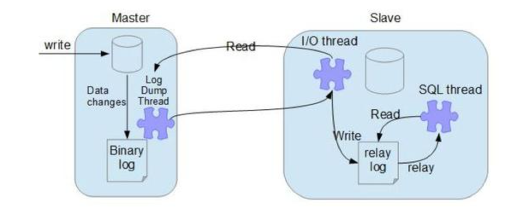

1.从节点连接主节点时，主节点会创建一个log dump 线程，用于发送bin-log的内容。

2.从节点会创建一个I/O线程用来连接主节点，请求主库中更新的bin-log。I/O线程接收到主节点binlog dump 进程发来的更新之后，保存在本地relay-log中

3.SQL线程负责读取relay log中的内容，解析成具体的操作并执行

#### 复制的模式

##### 异步模式

主节点不会主动push bin log到从节点

##### **半同步模式(mysql semi-sync)**

主节点只需要接收到其中一台从节点的返回信息，就会commit；否则需要等待直到超时时间然后切换成异步模式再提交

##### 全同步模式

全同步模式是指主节点和从节点全部执行了commit并确认才会向客户端返回成功


## 15、分库分表

#### 分库分表的原因

单表的数据量达到1000w或100g以后，即使添加从库、优化索引、仍然会性能下降。把数据分散到不同的数据库中，来缓解单一数据库的性能。

#### 分库分表的方案

1. 单表数据量超过1000万或100g的时候，速度会变慢

   分库分表： 垂直分库、垂直分表、水平分库、水平分表

   垂直分库：
   	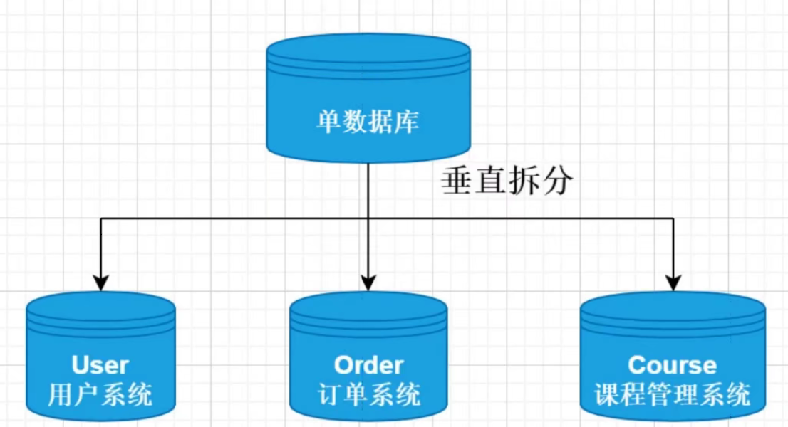

   垂直分表：
   按照字段分成多个表

   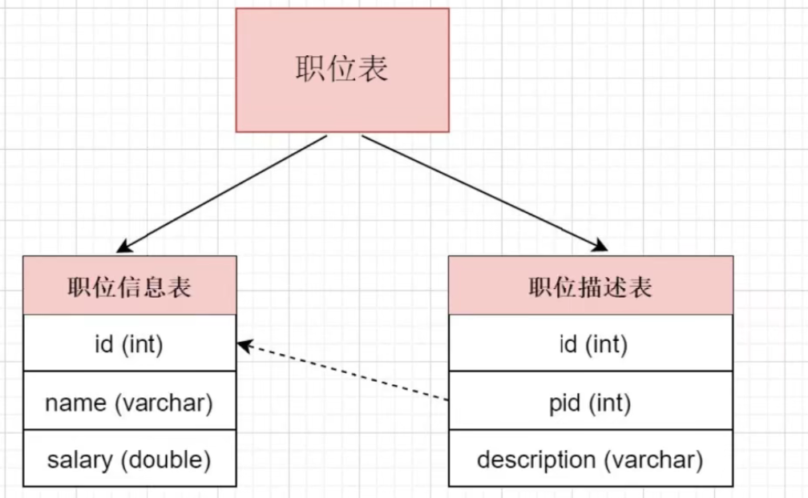

   水平分库：

   讲单张表的数据分到不同的数据库中，每个数据库具有相同的库与表，只是表数据集合不同。 
   比如按照订单表的id是奇数还是偶数存储在不同的库中。
   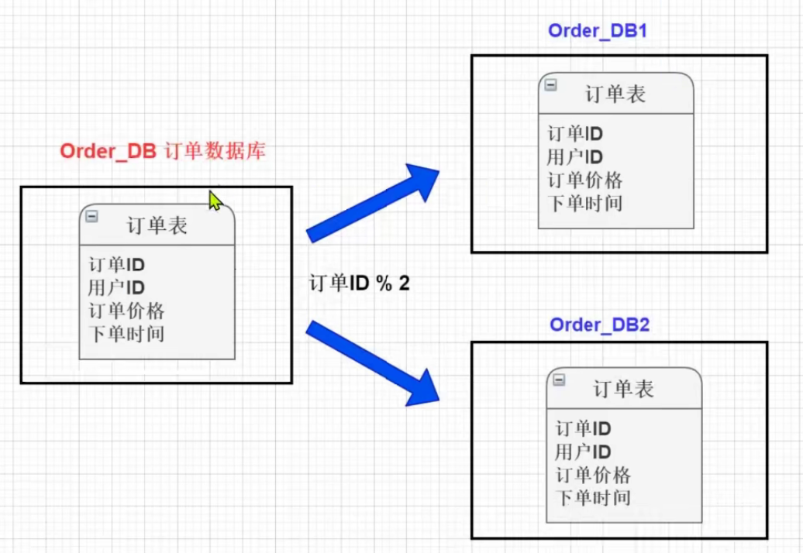

    水平分表：
   针对数据量巨大的单张表，按照规则把一张表的数据切分到多张表里面去。

   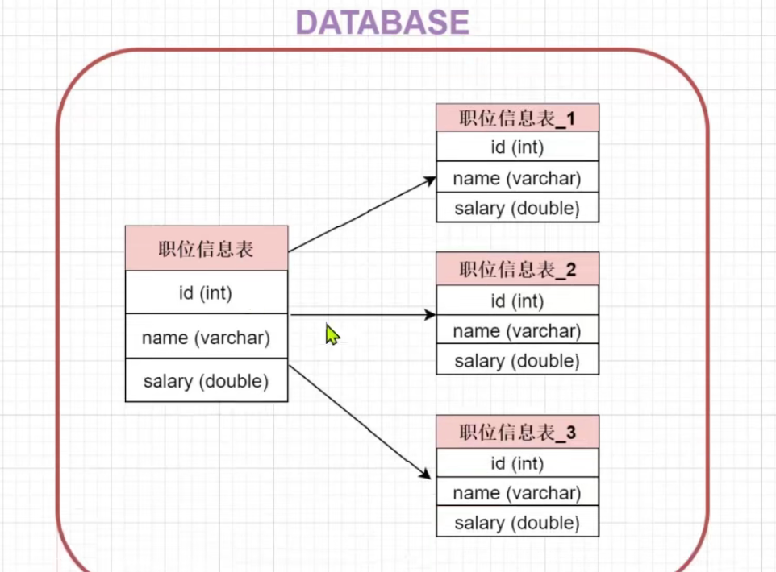

   


#### 分库分表带来的问题以及解决方案

1. 事务一致性问题
   一般可使用"XA协议"和"两阶段提交"处理；

2. 跨节点关联查询 join
   尽量避免使用join；
   全局表，系统中所有模块都可能依赖的一些表，所有库都放一份；
   字段冗余；
   数据组装，分多次sql查询
   ER分片，先确定表之间的关联关系，并将那些存在关联关系的表记录存放在同一个分片上，按照主键切分

3. 跨节点分页、排序、函数问题

4. 主键避重问题
   分库分表环境中，由于表中数据同时存在不同数据库中，主键值平时使用的自增长将无用武之地，某个分区数据库自生成的ID无法保证全局唯一。
   1)UUID；

   2)结合数据库维护主键ID表

   3)雪花算法

## 16、慢日志查询

1. 开启慢日志查询

   ```sql
   SET GLOBAL slow_query_log = 'ON';
   -- 未使用索引的查询也认为是一个可能的慢查询
   set global log_queries_not_using_indexes = 'ON';
   ```

   ```
   MySQL 慢日志位于 /var/lib/mysql/-slow.log
   ```

   

## 面试题

## 1、三范式

1. 第一范式：每个列不可在拆
2. 第二范式：第一范式基础上，非主键完全依赖主键
3. 第三范式：第二范式基础上，非主键只依赖主键，不依赖于其他非主键

## 2、mysql的binlog有几种录入格式？

三种：statement, row和mixed

1. statement模式，每一条修改数据sql都会记录在binlog。不需记录每行的变化，减少了binlog的日志量。但sql执行是有上下文环境，需要保存。
2. row级别，记录单位为每一行的改动。但是大批量的记录修改(alter table)会生成大量的记录
3. mixed，普通操作用statement记录，无法使用statement时用row

## 3、MyISAM和Innodb区别

1. 锁粒度：Innodb支持行锁，表锁。MyIsam仅为表锁
2. 支持事务：Innodb支持事务，并支持savepoint；myisam不支持事务
3. 查询性能：MylSAM 要优于 InnoDB 因为 InnoDB 在查询过程中，是需要维护
   数据缓存，而且查询过程是先定位到行所在的数据块，然后在从数据块中
   定位到要查找的行;而 MyISAM 可以直接定位到数据所在的内存地址，可以
   直接找到数据。
4. 表结构上：MyISAM 的表结构文件包括:frm(表结构定义),.MYI(索引),.MYD(数据);而 InnoDB 的表数据文件为:ibd 和 frm(表结构定义)。 

## 4、MyISAM索引和InnoDB索引

1. innodb是聚簇索引，MyIsam是非聚簇索引
   聚簇索引：关系表记录的物理顺序与索引的逻辑顺序相同(聚簇只有一个)
2. innodb主键索引叶子节点存储数据数据，非主键索引只记录索引值和主键值。
3. myIsam叶子节点存储行数据地址，需要在寻址一次才能得到数据
4. InnoDB 非主键索引的叶子节点存储的是主键和其他带索引的列数据，因此
   查询时做到覆盖索引会非常高效

## 5、索引类型

+ 主键：数据列不重复，不为null，一个表只有一个
+ 唯一：数据列不重复，可为null，一个表可以有多个
+ 普通：数据列可重复，可为null，可以有多个
+ 全文索引：

## 6、mysql中的锁

+ 表锁：开销小，加锁快；不会出现死锁；粒度大
+ 行锁：开销大，加锁慢；会出现死锁；锁定粒度最小，发生锁冲突的概率最低
+ 页面锁：开销和加锁时间界于表锁和行锁之间；会出现死锁；锁定粒度界
  于表锁和行锁之间，并发度一般。

## 7、事务隔离等级

SQL 标准定义的四个隔离级别为：

+ read uncommited：读到未提交数据

+ read committed：脏读，不可重复读

+ repeatable read：可重读

+ serializable：串行事物

#### 8、两阶段提交

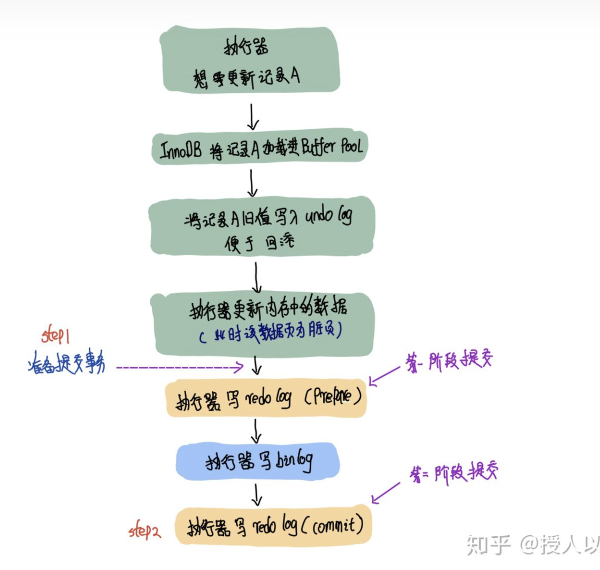


### 乐观锁

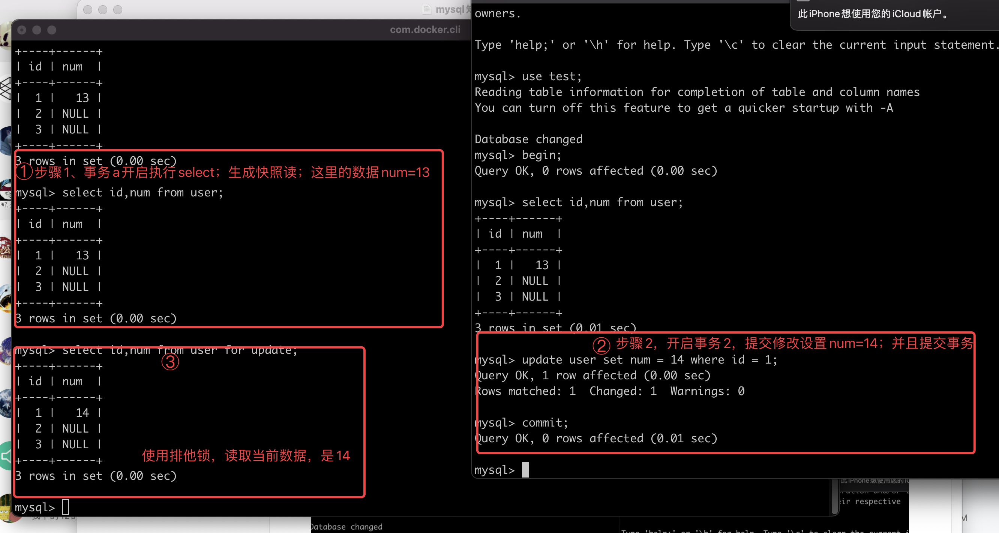

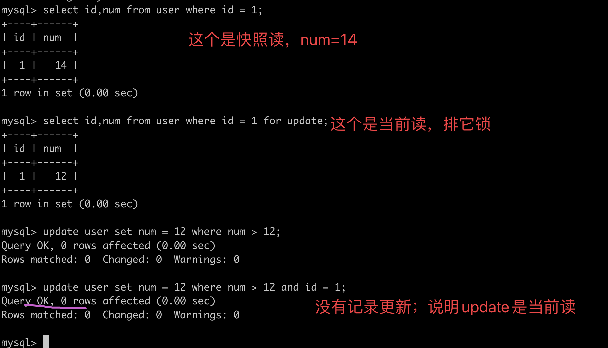

总结: 库存扣减的判断逻辑放到update语句里面，根据更新记录来判断扣减是否成功，不成功回滚

