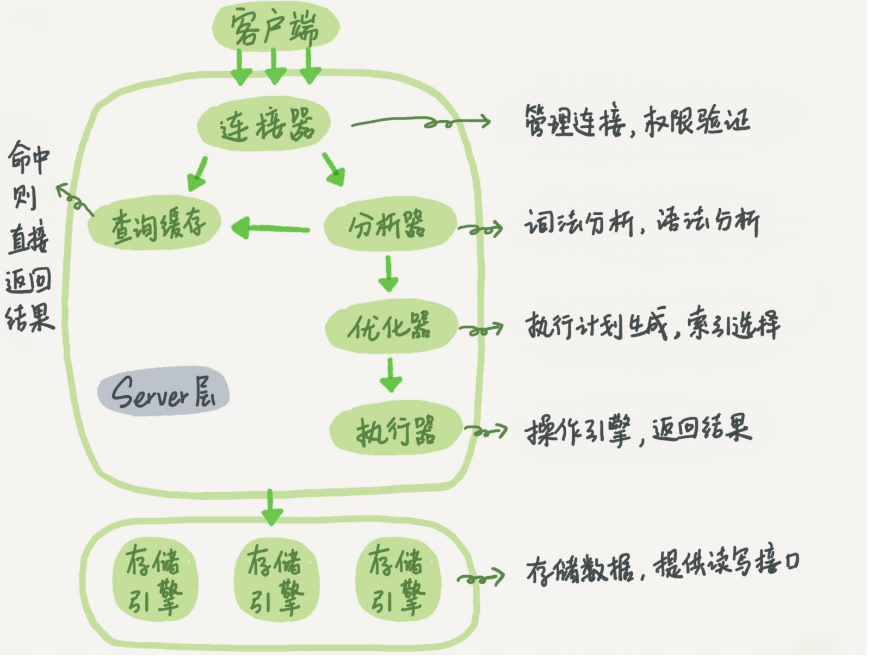
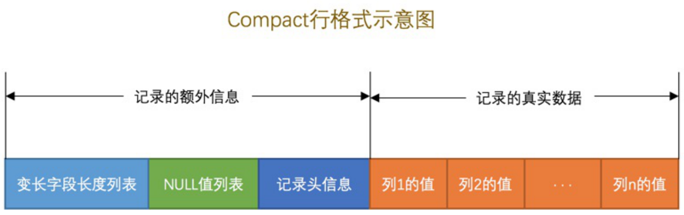
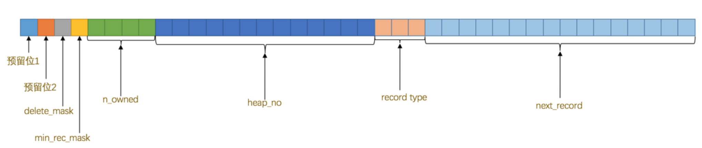

## 理论知识体系

## 1、数据类型

#### 整型

+ TINYINT, SMALLINT, MEDIUMINT, INT, BIGINT 分别使用 8, 16, 24, 32, 64 位存储空间，一般情况下越小的列越好
+ 默认有符号
+ 无符号可以用unsigned修饰
+ int(M) 表示最大的显示宽度，int依然占4个字节

#### 浮点数

FLOAT 和 DOUBLE 为浮点类型，DECIMAL 为高精度小数类型。CPU 原生支持浮点运算，但是不支持 DECIMAl 类型的计算，因此 DECIMAL 的计算比浮点类型需要更高的代价。

FLOAT、DOUBLE 和 DECIMAL 都可以指定列宽，例如 DECIMAL(18, 9) 表示总共 18 位，取 9 位存储小数部分，剩下 9 位存储整数部分。

#### float, double, decimal如何选择

先说结论：
1、你要表示的浮点型数据转成二进制之后能被32位float存储，或者可以容忍截断，则使用float，这个范围大概为要精确保存6位数字左右的浮点型数据
2、double则是64位
3、DBA强烈推荐和金钱相关的类型都要存储为decimal类型

浮点型数据在存储的时候，必须转化成二进制。float存储格式为符号位占一位，后面接8位指数为，在加23位尾数部分。如果尾数过长就会发生截断。

#### 字符串

+ char，0-255字节，定长
+ varchar，0-65535字节，变长
+ tinytext，0-255字节，短文本字符串
+ text，0-65535，长文本字符串
+ longtext，0-4295967295字节， 极大文本数据
+ tinyblob，0-255字节，二进制字符串
+ blob，0-65535，二进制形式的长文本
+ longblob，0-4295967295字节， 

char定长，varchar变长
VARCHAR 会保留字符串末尾的空格，而 CHAR 会删除
char(m),varchar(m),m表示保存字符串的字符数
Varcahr(5),varchar(200)的所占在存储空间时一样的，但更长的列需要更长的内存。

#### 字符，字符集，unicode字符集，编码，utf8编码，比较规则

字符，各种文字，符号，表意文字。
字符集，一定数量字符的集合。
unicode字符集，所有字符集的集合。4个字节表示所有字符。
编码，将每个字符用计算机数字表示。
utf-8编码，针对unicode字符集的编码，特点是可变长度字符编码，是一种前缀码。
utf-8编码表示规则：
	

#### 时间和日期

1. datetime
   1. 保存1001年到9999年日期和时间，精度为秒，8字节存储空间
   2. 时区无关
2. timestamp
   1. 和unix时间戳相同，1970年1月1日午夜以来的秒数，4个字节
   2. 时区有关

应该尽量使用 TIMESTAMP，因为它比 DATETIME 空间效率更高

```
https://segmentfault.com/a/1190000039139882
```


## 

## 2、mysql基础架构



+ 分为server层和存储引擎层
+ server层包括连接器、查询缓存、分析器、优化器、执行器
+ 存储引擎层在负责数据存储和读取。5.5.5版本之后，默认innodb

查询缓存：查询结果以key-value缓存起来。mysql8.0已经被砍掉了。
分析器：先词法分析，识别各个字符串。在进行语法分析，校验语法规则。
优化器： 评估多个索引的成本，选择最优的一个；决定join的驱动表；
执行器：先进行执行条件的校验。根据引擎定义去调用相应的引擎接口

## 3、存储引擎Innodb

1、实现四个标准的隔离级别读未提交、读已提交、可重复读、序列化。
2、在重复读级别通过多版本并发mvcc+间隙锁防止幻读
3、主键索引是聚簇索引，索引中保存了数据。

#### 什么是Innodb数据页

磁盘和内存交互的基本单位， 一般为16k。

## innodb行格式

Compact、Redundant、Dynamic和Compressed四种。

#### Compact



变成字段长度列表：**逆序存放**各变长字段占用的字节数
NULL值列表：没有null列则没有null值列表，有则按照1是bull，0不为null逆序排列
记录头信息：用于描述记录的一些相关信息
		

+ delete_mask：删除标记
+ min_rec_mask：B+树的每层非叶子节点中的最小记录都会添加该标记
+ record_type：0表示普通记录，1表示B+树非叶子节点记录，2表示最小记录，3表示最大记录
+ next_record：表示下一条记录的相对位置

隐藏列：

+ row_id :  不是必须，行id，唯一的标识一个记录
+ transaction_id：事务ID
+ roll_pointer：回滚指针


## 面试题

## 1、三范式

1. 第一范式：每个列不可在拆
2. 第二范式：第一范式基础上，非主键完全依赖主键
3. 第三范式：第二范式基础上，非主键只依赖主键，不依赖于其他非主键

## 2、mysql的binlog有几种录入格式？

三种：statement, row和mixed

1. statement模式，每一条修改数据sql都会记录在binlog。不需记录每行的变化，减少了binlog的日志量。但sql执行是有上下文环境，需要保存。
2. row级别，记录单位为每一行的改动。但是大批量的记录修改(alter table)会生成大量的记录
3. mixed，普通操作用statement记录，无法使用statement时用row

## 3、MyISAM和Innodb区别

1. 锁粒度：Innodb支持行锁，表锁。MyIsam仅为表锁
2. 支持事务：Innodb支持事务，并支持savepoint；myisam不支持事务
3. 查询性能：MylSAM 要优于 InnoDB 因为 InnoDB 在查询过程中，是需要维护
   数据缓存，而且查询过程是先定位到行所在的数据块，然后在从数据块中
   定位到要查找的行;而 MyISAM 可以直接定位到数据所在的内存地址，可以
   直接找到数据。
4. 表结构上：MyISAM 的表结构文件包括:frm(表结构定义),.MYI(索引),.MYD(数据);而 InnoDB 的表数据文件为:ibd 和 frm(表结构定义)。 

## 4、MyISAM索引和InnoDB索引

1. innodb是聚簇索引，MyIsam是非聚簇索引
   聚簇索引：关系表记录的物理顺序与索引的逻辑顺序相同(聚簇只有一个)
2. innodb主键索引叶子节点存储数据数据，非主键索引只记录索引值和主键值。
3. myIsam叶子节点存储行数据地址，需要在寻址一次才能得到数据
4. InnoDB 非主键索引的叶子节点存储的是主键和其他带索引的列数据，因此
   查询时做到覆盖索引会非常高效

## 5、索引类型

+ 主键：数据列不重复，不为null，一个表只有一个
+ 唯一：数据列不重复，可为null，一个表可以有多个
+ 普通：数据列可重复，可为null，可以有多个
+ 全文索引：

## 6、mysql中的锁

+ 表锁：开销小，加锁快；不会出现死锁；粒度大
+ 行锁：开销大，加锁慢；会出现死锁；锁定粒度最小，发生锁冲突的概率最低
+ 页面锁：开销和加锁时间界于表锁和行锁之间；会出现死锁；锁定粒度界
  于表锁和行锁之间，并发度一般。

## 7、事务隔离等级

SQL 标准定义的四个隔离级别为：

+ read uncommited：读到未提交数据

+ read committed：脏读，不可重复读

+ repeatable read：可重读

+ serializable：串行事物


