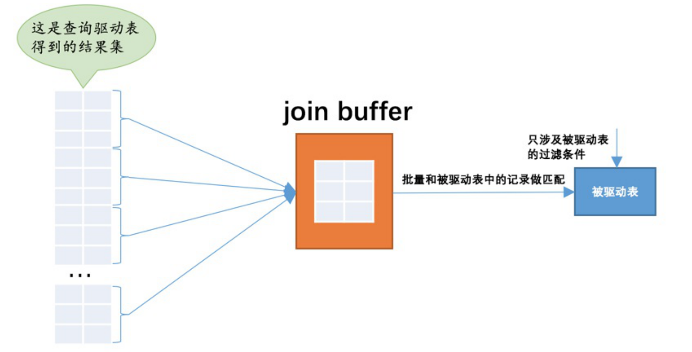

### 1、什么是连接

连接的本质就是把各个连接表中的记录都取出来依次匹配的组合加入结果集并返回给用户。
驱动表只需要访问一次，被驱动表可能被访问多次
对于内连接的两个表，驱动表中的记录在被驱动表中找不到匹配的记录，该记录不会加入到最后的结果集
对于外连接的两个表，驱动表中的记录即使在被驱动表中没有匹配的记录，也仍然需要加入到结果集。 
左外连接:选取左侧的表为驱动表。 
右外连接:选取右侧的表为驱动表。

### 2、连接条件

+ 涉及单个表的
+ 涉及两个表的条件

### 3、连接过程

+ 确定第一个需要查询的表，驱动表。执行单表查询
+ 从驱动表产生的结果集中的每一条记录，分别需要到t2表中查找匹配的记录，所谓匹配的记录，指的是符合过滤条件的记录
+ 驱动表只需要访问一次，被驱动表可能被访问多次

### 4、内连接和外连接

+ 对于内连接的两个表，驱动表中的记录和被驱动表中找不动匹配的记录，该记录不会加入最后的结果集
+ 对于外连接的两个表，驱动表的记录即是在被驱动表中没有匹配的记录，也仍然需要加入结果集

where和连接条件：

+ 涉及单表的过滤条件放在where中，涉及两张表的过滤条件放在on子句，在内连接中where和on子句是等价的。

### 5、连接的原理

内连接的驱动表，选取哪张表都是没关系的。外连接是固定的。

join buffer就是执行连接查询前申请的一块固定大小的内存，先把若干条驱动表结果集中的记录装在这个join buffer中，然后开始扫描被驱动表，每一条被驱动表的记录一次性和join buffer中的多条驱动表记录做匹配，因为匹配的过程都是在内存中完成 的，所以这样可以显著减少被驱动表的I/O代价

驱动表的记录并不是所有列都会被放到join buffer中，只有查询列表中的列和过滤条件中的列才会被放到join buffer