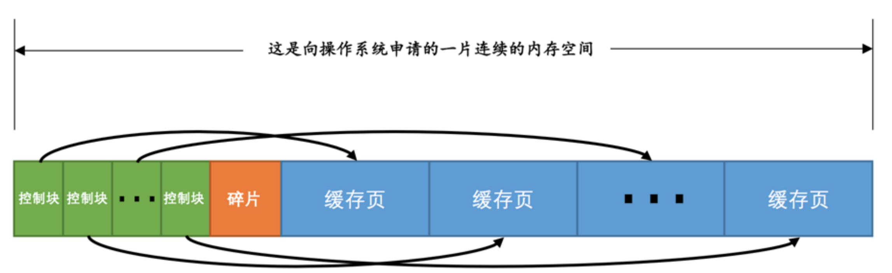
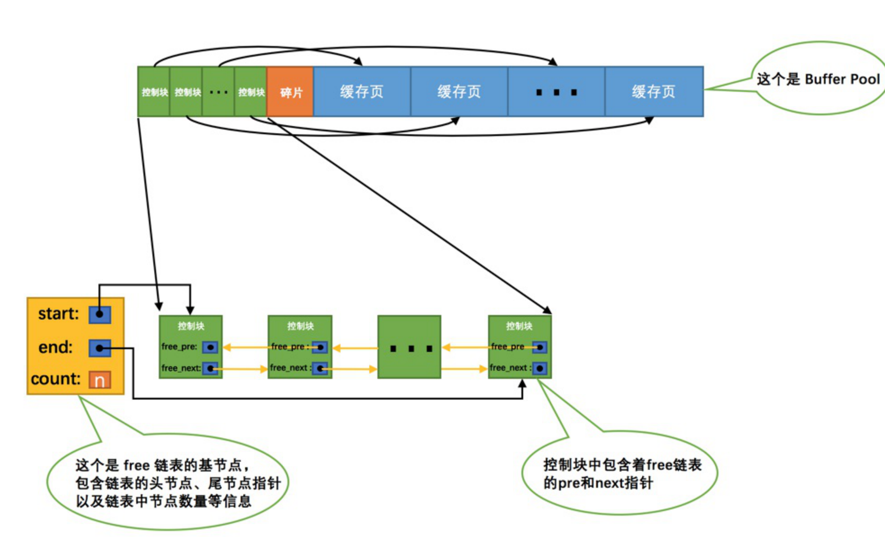
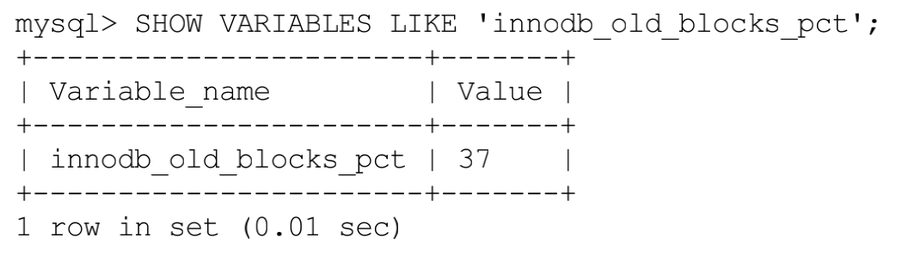

Buffer pool
mysql服务器启动的时候就向操作系统申请了一片连续的内存，就叫buffer pool。

```
innodb_buffer_pool_size = 268435456 //单位字节
```

缓存页大小为16k。每个缓存页都对应一个控制块。控制块表示和控制缓存页的属性。每个控制所占内存大小都一样。



free链表：所有空闲的缓存页对应的控制块都作为一个节点放到一个链表中。



缓存页的哈希处理

表空间号 + 页号作为key，缓存页作为value创建一个哈希表。在需要访问某个页的数据时，先从哈希表中根据表空间号 + 页号看看有没有对应的缓存页，如果有，直接使用该缓存页就好，如果没有，那就从free链表中选一个空闲的缓存页，然后把磁盘中对应的页加载到该缓存页的位置

flush链表的管理
凡是修改过的缓存页对应的控制块都会作为一个节点加入到一个链表中，因为这个链表节点对应的缓存页都是需要被刷新到磁盘上的，所以也叫flush链表

缓存过期原则
**LRU**链链表按照最近最少使用的原则去淘汰缓存页的，(LRU,least recently used)

+ 如果该页不在Buffer Pool中，在把该页从磁盘加载到Buffer Pool中的缓存页时，就把该缓存页对应的控制块作为节点塞到链表的头部。
+  如果该页已经缓存在Buffer Pool中，则直接把该页对应的控制块移动到LRU链表的头部。


预读

+ 线性预读，如果一个extent中的被顺序读取的page超过或者等于该参数变量时，Innodb将会异步的将下一个extent读取到buffer pool中，innodb_read_ahead_threshold可以设置为0-64的任何值
+ 随机预读，同一个extent中的一些page在buffer pool中发现时，Innodb会将该extent中的剩余page一并读到buffer pool中。在5.5中已经将这种预读方式废弃，默认是OFF

预读会大大降低缓存命中率，如何解决：
按比例把LRU链表分成两部分
       一部分存储使用频率非常高的缓存页，所以这一部分链表也叫做热数据，或者称young区域。 
      另一部分存储使用频率不是很高的缓存页，所以这一部分链表也叫做冷数据，或者称old区域。

	

当磁盘上的某个页面在初次加载到Buffer Pool中的某个缓存页时，该缓存页对应的控制块会被放到old区域的头部

在进行全表扫描时，虽然首次被加载到Buffer Pool的页被放到了old区域的头部，但是后续会被马上访问到，每次进行访问的时候又会把该页放到young区域的头部，这样仍然会把那些使用频率比较高的页面给顶下去

在对某个处在old区域的缓存页进行第一次访问时就在它对应的控 

制块中记录下来这个访问时间，如果后续的访问时间与第一次访问的时间在某个时间间隔内，那么该页面就不会被从old区域移动到young区域的头部，否则将 它移动到young区域的头部


刷新脏页到磁盘

+ 从LRU链表的冷数据中刷新一部分页面到磁盘。
+ 从flush链表中刷新一部分页面到磁盘。 


Buffer Pool实例

Buffer Pool实例其实是由若干个chunk组成的，一个chunk就代表一片连续的内存空间，里边儿包含了若干缓存页与其对应的控制块