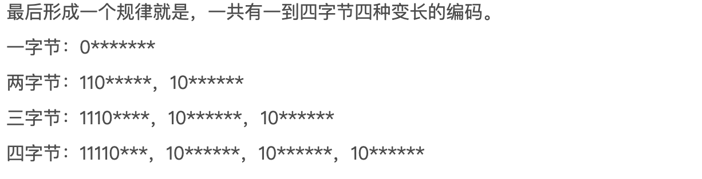
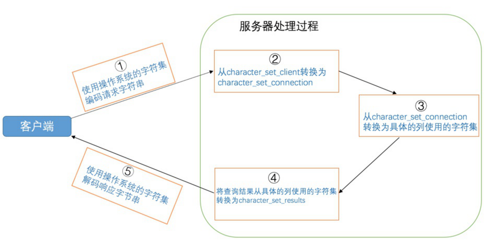

1. 什么是字符集，什么编码，什么是unicode字符集，是什么utf8编码
   在现实世界，每一个文字、符号的都可以称为字符，所有字符的抽象集合就是字符集。
   
   给每个字符一个唯一数字作为标识，在计算机中表示这种映射关系的集合就是字符集。如何去表示字符对应的标识就是编码规则。
   ASCII字符集只有英文字符和一些特定的符号，用单个字节就可表示。但引入其他语言的字符就不够了。Unicode字符集使用4字节的数字来表示世界上的每个字母、符号，或者表意文字。
   如果每个字符都用4个字节来表示会浪费大量的空间，有些字符一个字节就可以表示，有些需要两个。utf8编码就一种变长编码，通过前缀来表示一个字符需要有几个字节来表示。

   
   
2. mysql中的utf8 和utf8mb4
   mysql中utf8是阉割过的(只是用1~3字节表示字符)，建议使用utf8mb4

   ```
    SHOW CHARSET; //查看支持的字符集
   ```

3. 比较规则
   最简单就是直接通过编码的值进行比较。但是有时，我们希望忽略大小写进行比较等这种规则进行比较，就要做特定的转换。同时也说明同一种字符集可以有多种比较规则。建议不整一些花里胡哨的，直接默认用utf8_genaral_ci

4. 不同级别的字符集和比较规则

   + 服务器级别
   + 数据库级别
   + 表级别
   + 列级别

5. 客户端和服务器通信中的字符集 

   | 系统变量                 | 描述                                                         |
   | ------------------------ | ------------------------------------------------------------ |
   | character_set_client     | 服务器解码请求时使用的字符集                                 |
   | character_set_connection | 服务器处理请求时会把请求字符串从character_set_client转为character_set_connection |
   | character_set_results    | 服务器向客户端返回数据时使用的字符集                         |

   

