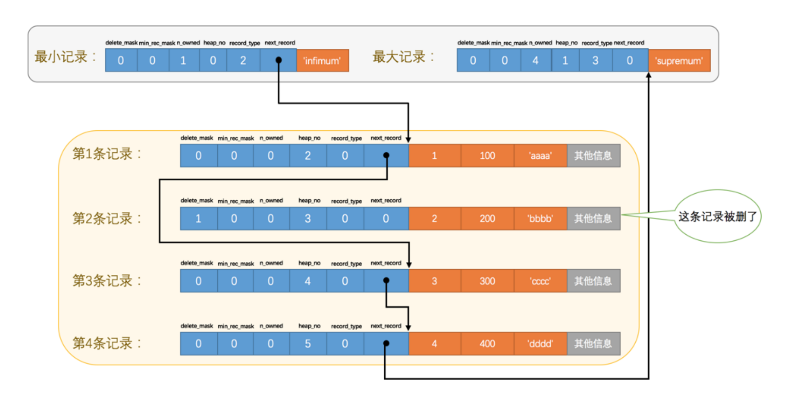

# innodb数据页的格式

| 名称               | 中文名             | 占用空间大小 | 简单描述                 |
| ------------------ | ------------------ | ------------ | ------------------------ |
| file header        | 文件头             | 38           | 页的通用信息             |
| page header        | 页面头             | 56           | 数据页的信息             |
| Infimum + Supremum | 最小记录和最大记录 | 26           | 两个虚拟的行记录         |
| user records       | 用户记录           | 不定         | 实际存储的行记录         |
| free space         | 空闲空间           | 不定         | 未使用的空间             |
| page directory     | 页面目录           | 不定         | 页中的某些记录的相对位置 |
| file trailer       | 文件尾部           | 8字节        | 校验页是否完整           |

一开始User Records这个部分空，每插入一条记录，都会从Free  Space部分中申请一个记录大小的空间划分到User Records部分，当Free Space部分的空间全部被UserRecords部分替代掉之后，也就意味着这个页使用完了，如果还有新的 记录插入的话，就需要去申请新的页了

InnoDB始终会维护一条记录的单链表，链表中的各个节点是按照主键值由小到大的顺序连接起来的

## page directory 页目录

对每个数据页中的用户记录进行分组，建立目录索引，来减少遍历数据页用户记录链条的开销。
分组规则如下：

+ 最小记录独分一个组，包含最大记录的分组只能有1-8条记录，其余分组记录在4到8条
+ 最大记录和最小记录不能在同一个组
+ 在一个组的记录数等于8在加入一条后，必须拆分组，一个4条，一个5条。这个过程会在页目录中新增一个槽来记录这个新增分组中最大的那条记录的偏移量

## page header 页面头部

一个数据页中存储的记录的状态信息。

| 名称              | 大小(字节) | 描述                                                         |
| ----------------- | ---------- | ------------------------------------------------------------ |
| PAGE_N_DIR_SLOTS  | 2          | 在页目录中的槽数量                                           |
| PAGE_HEAP_TOP     | 2          | 还未使用的空间最小地址，也就是说从该地址之后就是Free Space   |
| PAGE_N_HEAP       | 2          | 本页中的记录的数量（包括最小和最大记录以及标记为删除的记录） |
| PAGE_FREE         | 2          | 第一个已经标记为删除的记录地址                               |
| PAGE_GARBAGE      | 2          | 已删除记录占用的字节数                                       |
| PAGE_LAST_INSERT  | 2          | 最后插入记录的位置                                           |
| PAGE_DIRECTION    | 2          | 记录插入的方向                                               |
| PAGE_N_RECS       | 2          | 该页中记录的数量                                             |
| PAGE_MAX_TRX_ID   | 8          | 修改当前页的最大事务ID，该值仅在二级索引中定义               |
| PAGE_LEVEL        | 2          | 当前页在B+树中所处的层级                                     |
| PAGE_INDEX_ID     | 8          | 索引ID，表示当前页属于哪个索引                               |
| PAGE_BTR_SEG_LEAF | 10         | B+树叶子段的头部信息，仅在B+树的Root页定义                   |
| PAGE_BTR_SEG_TOP  | 10         | B+树非叶子段的头部信息，仅在B+树的Root页定义                 |

## file header 文件头部

| 名称                             | 大小(字节) | 描述                                                         |
| -------------------------------- | ---------- | ------------------------------------------------------------ |
| FIL_PAGE_SPACE_OR_CHKSUM         | 4          | 页的校验和                                                   |
| FIL_PAGE_OFFSET                  | 4          | 页号                                                         |
| FIL_PAGE_PREV                    | 4          | 上一页页号                                                   |
| FIL_PAGE_NEXT                    | 4          | 下一个页的页号                                               |
| FIL_PAGE_LSN                     | 8          | 页面被最后修改时对应的日志序列位置                           |
| FIL_PAGE_TYPE                    | 2          | 该页类型                                                     |
| FIL_PAGE_FILE_FLUSH_LSN          | 8          | 仅在系统表空间的一个页中定义，代表文件至少被刷新到了对应的LSN值 |
| FIL_PAGE_ARCH_LOG_NO_OR_SPACE_ID | 4          | 页属于哪个表空间                                             |

