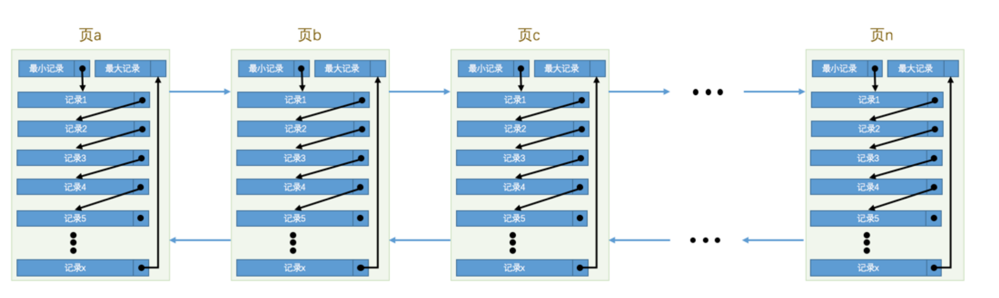
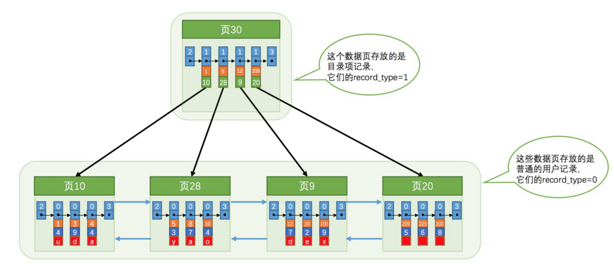

记录查找分为两个阶段：

+ 定位到记录所在的页
+ 在页中查找

InnoDb的索引方案
	复用了之前存储用户记录的数据页来存储目录项，为了和用户记录做一下区分，我们把这些用来表示目录项的记录称为目录项记录

目录项记录的record_type值是1，而普通用户记录的record_type值是0。 

目录项记录只有主键值和页的编号两个列，而普通的用户记录的列是用户自己定义的，可能包含很多列，另外还有InnoDB自己添加的隐藏列。

## 聚集索引

1. 使用记录主键值的大小进行记录和页的排序，这包括三个方面的含义： 

页内的记录是按照主键的大小顺序排成一个单向链表。 

各个存放用户记录的页也是根据页中用户记录的主键大小顺序排成一个双向链表。 

存放目录项记录的页分为不同的层次，在同一层次中的页也是根据页中目录项记录的主键大小顺序排成一个双向链表。 

2. B+树的叶子节点存储的是完整的用户记录。 

所谓完整的用户记录，就是指这个记录中存储了所有列的值（包括隐藏列）。

## 普通索引

使用同样的数据结构，但是叶子节点不包含完整的信息，需要通过主键id在去聚集索引查找一次，这个过程被称为回表
