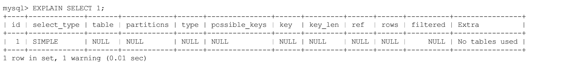
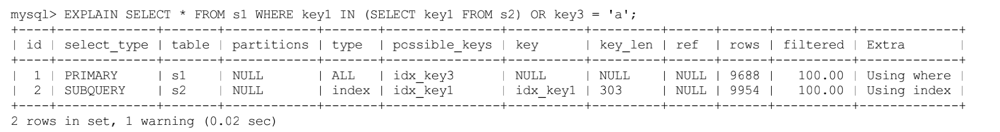

过MySQL查询优化器的各种基于成本和规则的优化会后生成一个所谓的执行计划。

| 列名         | 描述                                                   |
| ------------ | ------------------------------------------------------ |
| id           | 一条查询语句中的每个select关键字对应一个id             |
| select_type  | Select关键字对应的那个查询的类型                       |
| table        | 表名                                                   |
| Partitions   | 匹配分区信息                                           |
| type         | 针对单表的访问方法                                     |
| possible_key | 可能用到的索引                                         |
| key          | 实际上用到的key                                        |
| key_len      | 实际上用到的索引长度                                   |
| ref          | 当使用索引列等值查询时，与索引列进行等值匹配的对象信息 |
| rows         | 预估需要读取的记录条数                                 |
| filtered     | 某个表经过搜索条件过滤后剩余记录条数的百分比           |
| extra        | 一些额外的信息                                         |

id

包含子查询的和union语句会有多个select

在连接查询中，from后面跟着多个表，每个表也都会对应一条记录，但是这些记录的id值是相同的。

出现在前边的表表示驱动表，出现在后边的表表示被驱动表

而对于子查询的话每个select就会有对应的id

UNION子句它会把多个查询的结果集合并起来并进行去重。MySQL使用的是内部的临时表。

UNION子句是为了把id为1的查询和id为2的查询的结果集合并起来并去重，所以在内部创建了一个名为<union1, 2>的临时表（就是执行计划第三条记录的table列的名称），id为NULL表明这个临时表是为了合并两个查询的结果集而创建的

| 名称                 | 描述                                                         |
| -------------------- | ------------------------------------------------------------ |
| simple               | Simple SELECT (not usingUNION or subqueries)  不含子查询和union都是simple，连接查询 |
| primary              | Outermost SELECT  对于包含union、union all或者包含子查询的大查询，由几个小查询构成，最左边的那个查询用被称作primary，而其他的查询就被称作union |
| union                | Second or later SELECT statement in a UNION                  |
| UNION RESULT         | Result ofa UNION  使用临时进行去重                      |
| subquery             | First SELECT in subquery 包含子查询的查询语句不能够转为对应的semi-join的形式，并且该子查询是不相关子查询 |
| DEPENDENT SUBQUERY   | First SELECT in subquery, dependent on outer query  包含子查询的查询语句不能够转为对应的semi-join的形式，并且该子查询是相关子查询，则该子查询的第一个SELECT关键字代表的那个查询的select_type就是DEPENDENT SUBQUERY |
| DEPENDENT UNION      | Second or later SELECT statement in a UNION, dependent on outer query 在包含UNION或者UNION ALL的大查询中，如果各个小查询都依赖于外层查询的话，那除了最左边的那个小查询之外，其余的小查询的select_type的值就是DEPENDENT UNION |
| DERIVED              | Derived table  对于采用物化的方式执行的包含派生表的查询，该派生表对应的子查询的select_type就是DERIVED |
| MATERIALIZED         | Materialized subquery                                        |
| UNCACHEABLE SUBQUERY | Asubquery for which theresultcannot becached and must bere-evaluated foreach rowofthe outer query |
| UNCACHEABLE UNION    | Thesecond or later select in a UNION that belongs to an uncacheablesubquery (see UNCACHEABLE SUBQUERY) |

**partitions**

由于我们压根儿就没唠叨过分区是个啥，所以这个输出列我们也就不说了哈，一般情况下我们的查询语句的执行计划的partitions列的值都是NULL。

**type** 
访问方法

+ system
  当表中只有一条记录并且该表使用的存储引擎的统计数据是精确的
+ const
  根据主键或者唯一二级索引与常数进行等值匹配
+ eq_ref
  连接查询时，被驱动表通过主键或者唯一二级索引与常数进行等值匹配（如果该主键或者唯一二级索引是联合索引的话，所有的索引列都必须进行等值比较）
+ ref
  普通二级索引常数等值匹配
+ fulltext
+ ref_of_null
  当对普通二级索引进行等值查询，该索引值可以为null的时候
+ index_merge
  某个表的查询只能使用到一个索引，但单表访问方法时特意强调了在某些场景下可以使用Intersection、Union、Sort-Union这三种索引合并的方式来执行查询
+ unique_subquery 
  两表连接中被驱动表的eq_ref访问方法，unique_subquery是针对在一些包含IN子查询的查询语句中，如果查询优化器决定将IN子查询转换为EXISTS子查询
+ index_subquery
  index_subquery与unique_subquery类似，只不过访问子查询中的表时使用的是普通的索引
+ range
  索引获取某些范围区间的记录，那么就可能使用到range访问方法
+ index
  当我们可以使用索引覆盖，但需要扫描全部的索引记录时，该表的访问方法就是index
+ all
  全表扫描

possible_keys 和 key

​		possible_keys列表示在某个查询语句中，对某个表执行单表查询时可能用到的索引有哪些，key列表示实际用到的索引

key_len
       key_len列表示当优化器决定使用某个索引执行查询时，该索引记录的最大长度，它是由这三个部分构成的：
		对于使用固定长度类型的索引列来说，它实际占用的存储空间的最大长度就是该固定值，对于指定字符集的变长类型的索引列来说，比如某个索引列的类型是VARCHAR(100)。
       如果该索引列可以存储NULL值，则key_len比不可以存储NULL值时多1个字节。

ref

​	当使用索引列等值匹配的条件去执行查询时，也就是在访问方法是const、eq_ref、ref、ref_or_null、unique_subquery、index_subquery其中之一时，ref列展示的就是与索引列作等值匹配的

rows
	查询优化器决定使用全表扫描的方式对某个表执行查询时，执行计划的rows列就代表预计需要扫描的行数，如果使用索引来执行查询时，执行计划的rows列就代表预计扫描的索引记录行数

extra

+ no tables used
+ Impossible WHERE 
+ No matching min/max row
+ Using index 
+ Using index condition
  有些搜索条件中虽然出现了索引列，但却不能使用到索引
+ Using where 
  用全表扫描来执行对某个表的查询，并且该语句的WHERE子句中有针对该表的搜索条件时，在Extra列中会提示上述额外信息
+ Using join buffer
  在连接查询执行过程中，当被驱动表不能有效的利用索引加快访问速度，MySQL一般会为其分配一块名叫join buffer的内存块来加快查询速度
+ Not exists
  如果WHERE子句中包含要求被驱动表的某个列等于NULL值的搜索条件，而且那个列又是不允许存储NULL值的
  \> EXPLAIN SELECT * FROM s1 LEFT JOIN s2 ON s1.key1 = s2.key1 WHERE s2.id IS NULL;
+ Using intersect(...)、Using union(...)和Using sort_union(...) 
+ Zero limit
+ Using filesort
  对结果集中的记录进行排序是可以使用到索引的
+ Using temporary 
  在许多查询的执行过程中，MySQL可能会借助临时表来完成一些功能
+ Start temporary, End temporary
+ LooseScan

