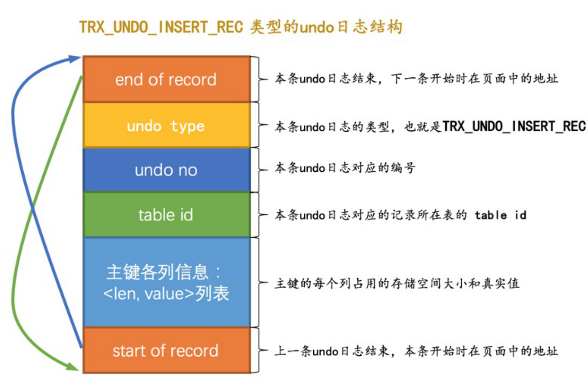
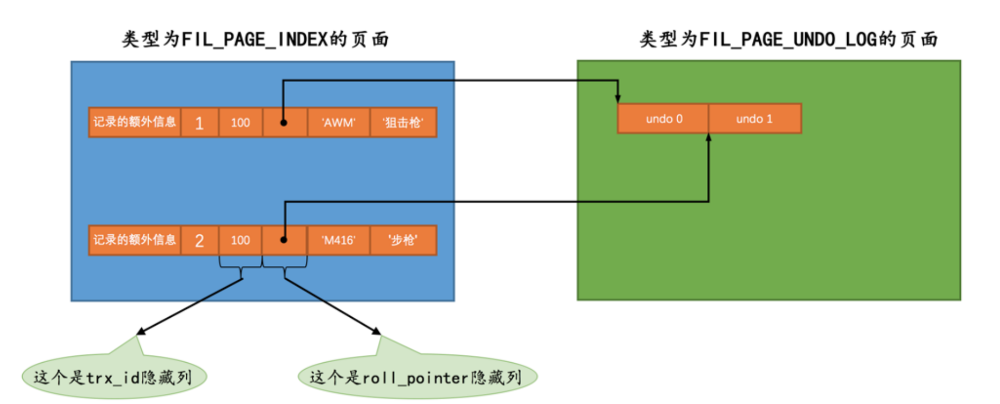

事务id
事务执行过程中设计对表的增删改，innodb引擎则会分配一个事务id。

+ 对于只读事务，首次对由用户创建的临时表增删改才会被分配事务id
+ 对于读写事务，首次对表(包括临时表)增删改才会被分配事务

##### 事务id怎么生成

+ 服务器在内存中维护一个全局变量，每次分配自动加1
+ 该值为256的倍数的时，刷新到系统表空间页号为5的Max Trx Id
+ 下一次启动时，去读Max trx id 并加上256

 	

##### undo log的格式

每对一条记录做一次改动，就对应着一条undo日志，但在某些更新记录的操作中，也可能会对应着2条undo日志。

undo日志是被记录到类型为FIL_PAGE_UNDO_LOG页面中。

##### insert操作对应undo log

+ undo no 在一个事务中从0开始递增
+ 主键只包含一个列，那么在类型为TRX_UNDO_INSERT_REC的undo日志中只需要把该列占用的存储空间大小和真实值记录下来，如果记录中的主键包含多个列，那么每个列占用的存储空间大小和对应的真实值

##### roll_pointer隐藏列的含义

是一个指向记录对应的undo日志的一个指针。

##### **DELETE**操作对应的**undo**日志 

