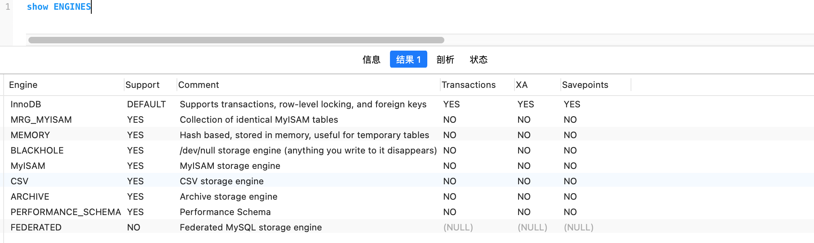

1. 查看mysql支持的存储引擎

   ```mysql
   show engines
   ```

   

2. innoDb和MyISAM的区别

   |                  | InnoDB                                                       | MyISAM                                                       |
   | ---------------- | ------------------------------------------------------------ | ------------------------------------------------------------ |
   | 支持事务         | 支持,并且支持savepoints                                      | 不支持                                                       |
   | 锁               | 支持行锁，表锁，间隙锁                                       | 支持表锁                                                     |
   | 数据文件保存格式 | .frm文件存储表定义<br />.MYD 为数据文件<br />.MYI索引文件的扩展名 | 基于磁盘的资源是InnoDB表空间数据文件和它的日志文件，InnoDB 表的大小只受限于操作系统文件的大小 |
   |                  |                                                              |                                                              |

   ```
   参考文章：https://www.runoob.com/w3cnote/mysql-different-nnodb-myisam.html
   ```

   

