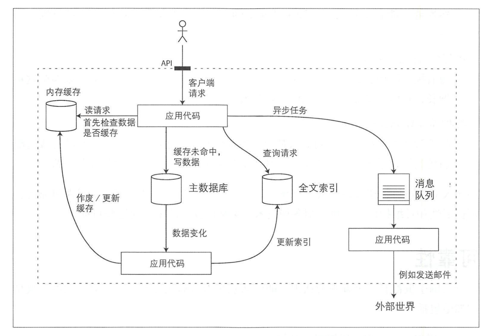

应用系统的模块

+ 数据库：存储数据
+ 高速缓存：缓存某些复杂或者 操作代价昂贵的结果，以加快下一次访问
+ 索引：用户可以按关键字搜索数据井支持各种过掳
+ 流式处理：持续发送消息到另一进程，处理采用异步方式
+ 批处理：定期处理大量的累积数据

#### 软件系统三个问题

+ 可靠性

  当出现意外情况如硬件、软件故障、人为失误等，系统应可以继续正常运转

+ 可扩展性

  着规模 增长 ，例如数据 、流量或复杂性，系统应以合理的方式来匹配这种增长

+ 可维护性

  许多新的人员参与到系统开发和运维， 以维护现有功能或适配新场景等，系统都应高效运转

  

### 可靠性

+ 应用程序执行用户所期望的功能。

+ 可以容忍用户出现错误或者不正确的软件使用方怯

+ 性能可以应对典型场 理负载压力和数据量。

+ 系统可防止任何未经授权的访问和滥用。

### 可扩展性