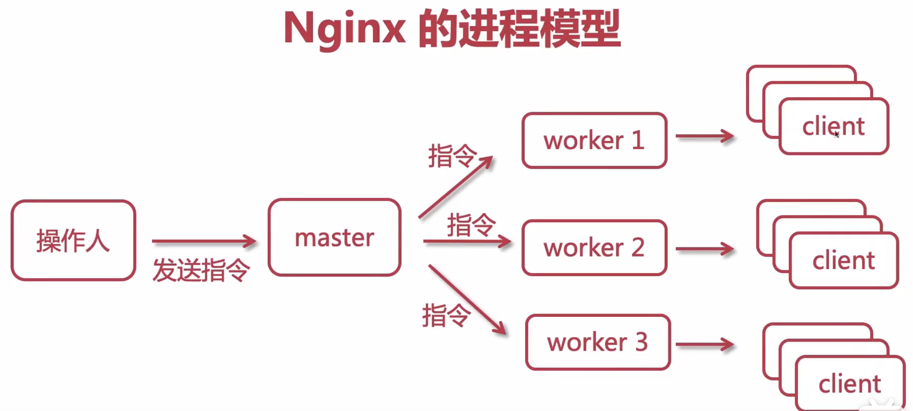

## nginx三大功能

+ web服务器
+ 反向代理服务器
+ 邮件服务器


## nginx进程模型

nginx启动后在unix系统以daemon的方式在后台运行。一个后台进行包含一个master进程和多个worker进程

nginx在启动后，会有一个master进程和多个worker进程。

master进程主要用来管理worker进程，包含：接收来自外界的信号，向各worker进程发送信号，监控worker进程的运行状态，当worker进程退出后(异常情况下)，会自动重新启动新的worker进程。

多个worker进程之间是对等的，他们同等竞争来自客户端的请求，各进程互相之间是独立的

worker进程的个数是可以设置的，一般我们会设置与机器cpu核数一致

 

nginx进程模型的好处：

	1. 对于每个worker进程来说，独立的进程，不需要加锁，所以省掉了锁带来的开销，同时在编程以及问题查找时，也会方便很多
	1. 采用独立的进程，可以让互相之间不会影响，一个进程退出后，其它进程还在工作，服务不会中断，master进程则很快启动新的worker进程
	1. 如果worker进程的异常退出，肯定是程序有bug了，异常退出，会导致当前worker上的所有请求失败，不过不会影响到所有请求，所以降低了风险


### master发送信号给worker进程

```
./nginx -s stop
./nginx -s quit
./nginx -s reload
./nginx -t
```




### worker抢占机制

客户端请求会有accept _mutex让worker抢占。

基于epoll的非阻塞机制来处理网络io。
