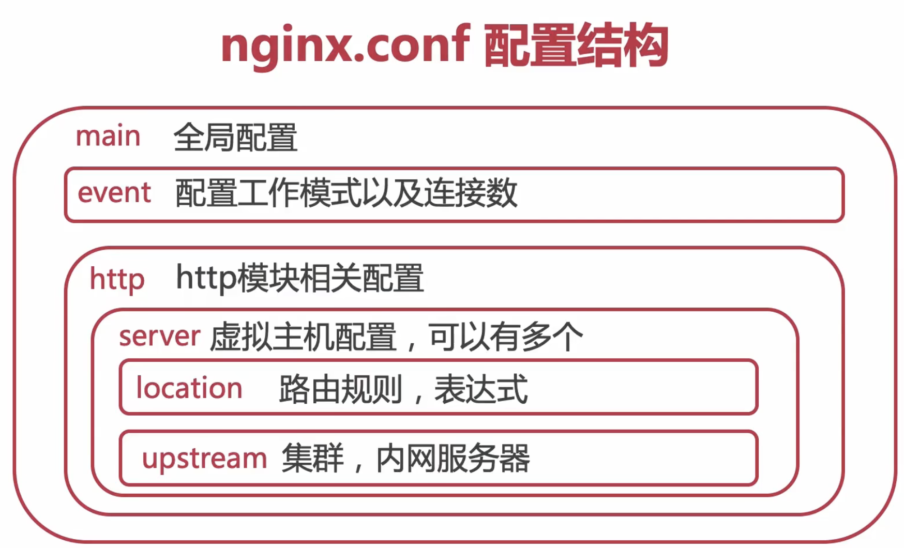
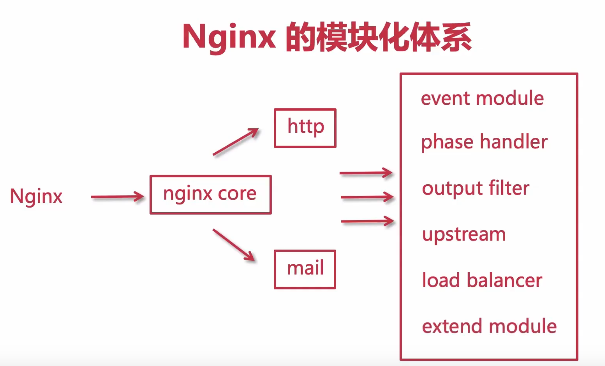
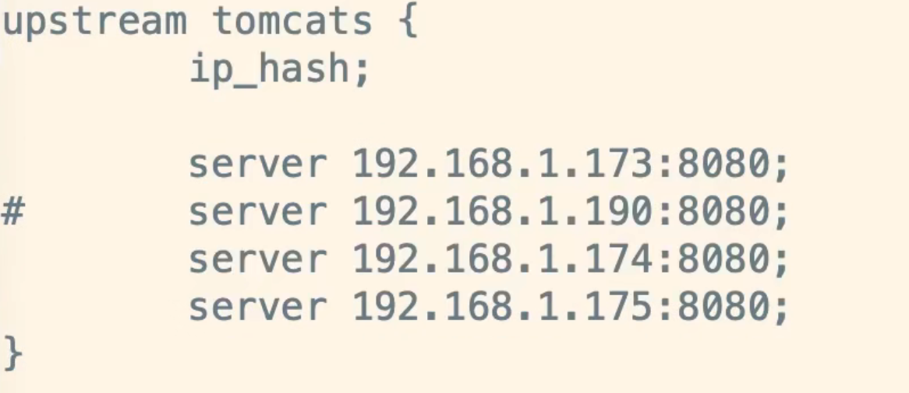
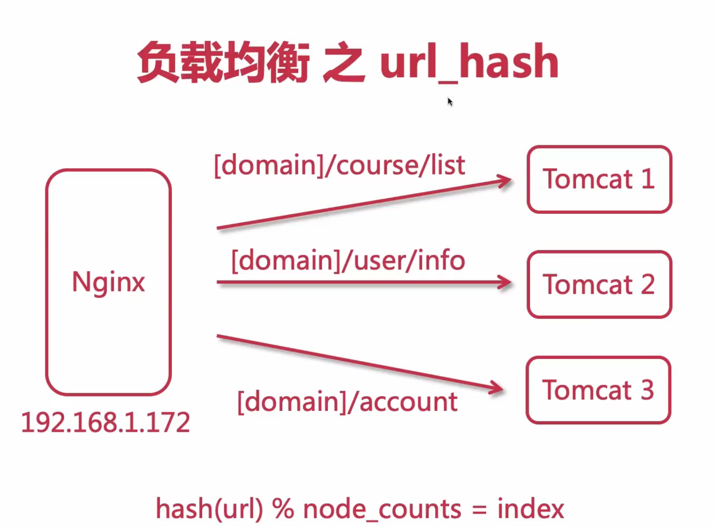
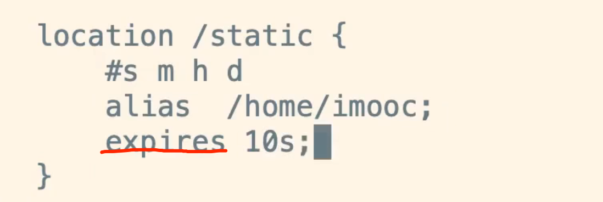
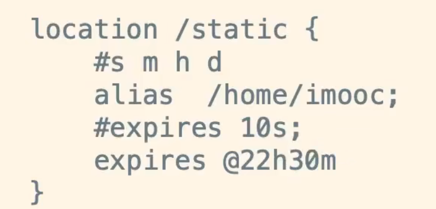

```nginx
worker_processes 1; //工作线程数量
```

```nginx
events {
  #默认是使用epoll
 	use epoll;
  #每个work进程的最多连接数
  worker_connections 1024;
}
```



```nginx
user nobody
```

```nginx
#日志级别 debug info notice warn error crit
error_log  logs/error.log
```

```nginx
http {
	#导入文件
	include mine.types;
  default_type application/octet-stream;
  #log_format main 日志格式
  #发送文件
  sendfile on;
  keepalive_timeout 65;#链接时长，单位秒
  #虚拟主机
  server {
    listen 80;
    server_name localhost;
    
    location / {
      	root html;
      	index index.html;
      	error_page 500 502 503 504 /50x.html
        location = /50x.html {
        	root html
      }
    }
  }
}
```

## 常用命令

nginx -s stop 强制关闭

nginx -s quit 优雅的关系，处理完所有的请求关闭

## 日志切割


## 压缩

```nginx
gzip on
#低于1字节的文件不会被压缩
gzip_min_length 1;
#压缩的级别,级别越高 压缩越大；会消耗cpu
gzip_comp_level 3;
#压缩文件的类型
gzip_types
```


## location

```nginx
location = / { #等于表示精确匹配
	root html;
	index imooc.html index.htm
}
#正则表达式
```


## nginx 解决跨域

```nginx
add_header 'Access-Control-Allow-Origin' *;
add_header 'Access-Control-Allow-Credentials'  true;
add_header 'Access-COntrol-Allow-Methods' *;
add_header 'Access-COntrol-Allow-Headers' *;
```


## nginx 模块设计




## 四层和七层负载均衡 

+ F5硬负载均衡、
+ LVS四层负载均衡
+ haproxy四层负载均衡
+ nginx四层负载均衡


+ nginx 七层负载均衡
+ haproxy 七层负载均衡
+ apache 七层负载均衡


## upstream 指令参数

+ service 反向服务地址 加端口
+ weight 权重
+ max_fails 失败多少次 认为主机已挂掉则，踢出
+ fail_timeout 踢出后重新探测时间
+ backup 备用服务
+ max_conns 允许最大连接数
+ slow_start 当节点恢复，不立即加入
  

## ip_hash

 

## 一致性hash算法


## 负载均衡之url_hash




### 浏览器过期时间

 

具体时间过期

 


