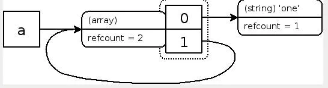
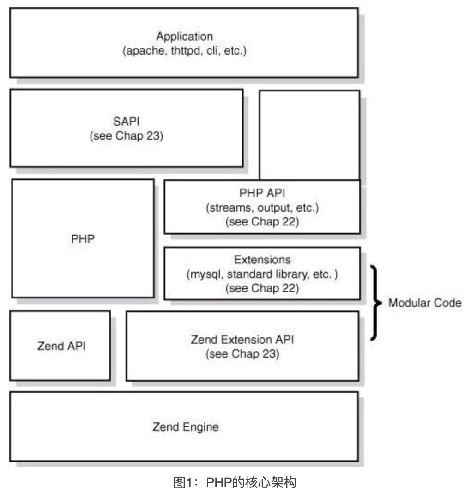

## 1、PHP-FPM进程模型

1. #### 什么是CGI协议

   1. `CGI协议`同 HTTP 协议一样是一个「应用层」协议，它的 功能 是为了解决 Web 服务器与 PHP 应用（或其他 Web 应用）之间的通信问题

   2. cgi运行原理

      + Web 服务器中的 CGI 进程将接收到的 HTTP 请求数据读取到环境变量中，通过标准输入转发给 PHP 的 CGI 程序；
      + 当 PHP 程序处理完成后，Web 服务器中的 CGI 进程从标准输出中读取返回数据，并转换回 HTTP 响应消息格式，最终将页面呈献给用户。
      + 然后 Web 服务器关闭掉这个 CGI 进程

   3. FastCGI协议

      解决每次处理用户请求，都需要重新 fork CGI 子进程、销毁 CGI 子进程；它是一种常驻型的 CGI 协议；

      - FastCGI 进程管理器启动时会创建一个 主（Master） 进程和多个 CGI 解释器进程（Worker 进程），然后等待 Web 服务器的连接。
      - Web 服务器接收 HTTP 请求后，将 CGI 报文通过 套接字（UNIX 或 TCP Socket）进行通信，将环境变量和请求数据写入标准输入,转发到 CGI 解释器进程。
      - CGI 解释器进程完成处理后将标准输出和错误信息从同一连接返回给 Web 服务器。
      - CGI 解释器进程等待下一个 HTTP 请求的到来。

   

2. PHP-FPM是多进程模型

   PHP-FPM是FastCGI的实现，并提供了进程管理的功能。

   master 进程只有一个，负责监听端口，接收来自 Web Server 的请求，而 worker 进程则一般有多个(具体数量根据实际需要配置)，每个进程内部都嵌入了一个 PHP 解释器，是 PHP 代码真正执行的地方

   Nginx 服务器无法直接与 FastCGI 服务器进行通信，需要启用 ngx_http_fastcgi_module 模块进行代理配置，才能将请求发送给 FastCGI 服务。

```
https://juejin.cn/post/6864726280550481927
```

## 2、php 垃圾回收机制

1. 什么是垃圾

   有没有变量名指向变量容器zval

2. refcount 和 is_ref

   refcount，被引用次数

   is_ref，是不是引用变量

3. 复合类型(对象，数组)的变量

   数组的zval格式，

   ```
   a: (refcount=1, is_ref=0)=array (
   
       'meaning' => (refcount=1, is_ref=0)='life',
   
       'number' => (refcount=1, is_ref=0)=42
   
   )
   
   ```

   数组元素引用本身数组

   ```
   $a = array('one');
   $a[] = &$a;
   ```

    

   什么时候数组变量会变成垃圾？

   数组剩下的元素都是对自己本身的引用

   

```
https://juejin.cn/post/6844903788810092557
```

## 3、php的执行过程

1. php体系

    


## 3、opcode优化

1. 静态编译、解释执行、及时编译

   静态编译（static compilation），也称事前编译（ahead-of-time compilation），简称AOT。即把源代码编译成目标代码，执行时在支持目标代码的平台上运行。

   动态编译（dynamic compilation），相对于静态编译而言，指”在运行时进行编译”。通常情况下采用解释器(interpreter)编译执行，它是指一条一条的解释执行源语言。

   JIT编译（just-in-time compilation），即即时编译，狭义指某段代码即将第一次被执行时进行编译，而后则不用编译直接执行，它为动态编译的一种特例

```
https://www.php.cn/php-weizijiaocheng-413238.html
https://tech.youzan.com/understanding-opcode-optimization-in-php/
```

