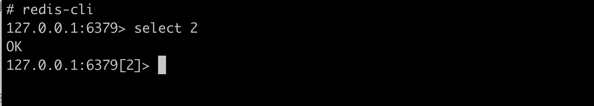
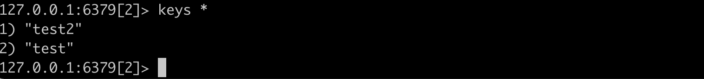

1.  redis有16个数据库
   默认第0个数据库，通过select进行切换
   

2. DBSIZE 查看当前值
	
2. keys * 查看所有的命令
		

 	4. flushdb清空当前数据库，flushall清空所有数据
 	5. exists name 是否存在，存放返回1
 	6. move name db 移动name值至数据库
 	7. Expire name seconds 设置过期时间
 	8. type key 查看当前key的类型


## 基本数据类型

#### string

1. append key string 追加字符串

```shell
127.0.0.1:6379[2]> get name
"fus"
127.0.0.1:6379[2]> append name test #如果key不存在相当于set key
(integer) 7	#返回字符串长度
127.0.0.1:6379[2]> get name
"fustest"
```

2. strlen  key 获取字符串长度

   ```shell
   127.0.0.1:6379[2]> strlen name
   (integer) 7
   127.0.0.1:6379[2]>
   ```

3. incr  自增1；decr自减1

   ```shell
   127.0.0.1:6379[2]> set views 1
   OK
   127.0.0.1:6379[2]> incr views
   (integer) 2
   127.0.0.1:6379[2]> get views
   "2"
   127.0.0.1:6379[2]> decr incr
   (integer) -1
   127.0.0.1:6379[2]> decr views
   (integer) 1
   127.0.0.1:6379[2]> get views
   "1"
   ```

4. getrange key start end 通过索引下标截取字符

   ```shell
   127.0.0.1:6379[2]> set name "this is my best lift"
   OK
   127.0.0.1:6379[2]> get name
   "this is my best lift"
   127.0.0.1:6379[2]> getrange name 1 3
   "his"
   ```

5. setrange key start value 替换索引范围的字符串

```shell
127.0.0.1:6379[2]>  setrange name 1  fff
(integer) 20
127.0.0.1:6379[2]> get name
"tfff is my best lift"
127.0.0.1:6379[2]>
```

6. setex key second value 设置key的值同时设置过期时间

   ```
   127.0.0.1:6379[2]> setex mylife 10 cccc
   OK
   127.0.0.1:6379[2]> get mylife
   "cccc"
   127.0.0.1:6379[2]> ttl mylife
   (integer) 2
   127.0.0.1:6379[2]> ttl mylife
   (integer) -2
   127.0.0.1:6379[2]>
   
   ```

7. setnx key value 设置值如果值不存在。值存在则返回0

   ```
   127.0.0.1:6379[2]> setnx fus 1111
   (integer) 0
   127.0.0.1:6379[2]> get fus
   "1"
   127.0.0.1:6379[2]> setnx fusjoke 111
   (integer) 1
   127.0.0.1:6379[2]> get fusjoke
   "111"
   ```

8. mset key1 value1 key2 value2 同时设置多个值

   ```shell
   127.0.0.1:6379[2]> flushdb
   OK
   127.0.0.1:6379[2]> mset k1 v1 k2 v2 k3 v3
   OK
   127.0.0.1:6379[2]> keys *
   1) "k3"
   2) "k2"
   3) "k1"
   127.0.0.1:6379[2]>
   ```

9. msetnx key1 value1 key2 value2 同时设置多个值，必须要所有的值都不存在才会设置

   ```
   127.0.0.1:6379[2]> msetnx k1 v1 k2 v2 k3 v3 k4 v4
   (integer) 0
   127.0.0.1:6379[2]> keys *
   1) "k3"
   2) "k2"
   3) "k1"
   ```

10. getset key value 先获取值在设置、

    ```shell
    127.0.0.1:6379[2]> getset fus 123456
    (nil)
    127.0.0.1:6379[2]> get fus
    "123456"
    127.0.0.1:6379[2]> getset fus 654321
    "123456"
    127.0.0.1:6379[2]> get fus
    "654321"
    ```

#### List

1. Lpush list value、 rpush list value、 lrange

   ```
   127.0.0.1:6379[2]> lpush list one
   (integer) 1
   127.0.0.1:6379[2]> lpush list two
   (integer) 2
   127.0.0.1:6379[2]> lpush list three
   (integer) 3
   127.0.0.1:6379[2]> rpush list zzzz
   (integer) 4
   127.0.0.1:6379[2]> lrange list 0 -1
   1) "three"
   2) "two"
   3) "one"
   4) "zzzz"
   ```

2. Lpop、rpop

   ```shell
   127.0.0.1:6379[2]> lpop list
   "three"
   127.0.0.1:6379[2]> rpop list
   "zzzz"
   127.0.0.1:6379[2]> lrange list 0 -1
   1) "two"
   2) "one"
   ```

3. lindex 通过下标获取值

   ```
   127.0.0.1:6379[2]> lindex list 0
   "two"
   127.0.0.1:6379[2]> lindex list 1
   "one"
   ```

4. llen list 返回列表长度

   ```
   127.0.0.1:6379[2]> llen list
   (integer) 5
   127.0.0.1:6379[2]>
   ```

5. lrem key count value 移除指定队列n个值等于value

   ```shell
    127.0.0.1:6379[2]> lrange list 0 -1
   1) "one"
   2) "one"
   3) "two"
   4) "one"
   127.0.0.1:6379[2]> lrem  list 2 one
   (integer) 2
   127.0.0.1:6379[2]> lrange list 0 -1
   1) "two"
   2) "one"
   ```

6. Ltrim key start end 截断指定长度的队列

   ```shell
   127.0.0.1:6379[2]> lpush mylist hello
   (integer) 1
   127.0.0.1:6379[2]> lpush mylist hello1
   (integer) 2
   127.0.0.1:6379[2]> lpush mylist hello2
   (integer) 3
   127.0.0.1:6379[2]> lpush mylist hello3
   (integer) 4
   127.0.0.1:6379[2]> lpush mylist hello4
   (integer) 5
   127.0.0.1:6379[2]> ltrim mylist  0 2
   OK
   127.0.0.1:6379[2]> lrange mylist 0 -1
   1) "hello4"
   2) "hello3"
   3) "hello2"
   ```

7. rpoplpush 弹出list1栈顶元素，压入list2

   ```shell
   127.0.0.1:6379[2]> lrange mylist 0 -1
   1) "hello4"
   2) "hello3"
   3) "hello2"
   127.0.0.1:6379[2]> rpoplpush mylist mylist2
   "hello2"
   127.0.0.1:6379[2]> lrange mylist 0 -1
   1) "hello4"
   2) "hello3"
   127.0.0.1:6379[2]> lrange mylist2 0 -1
   1) "hello2"
   ```

8. Lset  key index value 更新指定索引下标的值，list必须是存在的，否则设置失败

   ```shell
    127.0.0.1:6379[2]> lpush test ccccc
   (integer) 1
   127.0.0.1:6379[2]> lpush test ccccc
   (integer) 2
   127.0.0.1:6379[2]> lpush test ccccc
   (integer) 3
   127.0.0.1:6379[2]> lset test 2 bbbb
   OK
   127.0.0.1:6379[2]> lrange test 0 -1
   1) "ccccc"
   2) "ccccc"
   3) "bbbb"
   ```

9. Linsert key before element value

   ```
   127.0.0.1:6379[2]> linsert test before cccc xxxxx
   (integer) -1
   127.0.0.1:6379[2]> lrange test 0 -1
   1) "ccccc"
   2) "ccccc"
   3) "bbbb"
   127.0.0.1:6379[2]> linsert test before ccccc xxxxx
   (integer) 4
   127.0.0.1:6379[2]> lrange test 0 -1
   1) "xxxxx"
   2) "ccccc"
   3) "ccccc"
   4) "bbbb"
   
   ```

#### set （集合）

set的值不能重复，

1. sadd set value 往集合里面添加值

   ```
   127.0.0.1:6379[2]> sadd set value
   (integer) 1
   127.0.0.1:6379[2]> sadd myset zxsdasd
   (integer) 1
   127.0.0.1:6379[2]> sadd myset zxsfsd
   (integer) 1
   127.0.0.1:6379[2]> sadd myset zxsfsdxd
   (integer) 1
   127.0.0.1:6379[2]> SMEMBERS myset
   1) "zxsfsd"
   2) "zxsdasd"
   3) "zxsfsdxd"
   ```

2. smembers setname 查看集合元素

3. scard 返回集合元素的个数

   ```shell
   127.0.0.1:6379[2]> scard myset
   (integer) 4
   ```

4. srem set element 移除元素

   ```
   127.0.0.1:6379[2]> srem myset memberads
   (integer) 1
   127.0.0.1:6379[2]> smembers myset
   1) "zxsfsd"
   2) "zxsdasd"
   3) "zxsfsdxd"
   ```

5. Srandmember set count 随机返回n个元素

   ```
   127.0.0.1:6379[2]> srandmember set 2
   1) "value"
   127.0.0.1:6379[2]> srandmember myset 2
   1) "zxsdasd"
   2) "zxsfsdxd"
   127.0.0.1:6379[2]> srandmember myset 2
   1) "zxsfsd"
   2) "zxsfsdxd"
   ```

6. spop set 随机弹出一个元素 

7. sdiff set1 set2 差集， sinter set1 set2 交集，  sunion

### hash

1. Hset hash feild value 设置

2. hget  hash feild 

   ```
   127.0.0.1:6379[2]> hset myhash feild1 sss feild2 ssss
   (integer) 2
   127.0.0.1:6379[2]> hget myhash feild1
   "sss"
   ```

3. hgetall key 获取所有的值

   ```shell
   127.0.0.1:6379[2]> hgetall myhash
   1) "feild1"
   2) "sss"
   3) "feild2"
   4) "ssss"
   ```

4. Hdel key feild1 删除指定的值

   ```
   127.0.0.1:6379> hset myhash f1 cee f2 ssss
   (integer) 2
   127.0.0.1:6379> hgetall myhash
   1) "f1"
   2) "cee"
   3) "f2"
   4) "ssss"
   127.0.0.1:6379> hdel myhash f1
   (integer) 1
   127.0.0.1:6379> hgetall myhash
   1) "f2"
   2) "ssss"
   127.0.0.1:6379>
   ```

5. hlen key  返回哈希的长度

   ```
   127.0.0.1:6379> hlen myhash
   (integer) 1
   ```

6. hexists key field 

   ```shell
   127.0.0.1:6379[2]> hexists myhash feild1
   (integer) 1
   ```

7. hvals key 所有的值

   ```shell
   127.0.0.1:6379[2]> hvals myhash
   1) "sss"
   2) "ssss"
   ```

8. Hset key field num 设置值

   ```
   127.0.0.1:6379> hset myhash key1 10
   (integer) 1
   127.0.0.1:6379> hincrby myhash key1 2
   (integer) 12
   127.0.0.1:6379> hget myhash key1
   "12"
   ```

9. hincrby key field num 自增

10. Hsetnx key field value 自减

    ```shell
    127.0.0.1:6379[2]> hset myhash field3 5
    (integer) 1
    127.0.0.1:6379[2]> hincrby myhash field3 1
    (integer) 6
    127.0.0.1:6379[2]> hincrby myhash field3 2
    (integer) 8
    127.0.0.1:6379[2]> hincrby myhash field3 5
    (integer) 13
    127.0.0.1:6379[2]> hsetnx myhash field4  hello
    (integer) 1
    127.0.0.1:6379[2]> hsetnx myhash field4  helloff
    (integer) 0
    ```

####  zset 有序集合

1.  zadd key scope value

   ```
   127.0.0.1:6379[2]> zadd salary 2500 xiaohong
   (integer) 1
   127.0.0.1:6379[2]> zadd salary 5000 zhangsan
   (integer) 1
   127.0.0.1:6379[2]> zadd salary 500 kuangshen
   (integer) 1
   ```

2. Zrangebysore key min max [withscopes] [limit offset count] 小到到排序

   ```
   127.0.0.1:6379[2]> zrangebyscore salary -inf +inf
   1) "kuangshen"
   2) "xiaohong"
   3) "zhangsan"
   ```

3. Zrem key value 移除

   ```
   127.0.0.1:6379> zrem salary xiaohang
   (integer) 0
   127.0.0.1:6379> zrem salary xiaohong
   (integer) 1
   ```

4. Zcard key 有序集合的个数

   ```
   127.0.0.1:6379> zcard salary
   (integer) 2
   ```

5. zrevrange key -INF max 


