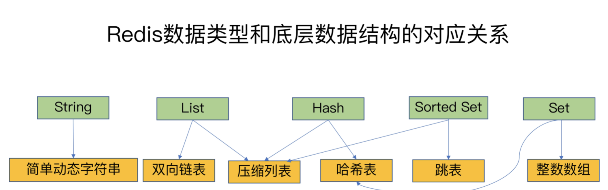
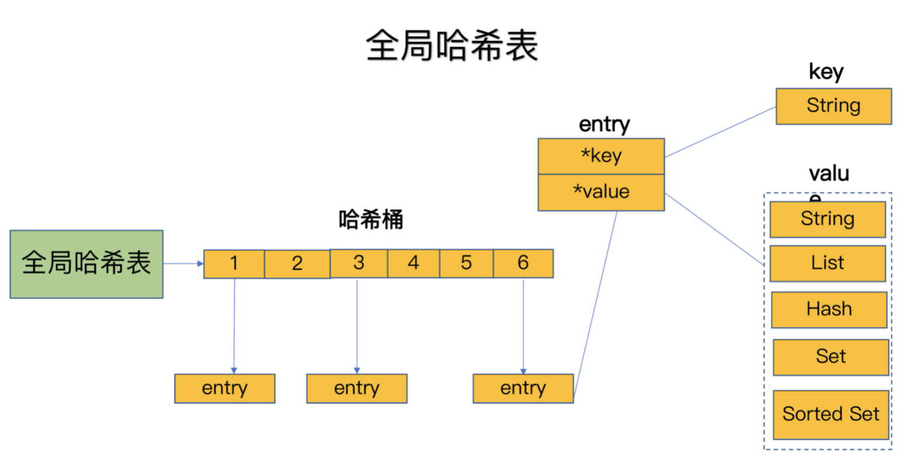
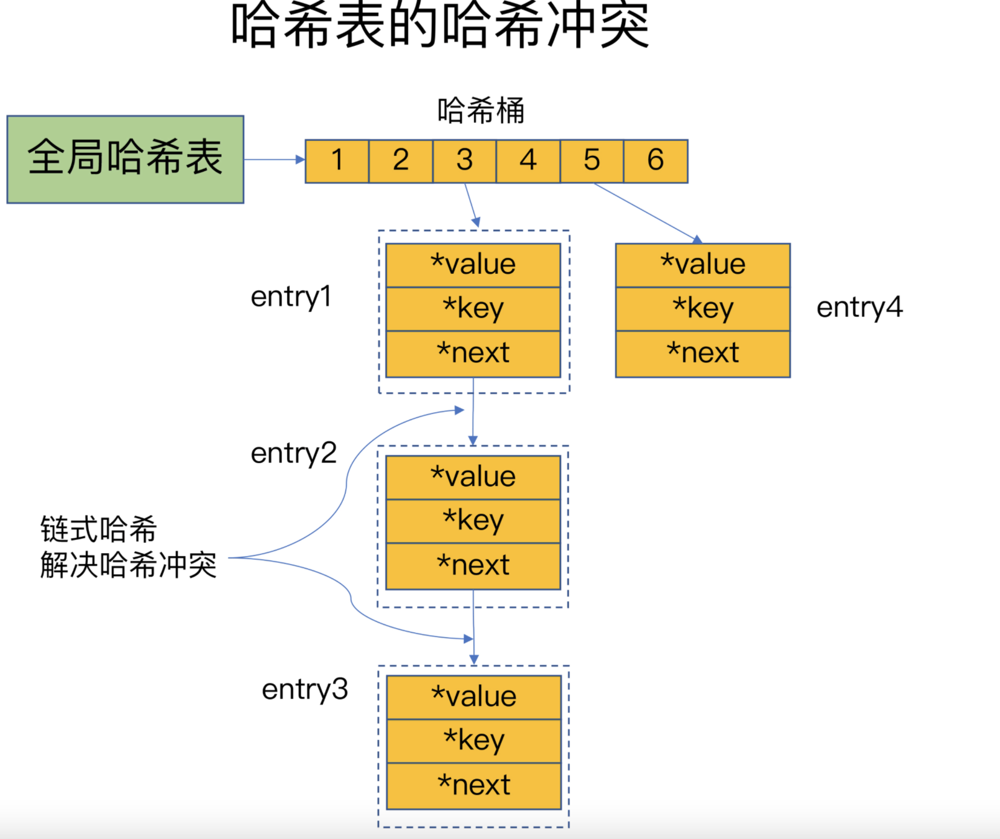
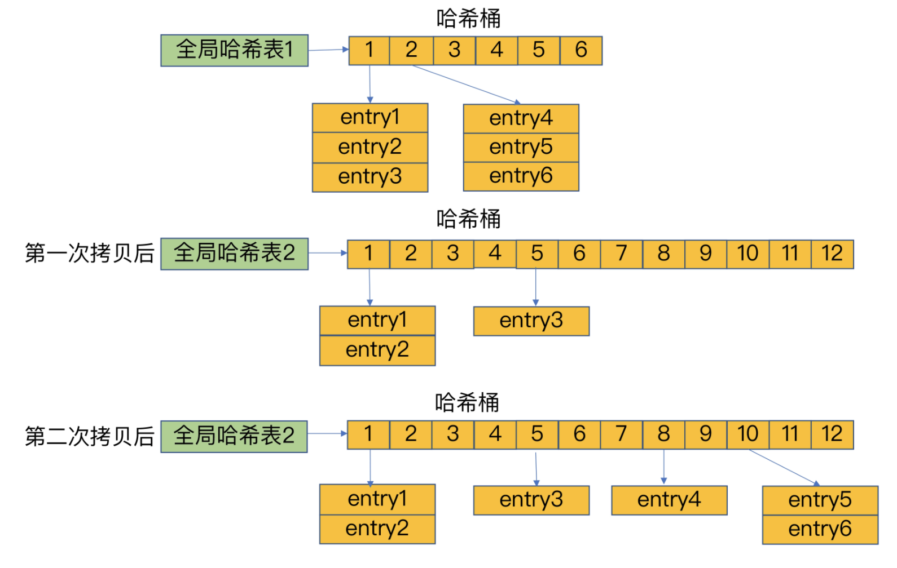
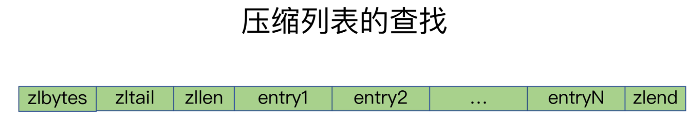
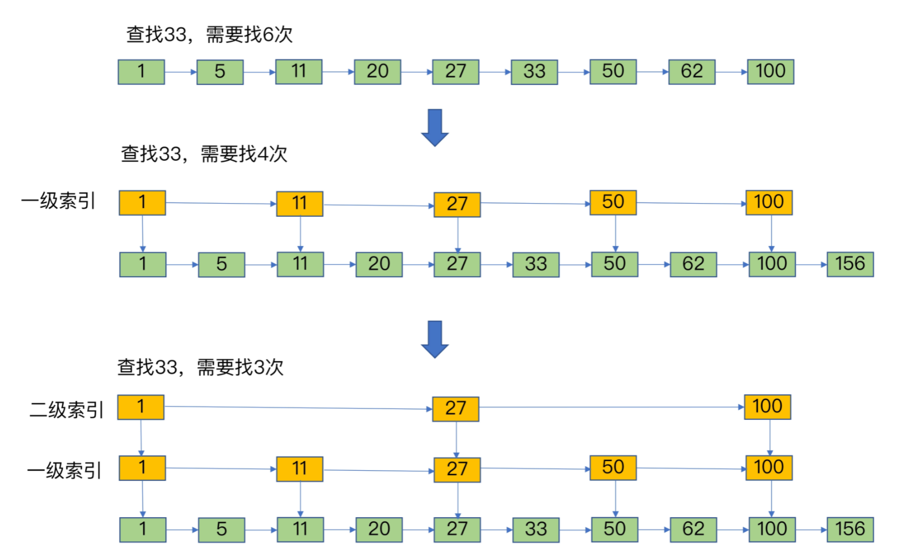

Redis用一个哈希表来保存所有键值对。

哈希表就是数组，数组的每个元素称为一个哈希桶。

哈希桶中的元素保存的指向具体值的指针。

哈希冲突，两个key的哈希值和哈希桶计算对应关系时，正好落在了同一个哈希桶中。解决哈希冲突，链式哈希

哈希链过长的问题，Redis会对哈希表做rehash操作。

Redis默认使用了两个全局哈希表：哈希表1和哈希表2。

1. 给哈希表2分配更大的空间，例如是当前哈希表1大小的两倍；
2. 把哈希表1中的数据重新映射并拷贝到哈希表2中；
3. 释放哈希表1的空间。

一次性把哈希表1中的数据都迁移完，会造成Redis线程阻塞，无法服务其他请求，为了避免这个问题，Redis采用了**渐进式rehash**

##### 数据结构

集合类型的底层数据结构主要有5种：整数数组、双向链表、哈希表、压缩列表和跳表。

###### 压缩列表

压缩列表在表头有三个字段zlbytes、zltail和zllen，分别表示列表长度、列表尾的偏移量和列表中的entry个数；压缩列表在表尾还有一个zlend，表示列表结束。

定位第一个元素和最后一个元素，可以通过表头三个字段的长度直接定位，复杂度是O(1)。而查找其他元素时，就没有这么高效了，只能逐个查找，此时的复杂度就是O(N)了

###### 跳表

跳表在链表的基础上，**增加了多级索引，通过索引位置的几个跳转，实现数据的快速定位**

第一，**单元素操作，是指每一种集合类型对单个数据实现的增删改查操作**。例如，Hash类型的HGET、HSET和HDEL，Set类型的SADD、SREM、SRANDMEMBER等。这些操作的复杂度由集合采用的数据结构决定，例如，HGET、HSET和HDEL是对哈希表做操作，所以它们的复杂度都是O(1)；Set类型用哈希表作为底层数据结构时，它的SADD、SREM、SRANDMEMBER复杂度也是O(1)。

这里，有个地方你需要注意一下，集合类型支持同时对多个元素进行增删改查，例如Hash类型的HMGET和HMSET，Set类型的SADD也支持同时增加多个元素。此时，这些操作的复杂度，就是由单个元素操作复杂度和元素个数决定的。例如，HMSET增加M个元素时，复杂度就从O(1)变成O(M)了。

第二，**范围操作，是指集合类型中的遍历操作，可以返回集合中的所有数据**，比如Hash类型的HGETALL和Set类型的SMEMBERS，或者返回一个范围内的部分数据，比如List类型的LRANGE和ZSet类型的ZRANGE。**这类操作的复杂度一般是O(N)，比较耗时，我们应该尽量避免**。

不过，Redis从2.8版本开始提供了SCAN系列操作（包括HSCAN，SSCAN和ZSCAN），这类操作实现了渐进式遍历，每次只返回有限数量的数据。这样一来，相比于HGETALL、SMEMBERS这类操作来说，就避免了一次性返回所有元素而导致的Redis阻塞。

第三，统计操作，是指**集合类型对集合中所有元素个数的记录**，例如LLEN和SCARD。这类操作复杂度只有O(1)，这是因为当集合类型采用压缩列表、双向链表、整数数组这些数据结构时，这些结构中专门记录了元素的个数统计，因此可以高效地完成相关操作。

第四，例外情况，是指某些数据结构的特殊记录，例如**压缩列表和双向链表都会记录表头和表尾的偏移量**。这样一来，对于List类型的LPOP、RPOP、LPUSH、RPUSH这四个操作来说，它们是在列表的头尾增删元素，这就可以通过偏移量直接定位，所以它们的复杂度也只有O(1)，可以实现快速操作。
