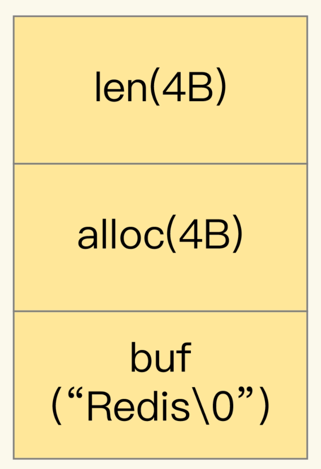
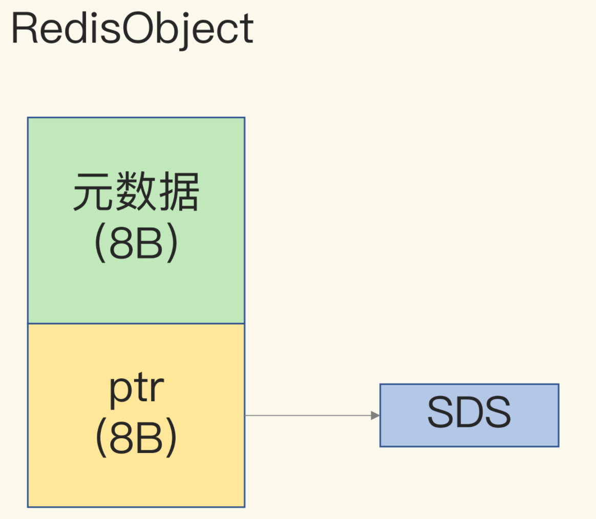
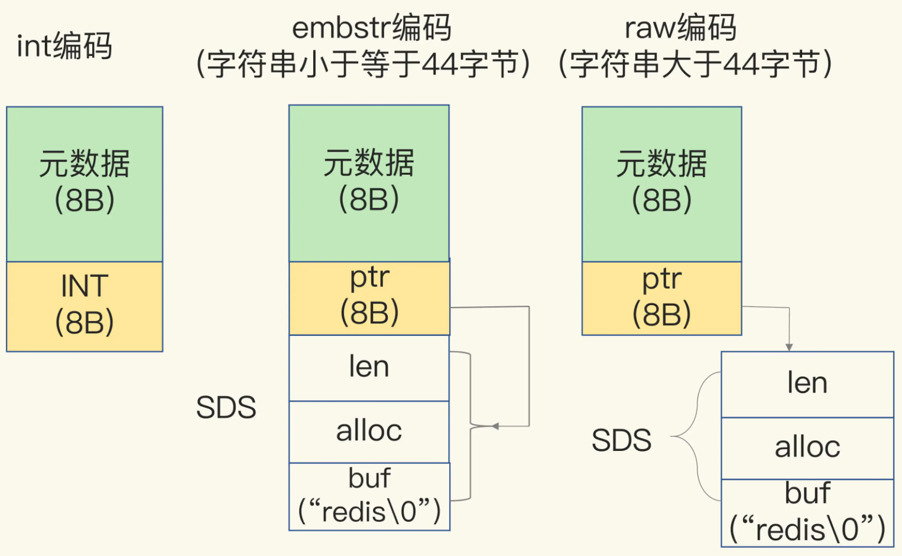
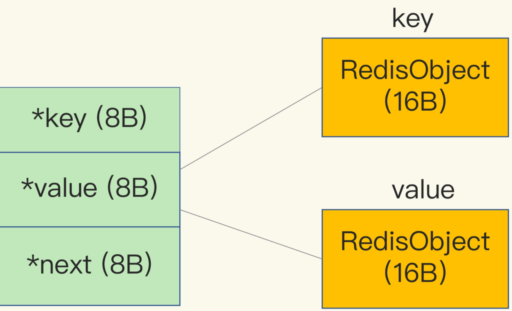
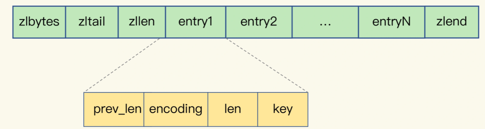

### String类型的内存空间消耗问题

String类型提供的一个键对应一个值的数据，String类型可以保存二进制字节流。

String类型用了64字节。

当你保存的数据中包含字符时，String类型就会用简单动态字符串（Simple Dynamic String，SDS）结构体来保存

+ buf：字节数组，保存实际数据。末尾加“\0”表示结束，额外占一个字节。
+ len：占4个字节，buf已用长度。
+ alloc：也占4字节，buf实际分配长度。

String类型来说，除了SDS的额外开销，还有一个RedisObject结构体的开销。

RedisObject包含了8字节的元数据和一个8字节指针，这个指针实际数据所在

### 为了节省内存空间，Redis还对Long类型整数和SDS的内存布局做了专门的设计

Long类型整数时，RedisObject中的指针就直接赋值为整数数据了，这样就不用额外的指针再指向整数。

当保存的是字符串数据，且小于等于44字节时，RedisObject中的元数据、指针和SDS是一块连续的内存区域，这样就可以避免内存碎片。这种布局方式也被称为embstr编码方式。

当字符串大于44字节时，SDS的数据量就开始变多了，Redis就不再把SDS和RedisObject布局在一起了，而是会给SDS分配独立的空间，并用指针指向SDS结构。这种布局方式被称为raw编码模式

Redis会使用一个全局哈希表保存所有键值对，哈希表的每一项是一个dictEntry的结构体，用来指向一个键值对。dictEntry结构中有三个8字节的指针，分别指向key、value以及下一个dictEntry，三个指针共24字节

Redis使用的内存分配库jemalloc了。如果你申请6字节空间，jemalloc实际会分配8字节空间；如果你申请24字节空间，jemalloc则会分配32字节。dictEntry结构就占用了32字节

## 用什么数据结构可以节省内存？

压缩列表（ziplist），非常节省内存。

压缩列表的构成，表头有三个字段zlbytes、zltail和zllen，分别表示列表长度、列表尾的偏移量，以及列表中的entry个数

+ prev_len， 前一个entry的长度。prev_len有两种取值情况：1字节或5字节。取值1字节时，表示上一个entry的长度小于254字节。虽然1字节的值能表示的数值范围是0到255，但是压缩列表中zlend的取值默认是255，因此，就默认用255表示整个压缩列表的结束，其他表示长度的地方就不能再用255这个值了。所以，当上一个entry长度小于254字节时，prev_len取值为1字节，否则，就取值为5字节。

- **len**：表示自身长度，4字节；
- **encoding**：表示编码方式，1字节；
- **content**：保存实际数据

Redis基于压缩列表实现了List、Hash和Sorted Set这样的集合类型，这样做的最大好处就是节省了dictEntry的开销

## 如何用集合类型保存单值的键值对？

采用基于Hash类型的二级编码方法。二级编码，就是把一个单值的数据拆分成两部分，前一部分作为Hash集合的key，后一部分作为Hash集合的value，这样一来，我们就可以把单值数据保存到Hash集合中了。

以图片ID 1101000060和图片存储对象ID 3302000080为例，我们可以把图片ID的前7位（1101000）作为Hash类型的键，把图片ID的最后3位（060）和图片存储对象ID分别作为Hash类型值中的key和value。

在使用String类型时，每个记录需要消耗64字节，这种方式却只用了16字节，所使用的内存空间是原来的1/4，满足了我们节省内存空间的需求。

Redis Hash类型的两种底层实现结构，分别是压缩列表和哈希表。

Hash类型设置了用压缩列表保存数据时的两个阈值，一旦超过了阈值，Hash类型就会用哈希表来保存数据了

- hash-max-ziplist-entries：表示用压缩列表保存时哈希集合中的最大元素个数。
- hash-max-ziplist-value：表示用压缩列表保存时哈希集合中单个元素的最大长度。

如果我们往Hash集合中写入的元素个数超过了hash-max-ziplist-entries，或者写入的单个元素大小超过了hash-max-ziplist-value，Redis就会自动把Hash类型的实现结构由压缩列表转为哈希表