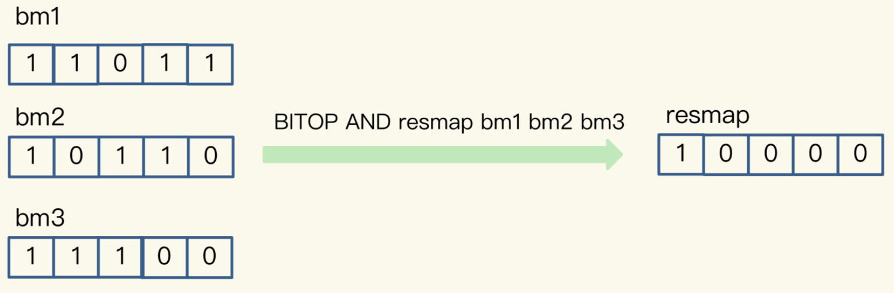

四种统计模式，包括聚合统计、排序统计、二值状态统计和基数统计

## 聚合统计

指统计多个集合元素的聚合结果，包括：

+ 统计多个集合的共有元素（交集统计）；
+ 把两个集合相比，统计其中一个集合独有的元素（差集统计）；
+ 统计多个集合的所有元素（并集统计）。

## 排序统计

在Redis常用的4个集合类型中（List、Hash、Set、Sorted Set），List和Sorted Set就属于有序集合。

**List是按照元素进入List的顺序进行排序的，而Sorted Set可以根据元素的权重来排序**

List是通过元素在List中的位置来排序的，当有一个新元素插入时，原先的元素在List中的位置都后移了一位，比如说原来在第1位的元素现在排在了第2位。所以，对比新元素插入前后，List相同位置上的元素就会发生变化，用LRANGE读取时，就会读到旧元素。

我们可以按评论时间的先后给每条评论设置一个权重值，然后再把评论保存到Sorted Set中。Sorted Set的ZRANGEBYSCORE命令就可以按权重排序后返回元素。这样的话，即使集合中的元素频繁更新，Sorted Set也能通过ZRANGEBYSCORE命令准确地获取到按序排列的数据

## 二值状态统计

二值状态统计。这里的二值状态就是指集合元素的取值就只有0和1两种。

Bitmap支持用BITOP命令对多个Bitmap按位做“与”“或”“异或”的操作，操作的结果会保存到一个新的Bitmap中

## 基数统计

基数统计就是指统计一个集合中不重复的元素个数
