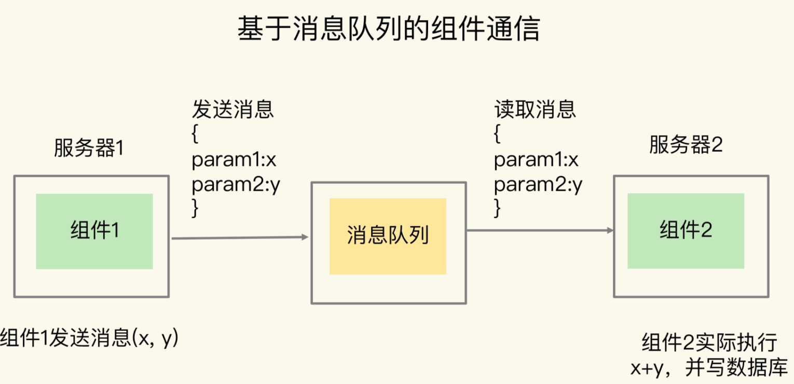

## 消息队列的消息存取需求

消息队列中发送消息的组件称为生产者（例子中的组件1），把接收消息的组件称为消费者（例子中的组件2）

**消息队列在存取消息时，必须要满足三个需求，分别是消息保序、处理重复的消息和保证消息可靠性。**

##### 需求一：消息保序

消费者仍然需要按照生产者发送消息的顺序来处理消息

##### 需求二：重复消息处理

消费者从消息队列读取消息时，有时会因为网络堵塞而出现消息重传的情况。此时，消费者可能会收到多条重复的消息。对于重复的消息，消费者如果多次处理的话，就可能造成一个业务逻辑被多次执行

##### 需求三：消息可靠性保证

消费者在处理消息的时候，还可能出现因为故障或宕机导致消息没有处理完成的情况。此时，消息队列需要能提供消息可靠性的保证，也就是说，当消费者重启后，可以重新读取消息再次进行处理，否则，就会出现消息漏处理的问题了

Redis的List和Streams两种数据类型，就可以满足消息队列的这三个需求。我们先来了解下基于List的消息队列实现方法

## 基于List的消息队列解决方案

list本身就是按先进先出的顺序对数据进行存取的，所以，如果使用List作为消息队列保存消息的话，就已经能满足消息保序的需求了。

具体来说，生产者可以使用LPUSH命令把要发送的消息依次写入List，而消费者则可以使用RPOP命令，从List的另一端按照消息的写入顺序，依次读取消息并进行处理。

在生产者往List中写入数据时，List并不会主动地通知消费者有新消息写入，如果消费者想要及时处理消息，就需要在程序中不停地调用RPOP命令（比如使用一个while(1)循环）。如果有新消息写入，RPOP命令就会返回结果，否则，RPOP命令返回空值，再继续循环。

所以，即使没有新消息写入List，消费者也要不停地调用RPOP命令，这就会导致消费者程序的CPU一直消耗在执行RPOP命令上，带来不必要的性能损失。

**BRPOP命令也称为阻塞式读取，客户端在没有读到队列数据时，自动阻塞，直到有新的数据写入队列，再开始读取新数据**

**消费者程序本身能对重复消息进行判断。**

一方面，消息队列要能给每一个消息提供全局唯一的ID号；另一方面，消费者程序要把已经处理过的消息的ID号记录下来

**生产者消息发送很快，而消费者处理消息的速度比较慢，这就导致List中的消息越积越多，给Redis的内存带来很大压力**

启动多个消费者程序组成一个消费组，一起分担处理List中的消息。但是，List类型并不支持消费组的实现

## 基于Streams的消息队列解决方案

Streams是Redis专门为消息队列设计的数据类型，它提供了丰富的消息队列操作命令。

- XADD：插入消息，保证有序，可以自动生成全局唯一ID；
- XREAD：用于读取消息，可以按ID读取数据；
- XREADGROUP：按消费组形式读取消息；
- XPENDING和XACK：XPENDING命令可以用来查询每个消费组内所有消费者已读取但尚未确认的消息，而XACK命令用于向消息队列确认消息处理已完成。

首先，我们来学习下Streams类型存取消息的操作XADD。

XADD命令可以往消息队列中插入新消息，消息的格式是键-值对形式。对于插入的每一条消息，Streams可以自动为其生成一个全局唯一的ID。

