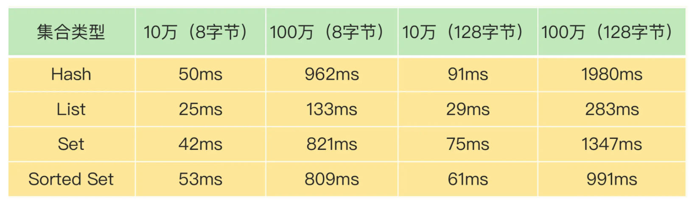

**1.和客户端交互时的阻塞点**

Redis使用了IO多路复用机制，避免了主线程一直处在等待网络连接或请求到来的状态，所以，网络IO不是导致Redis阻塞的因素。

键值对的增删改查操作是Redis和客户端交互的主要部分，也是Redis主线程执行的主要任务。所以，复杂度高的增删改查操作肯定会阻塞Redis。

Redis中涉及集合的操作复杂度通常为O(N)，我们要在使用时重视起来。例如集合元素全量查询操作HGETALL、SMEMBERS，以及集合的聚合统计操作，例如求交、并和差集。这些操作可以作为Redis的**第一个阻塞点：集合全量查询和聚合操作**。

操作系统需要把释放掉的内存块插入一个空闲内存块的链表，以便后续进行管理和再分配。会阻塞当前释放内存的应用程序

删除大量键值对数据的时候，最典型的就是删除包含了大量元素的集合，也称为bigkey删除。

**bigkey删除操作就是Redis的第二个阻塞点**

在Redis的数据库级别操作中，清空数据库（例如FLUSHDB和FLUSHALL操作）必然也是一个潜在的阻塞风险，因为它涉及到删除和释放所有的键值对。所以，这就是**Redis的第三个阻塞点：清空数据库**

##### 2.和磁盘交互是的阻塞点

Redis开发者早已认识到磁盘IO会带来阻塞，所以就把Redis进一步设计为采用子进程的方式生成RDB快照文件，以及执行AOF日志重写操作。

Redis直接记录AOF日志时，会根据不同的写回策略对数据做落盘保存。一个同步写磁盘的操作的耗时大约是1～2ms，如果有大量的写操作需要记录在AOF日志中，并同步写回的话，就会阻塞主线程了。这就得到了Redis的**第四个阻塞点了：AOF日志同步写**

**3.主从节点交互时的阻塞点**

