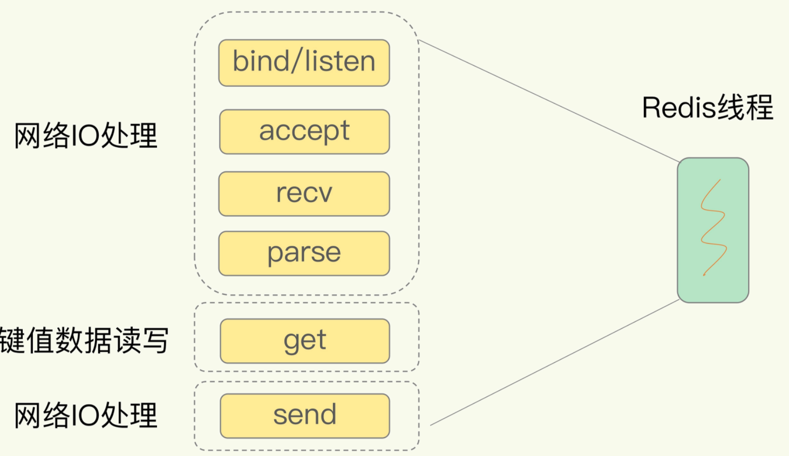
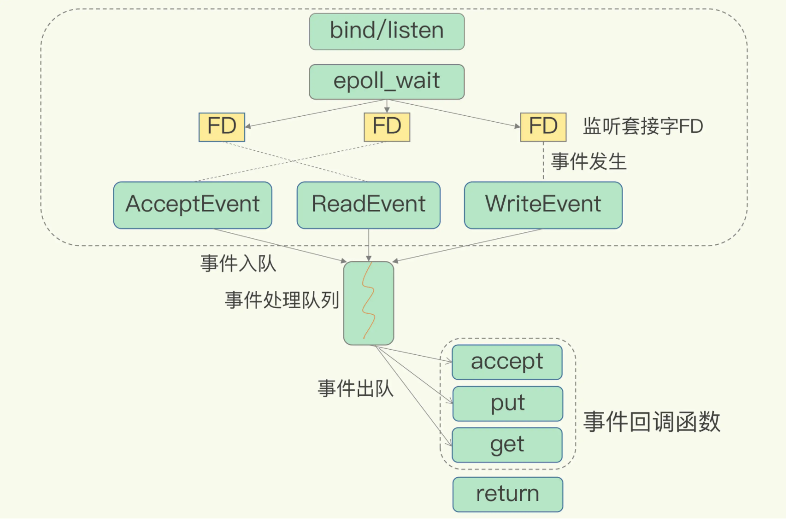

Redis是单线程，主要是指**Redis的网络IO和键值对读写是由一个线程来完成的，这也是Redis对外提供键值存储服务的主要流程**。但Redis的其他功能，比如持久化、异步删除、集群数据同步等，其实是由额外的线程执行的。

多线程的弊端

线程切换带来的开销，已经多线程并发访问控制带来的数据安全问题。

## 单线程Redis为什么那么快？

+ 采用了高效的数据结构
+ 采用了**多路复用机制**

### 基本IO模型与阻塞点

bind/listen、accept、recv、parse和send属于网络IO处理，而get属于键值数据操作

### 非阻塞模式

| 调用方法 | 返回套接字类型 | 非阻塞模式 | 效果                |
| -------- | -------------- | ---------- | ------------------- |
| socket() | 主动套接字     |            |                     |
| listen() | 监听套接字     | 可设置     | accept()阻塞        |
| accept() | 已连接套接字   | 可设置     | send()/recv()非阻塞 |

### 基于多路复用的高性能I/O模型

select/epoll提供了**基于事件的回调机制**，即**针对不同事件的发生，调用相应的处理函数**。其实，select/epoll一旦监测到FD上有请求到达时，就会触发相应的事件。