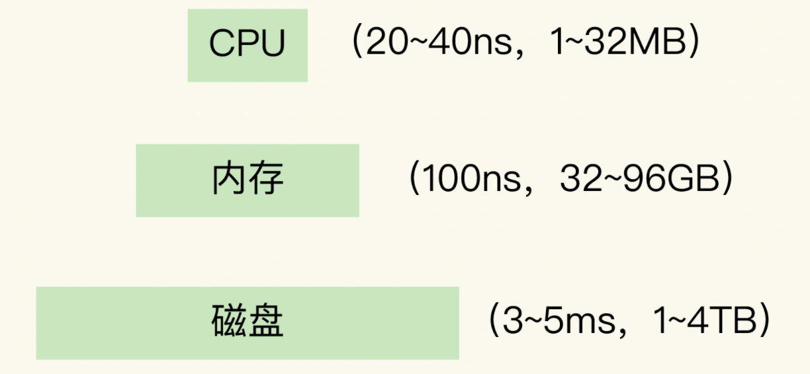
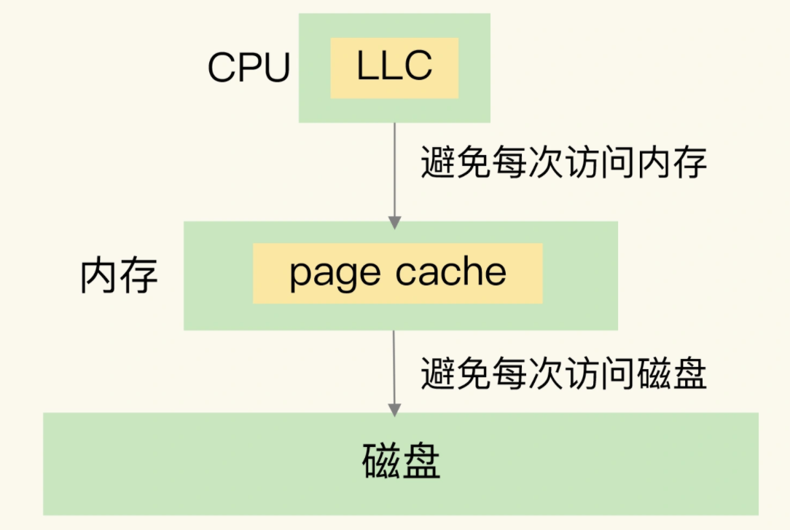

##### 缓存特征

一个系统中的不同层之间的访问速度不一样，所以我们才需要缓存，这样就可以把一些需要频繁访问的数据放在缓存中，以加快它们的访问速度。

计算机系统中，默认有两种缓存：

- CPU里面的末级缓存，即LLC，用来缓存内存中的数据，避免每次从内存中存取数据；
- 内存中的高速页缓存，即page cache，用来缓存磁盘中的数据，避免每次从磁盘中存取数据。

- **缓存命中**：Redis中有相应数据，就直接读取Redis，性能非常快。
- **缓存缺失**：Redis中没有保存相应数据，就从数据库中读取，性能就会变慢。而且，一旦发生缓存缺失，为了让后续请求能从缓存中读取到数据，我们需要把缺失的数据写入Redis，这个过程叫作缓存更新。缓存更新操作会涉及到保证缓存和数据库之间的数据一致性问题。
