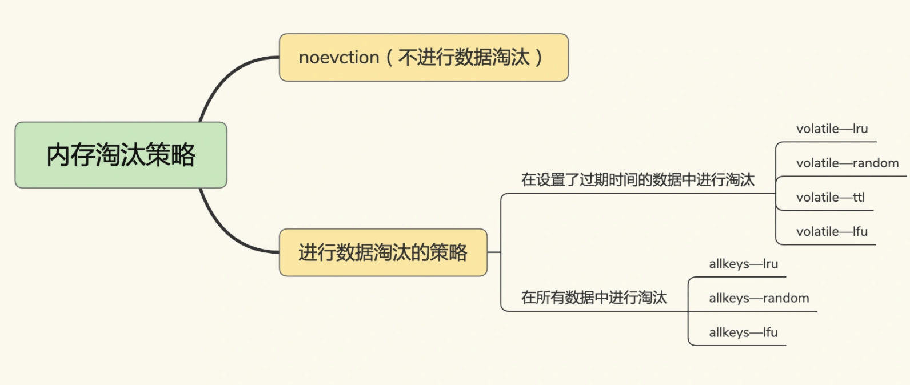

##### 1.如何设置缓存的容量

“八二原理”，有20%的数据贡献了80%的访问了，而剩余的数据虽然体量很大，但只贡献了20%的访问量。

**缓存容量设置为总数据量的15%到30%，兼顾访问性能和内存空间开销**

##### 2.缓存淘汰策略

**noeviction**：缓存被写满了，再有写请求来时，Redis不再提供服务，而是直接返回错误

- volatile-ttl             针对设置了过期时间的键值对，根据过期时间的先后进行删除，越早过期的越先被删除。
- volatile-random  在设置了过期时间的键值对中，进行随机删除。
- volatile-lru            会使用LRU算法筛选设置了过期时间的键值对。
- volatile-lfu            会使用LFU算法选择设置了过期时间的键值对。

- allkeys-random策略，从所有键值对中随机选择并删除数据；
- allkeys-lru策略，使用LRU算法在所有数据中进行筛选。
- allkeys-lfu策略，使用LFU算法在所有数据中进行筛选。

##### LRU算法的全称是Least Recently Used

LRU会把所有的数据组织成一个链表，链表的头和尾分别表示MRU端和LRU端

LRU算法用链表管理所有的缓存数据，会**带来额外的空间开销**。而且，当有数据被访问时，需要在链表上把该数据移动到MRU端，如果有大量数据被访问，就会带来很多链表移动操作，会很耗时，进而会降低Redis缓存性能

Redis中，LRU算法被做了简化：

Redis默认会记录每个数据的最近一次访问的时间戳，然后，Redis在决定淘汰的数据时，第一次会随机选出N个数据，把它们作为一个候选集合。接下来，Redis会比较这N个数据的lru字段，把lru字段值最小的数据从缓存中淘汰出去。**能进入候选集合的数据的lru字段值必须小于候选集合中最小的lru值**

