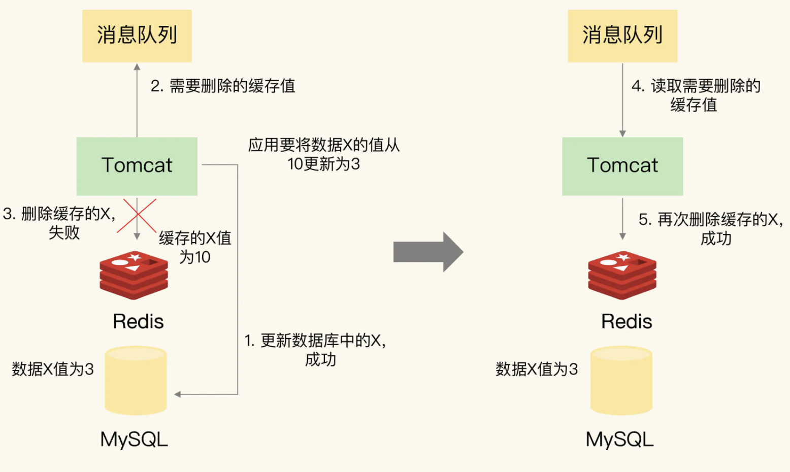

# 如何解决缓存和数据库的数据不一致问题

概括来说有4个方面：缓存中的数据和数据库中的不一致；缓存雪崩；缓存击穿和缓存穿透。

- 缓存中有数据，那么，缓存的数据值需要和数据库中的值相同；
- 缓存中本身没有数据，那么，数据库中的值必须是最新值。

- 同步直写策略：写缓存时，也同步写数据库，缓存和数据库中的数据一致；
- 异步写回策略：写缓存时不同步写数据库，等到数据从缓存中淘汰时，再写回数据库。使用这种策略时，如果数据还没有写回数据库，缓存就发生了故障，那么，此时，数据库就没有最新的数据了。

## 如何解决数据不一致问题？

重试机制

